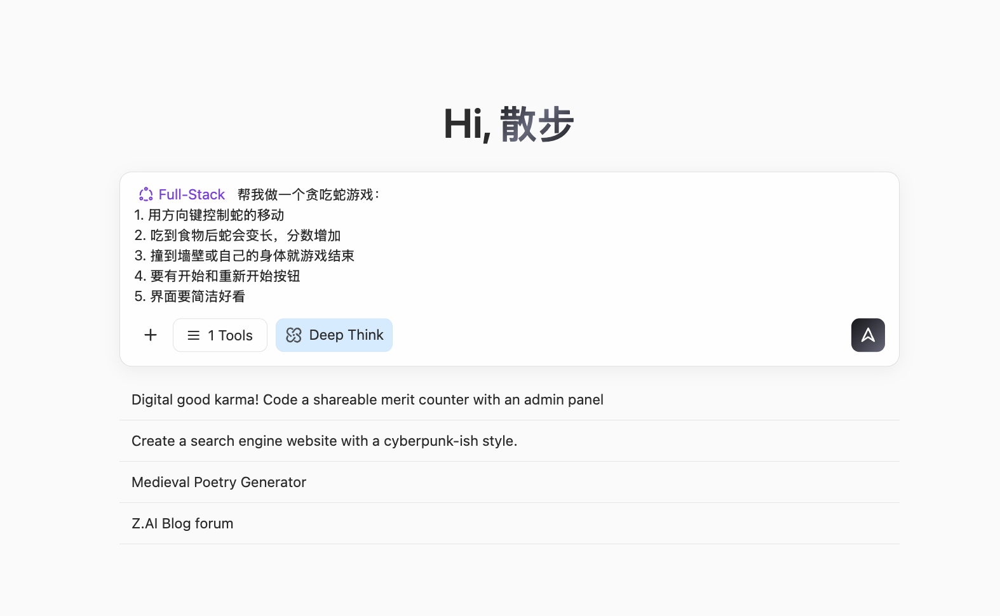
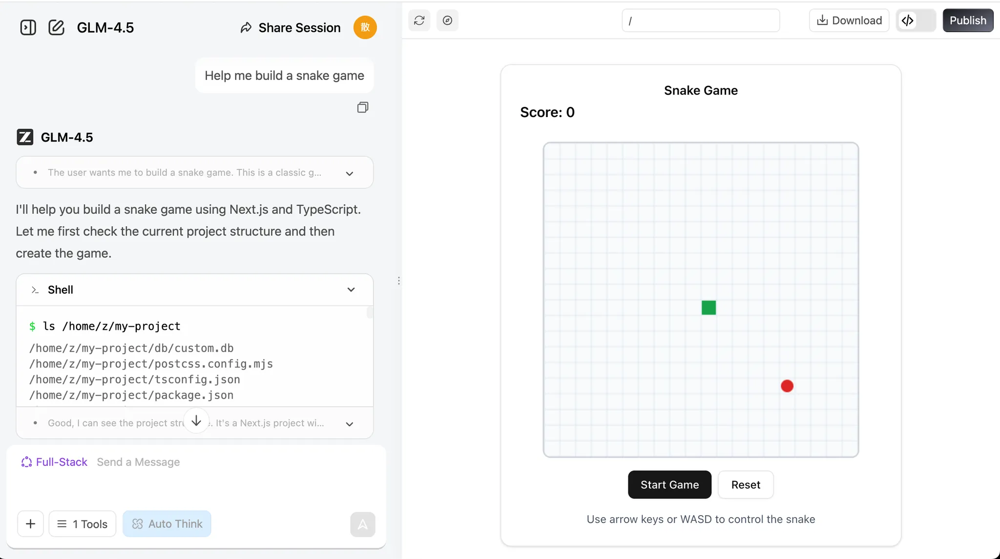

# 初级一：AI 时代，会说话就会编程

这是一个**基于项目制学习**的学习教程。我们鼓励你跟随步骤一步步操作，并尝试复现结果。
不要担心犯错或修改内容，我们永远相信你可以做到，请你永远记住：

<div style="text-align: center;">
<div style="display: inline-block; padding: 8px 20px; border-radius: 8px; border: 1px dashed #FFB6C1; background: linear-gradient(135deg, #FFF0F5 0%, #FFE4EC 100%); margin: 12px 0;">
  <span style="font-size: 15px; font-weight: 500; color: #666;">完成比完美更重要 🐣</span>
</div>
</div>

<script setup>
import { relatedArticlesMap } from '@theme/data/relatedArticles'

const duration = '约 <strong>4 小时</strong>，可分多次完成'
const relatedArticles =
  relatedArticlesMap['zh-cn/stage-1/ai-capabilities-through-games'] ?? []
</script>

## 本章导读

<ChapterIntroduction :duration="duration" :tags="['对话式 AI 编程', 'AI 原生小游戏', '贪吃蛇实战']" coreOutput="AI 原生贪吃蛇 + 自创小游戏" expectedOutput="1 个可运行的 AI 原生贪吃蛇 + （可选）1 个你自创的 AI 原生小游戏或 Demo">

如果你<strong>完全不会编程</strong>，或者只会一点皮毛，这一章就是为你准备的。我们会从最基础的开始：用<strong>对话的方式</strong>让 AI 帮你写代码，不需要记语法、不需要配环境，直接在网页上就能跑起来。

你会亲手做出<strong>第一个能运行的程序</strong>——一款会"吃单词、写诗、画画"的贪吃蛇。通过这个实战，你会体验到 AI 编程到底是什么感觉：不是 AI 代替你思考，而是你把想法说出来，AI 帮你实现。

所有的创造都是从 0 到 1 开始的，很高兴能将每一份信心与专业度传递与你，于你而言，<strong>执行力 is all you need</strong>。

</ChapterIntroduction>

<div style="margin: 50px 0;">
  <ClientOnly>
    <StepBar :active="0" :items="[
      { title: '困境与机会', description: '普通人的编程新可能' },
      { title: '能力初探', description: '60秒极速开发体验' },
      { title: '原生实战', description: '打造AI原生贪吃蛇' },
      { title: '拓展创造', description: '举一反三做游戏' }
    ]" />
  </ClientOnly>
</div>

## 1. 普通人的困境与机会

很多人脑子里有一堆产品点子：一款帮自己记账的小工具、一个记录孩子成长的网页、甚至一款小游戏。但一想到要写代码、要找程序员，就直接劝退。

AI 出现之后，第一次给了普通人一个全新的可能：你不需要会写代码，只需要学会对 AI 说清楚你想要什么。来自 GitHub Copilot 的[数据显示](https://www.wearetenet.com/blog/github-copilot-usage-data-statistics)，超过1500万开发者正在用AI辅助编程，平均46%的代码都是AI生成的! 在Java项目中这个比例能达到61%。

<el-card shadow="hover" style="margin: 20px 0; border-radius: 12px;">
  <template #header>
    <div style="display: flex; align-items: center; gap: 8px;">
      <span style="font-size: 20px;">🚀</span>
      <span style="font-weight: bold; font-size: 16px;">效率与采用率的飞跃</span>
    </div>
  </template>
  
  <el-row :gutter="20" style="margin-bottom: 24px;">
    <el-col :span="6" :xs="12">
      <div style="text-align: center; padding: 10px;">
        <div style="color: #409EFF; font-size: 24px; font-weight: bold;">55%</div>
        <div style="color: #909399; font-size: 12px; margin-top: 4px;">速度提升</div>
      </div>
    </el-col>
    <el-col :span="6" :xs="12">
      <div style="text-align: center; padding: 10px;">
        <div style="color: #67C23A; font-size: 24px; font-weight: bold;">2.4 <span style="font-size: 14px;">天</span></div>
        <div style="color: #909399; font-size: 12px; margin-top: 4px;">任务耗时 (原9.6天)</div>
      </div>
    </el-col>
    <el-col :span="6" :xs="12">
      <div style="text-align: center; padding: 10px;">
        <div style="color: #E6A23C; font-size: 24px; font-weight: bold;">81%</div>
        <div style="color: #909399; font-size: 12px; margin-top: 4px;">首日安装率</div>
      </div>
    </el-col>
    <el-col :span="6" :xs="12">
      <div style="text-align: center; padding: 10px;">
        <div style="color: #F56C6C; font-size: 24px; font-weight: bold;">96%</div>
        <div style="color: #909399; font-size: 12px; margin-top: 4px;">建议采纳率</div>
      </div>
    </el-col>
  </el-row>

  <div style="line-height: 1.8; color: #606266;">
    让人真正兴奋的是效率的飞跃：开发者完成任务的速度提升了 <b>55%</b>。原本需要 9.6 天才能提交的代码，现在只要 <b>2.4 天</b>就能搞定。 这种肉眼可见的效率提升，说明 AI 不再只是一个“可选工具”，而是正在成为开发流程中不可或缺的编程助手。采用率的数据也印证了这一点：在获得访问权限的当天，就有 <b>81%</b> 的开发者第一时间完成安装并开始使用；其中 <b>96%</b> 的人更是在当天就开始采纳 AI 提供的代码建议。换句话说，开发者几乎是立刻把 AI 融入了日常编码工作。
  </div>
</el-card>

对于普通人来说,这个趋势更有意义:如果专业程序员都在大量依赖AI写代码,那我们这些**不会编程的人,为什么不能直接跟AI对话来实现自己的想法呢**?

这门课的目标是帮你练成新技能：通过自然语言对话就能做应用。我们将教你怎么跟 AI 用计算机的语言沟通、怎么让AI帮你把脑子里的想法变成真实可用的产品。

<div style="margin: 50px 0;">
  <ClientOnly>
    <StepBar :active="1" :items="[
      { title: '困境与机会', description: '普通人的编程新可能' },
      { title: '能力初探', description: '60秒极速开发体验' },
      { title: '原生实战', description: '打造AI原生贪吃蛇' },
      { title: '拓展创造', description: '举一反三做游戏' }
    ]" />
  </ClientOnly>
</div>

## 2. AI 能帮你做到什么程度

在本节中，我们只讨论一个问题：如果你完全不会写代码，现在的 AI 能帮你做到什么程度？

大致来说，你可以把当前大模型的能力理解为：可以胜任**简单的内部小工具**、**数据可视化看板**，以及一些**轻量级小游戏**的开发。这些能力用来做**自用工具**、从**产品经理视角验证需求**，基本已经足够。但若想一键生成可直接**商用的成熟产品**，通常仍需要人工在**流程设计**、**细节打磨**上持续优化。

接下来，我们就以贪吃蛇为例，具体看看 AI 编程目前到底能做到什么程度。

### 2.1 60 秒做一个贪吃蛇游戏

首先，请你打开课程中使用的实验网页 [z.ai](https://chat.z.ai/)，`z.ai` 是由智谱 AI（中国领先的大语言模型公司之一）开发的 AI 平台，其核心能力由智谱自研的 GLM 系列大模型提供支持。该平台集成了多项 AI 功能，包括幻灯片生成、海报设计和全栈开发等。在本教程中，我们将重点介绍其全栈开发模块的使用。

::: details 💡 什么是「网页就能编程」的新模式？

过去，开发一个网页应用需要：
- 安装编程环境（如 Python、Node.js）
- 配置代码编辑器
- 学习 HTML/CSS/JavaScript 等语言
- 处理各种依赖和报错

而现在，借助 AI 编程平台，你只需要：
- 打开浏览器，访问网页
- 用自然语言描述你想要的功能
- AI 自动生成代码并实时预览效果

这种「对话即编程」的模式，让编程从「写代码」变成了「描述需求」。你不需要关心底层技术细节，只需要清楚地告诉 AI 你想要什么，它就能帮你把想法变成可运行的程序。这就是 AI 时代编程的新范式——**Vibe Coding（氛围式编码）**。
:::


输入我们的简单需求后点击 **全栈开发** 按钮，你可以实时观看网页的完整创建过程。通常只需泡一杯咖啡的时间，网页便会自动生成完毕！

```
帮我做一个贪吃蛇游戏：
1. 用方向键控制蛇的移动
2. 吃到食物后蛇会变长，分数增加
3. 撞到墙壁或自己的身体就游戏结束
4. 要有开始和重新开始按钮
5. 界面要简洁好看
```



生成结束后，你能看到右侧出现可浏览的网页界面。你可以上下滚动浏览页面内容，或点击页面顶部的 🧭 按钮切换至全屏模式查看效果。

> 其中顶部从左到右按钮的作用依次为：箭头按钮展开侧边对话历史栏，铅笔按钮用于新建一个对话，循环箭头按钮用于刷新页面，指南针按钮负责切换至全屏模式，Download 按钮用于下载项目，<> 按钮用于切换代码视图，Publish 按钮用于发布项目。


如果你想查看该网页的源代码，可以点击右上角的代码图标查看完整代码。


::: tip 🌐 探索更多 AI 编程工具

除了 z.ai，还推荐你还可以尝试以下优秀的 AI 编程平台进行测试：

| 工具 | 地址 | 特点 |
|------|------|------|
| **Google AI Studio**（推荐） | [aistudio.google.com/apps](https://aistudio.google.com/apps) | 谷歌官方出品，支持 Gemini 模型，适合快速原型开发 |
| **Figma Make** | [figma.com/make](https://www.figma.com/make) | 与设计工具深度整合，适合设计师快速实现交互原型 |
| **Coze** | [coze.com](https://www.coze.cn) | 字节跳动推出的 AI Bot 开发平台，提供零代码的可视化搭建能力。与豆包、Kimi 等国产大模型深度集成，支持插件市场、定时任务和多渠道发布（飞书、微信等），适合快速构建面向 C 端用户的对话应用或企业内部智能助手 |
| **v0.dev** | [v0.dev](https://v0.dev) | Vercel 出品的 AI 生成 UI 工具，输入描述即可生成可运行的 React 组件代码 |
| **Bolt.new** | [bolt.new](https://bolt.new) | StackBlitz 推出的 AI 全栈开发平台，可直接生成并部署完整的 Web 应用 |
| **Lovable** | [lovable.dev](https://lovable.dev) | 专注于生成高质量 React 应用，支持 GitHub 集成和一键部署 |
| **Replit Agent** | [replit.com](https://replit.com) | 集成 AI 编程助手的在线 IDE，支持多种语言和实时协作 |

想了解更多网页编程工具的详细对比和使用教程，可以参考我们的扩展阅读：[7 款主流 Vibe Coding 在线平台实测对比](../../stage-1/appendix-articles/example0-1/vibe-coding-tools-snake-game-tutorial.md)
:::

### 2.2 对话编程能做什么不能做什么

本节聚焦一个具体问题：当你只依赖对话式 AI、不写任何代码时，它究竟能把事情推进到哪一步。
在经验层面，一个较为稳定的结论是：它可以帮你完成一个“小而完整”的东西，但“做到什么程度就算够”，仍然需要你亲自决策每一步的详细步骤。

#### 更擅长“小而清晰”的应用

从前面的贪吃蛇示例中，你已经看到了一种典型模式：
只要你能把界面和交互说清楚，AI 通常可以在几轮对话内，拼出一个可以打开、可以点击、可以玩的完整网页。

这类任务往往具备几个共同特征：

- 范围清晰：一页网页、一个简单内部工具、一个小玩法
- 结果可见：你能立即在浏览器中验证是否按预期工作
- 纠错直接：发现问题后，可以在后续对话中点明具体现象并要求修正（通过复制错误直接粘贴，或者截图粘贴的形式让 AI 进行修改）

在这个边界内，你可以把对话式 AI 看作一位执行力不错的"辅助开发者"。你只需在每一轮用自然语言细化和修正需求，就能快速得到可用的原型。

**AI 独立完成小型项目的成功率：**
<el-progress :percentage="90" :stroke-width="15" status="success" striped striped-flow />

#### 大型项目需要“流程视角”

一旦超出小而清晰的范围，只指望靠几轮对话让 AI 端到端完成复杂系统，很快就会遇到上限。大型项目往往要接后端、连数据库、整合第三方服务，还牵涉权限、安全、并发和大量业务规则，目标是交付一整套与现有业务深度打通的系统，而不是一页网页。

在这种情况下，更合理的做法不是把所有需求一股脑丢给 AI，而是先梳理出清晰的整体流程：关键步骤是什么、每一步的输入输出和状态变化是什么、哪些节点对性能和安全最敏感。再基于这张流程图，把相对独立的环节拆分出来，交给对话式 AI 生成接口、模块、脚本和测试。

以目前的能力来看，AI 更擅长加速一个个小步骤，由你（或你的团队）来决定怎么拆步骤、如何串联，并负责最终的架构设计、系统集成和运维。

#### 能写和能用的区别

咋一看，AI 好像什么都能写，但这些东西到底能不能用，能用到什么程度，我们该如何划分？

一个可参考的经验是：

::: warning ⚠️ 适用场景指南

- **原型 / Demo / 内部自用工具**：非常适合先交给 AI 打第一版，再由你迭代细节。
- **面向真实用户的大型产品**：通常需要工程师在架构、抽象、性能和维护上长期投入。
- **强安全 / 强合规系统（如支付、风控、医疗等）**：在当前阶段，不宜“生成完就直接上线”，必须引入严格的审查与测试流程。
  :::

在当下，你可以相对安心地把 AI 视作一个高效的 Demo 与自用工具搭档：
只要你愿意多测试、多迭代，多问几轮“这里不对，帮我修一下并解释原因”，在原型与内部工具这一级别，整体质量通常是足够且具备实践价值的。

<div style="margin: 50px 0;">
  <ClientOnly>
    <StepBar :active="2" :items="[
      { title: '困境与机会', description: '普通人的编程新可能' },
      { title: '能力初探', description: '60秒极速开发体验' },
      { title: '原生实战', description: '打造AI原生贪吃蛇' },
      { title: '拓展创造', description: '举一反三做游戏' }
    ]" />
  </ClientOnly>
</div>

## 3. 动手：你的第一个 AI 原生应用

让我们回到动手部分，在前一部分，我们已经用 AI 快速做出了一个可以玩的贪吃蛇原型，也大致知道了 AI 能做什么、不能做什么。接下来我们将学习如何用最基础的 **vibe coding** 技巧创建一个**现代版**的 AI 贪吃蛇游戏。我们将让蛇吃掉文字字符而不是豆子。最后让游戏根据吃掉的文字字符生成一首诗，并画一幅画。
通过这个实际案例你能够理解全新编程方式的核心理念：如何学会用自然语言清晰地表达需求。

### 3.1 AI 原生贪吃蛇

在一开始，我们可以用最简单的方式与大模型对话，这将帮助我们快速获得产品原型。我们可以直接在聊天框中输入：

> **💡 示例提示词：** 帮我做一个贪吃蛇游戏
>
> 

> **💡 示例提示词：** 帮我做一个贪吃蛇游戏，它应该支持
>
> 1. 我可以吃不同的单词，它们会被收集在一个盒子里
>    

> **💡 示例提示词：** 帮我做一个贪吃蛇游戏，它应该支持：
>
> 1. 我可以吃不同的单词，它们会被收集在一个盒子里
> 2. 当蛇吃了8个单词时，llm 应该根据这些单词创作一首诗，我们可以根据需要重新混合这首诗。
> 3. 当诗完成后，下一步将自动根据这首诗创建一幅图像。
>
> 

注意，在开发过程中，我们可能会遇到不尽如人意的问题，例如点击按钮没有任何反应、使用功能时报错、功能未按预期工作，或者前端页面与预期设计不符。

在这种情况下，我们需要进一步向模型提问，以帮助修复这些意外问题。


### 3.2 给游戏添加新功能

完成基本功能后，我们可以尝试给我们的程序添加一些新花样！如果你觉得蛇吃单词或字符的过程有点枯燥，你可以让蛇吃不同颜色的单词，并相应地改变蛇的颜色。

你还可以为“吃”的过程添加特效，或者引入触发特效的魔法单词——比如增加蛇的速度或大小。另一个想法是每当蛇吃一个单词时就让模型生成一首诗和一幅图，而不是等到它吃掉八个单词。

如果觉得这些有挑战性，你可以直接向语言模型求助！它可以提供创意建议，让你的游戏更有趣。试一试吧！

```
1. "单词解锁世界" 机制
每当蛇吃掉一个单词，LLM 会对该单词进行诗意联想（例如，“树”→“森林”、“绿荫”），图像模型会即时为该单词生成一个小艺术品。这些图像逐渐拼凑成一个独特的、玩家创造的全景图，所以玩家每次游玩都在“作画和写诗”。

2. "诗歌拼图" 玩法
蛇吃掉的每个单词都会触发 LLM 生成简短的诗句，图像模型生成插图。这些诗句和图像像拼图一样组合在一起，在回合结束时形成一首 AI 协作的诗和画。

3. "魔法单词" & "故事分支"
特殊的“魔法单词”（例如，“风”、“夜”、“梦”）不仅触发 LLM 生成诗歌，还会改变场景的情绪或主题——将生成图像的风格转变为夜晚、暴风雨或梦幻般的氛围。
分支故事：LLM 在开始时给出一个主题或谜语（例如，“秋天的回忆”）。玩家的单词选择直接影响故事和诗歌的演变，图像模型实时更新背景和视觉效果。

4. "实时互动生成"
每个单词之后，LLM 生成一行对话或描述，游戏中的 NPC 可以对玩家“说话”，或者环境可以相应地改变。
蛇的外观或游戏中的障碍物可以根据吃掉的单词在视觉上发生变化，这要归功于图像模型。

5. "创作 & 分享"
玩家可以在会话结束时保存并分享他们 AI 创作的诗歌和图像，炫耀他们独特的“AI 协作”。
“最美诗歌+艺术”、“最有创意单词组合”等排行榜，鼓励重玩和创造力。

6. "按句贪吃蛇" 挑战
反向模式：LLM 给出一句诗或一个谜语，玩家必须引导蛇按顺序吃掉单词来重构句子。吃错单词会通过图像生成模型触发有趣或艺术性的后果。

7. "主题关卡" & "风格选择"
游戏开始时，玩家选择一个主题（例如，“童话”、“科幻”、“唐诗”），LLM 和图像模型都会调整单词选择、诗歌风格和视觉效果以匹配，使每次运行都感觉新鲜。

8. "现场共创"
当吃掉一个特殊单词时，LLM 可以提示玩家输入短语或选择风格，然后 AI 生成相应的诗句和插图，使其成为真正的人类-AI 共创。

9. "AI 彩蛋 & 成就"
某些单词组合被 LLM 识别为特殊主题或内部笑话（例如，“月亮”、“桂花”、“河岸”），触发稀有的诗句和插图，奖励探索。

10. "成长的故事"
随着蛇的成长，LLM 生成一个连续的故事诗，图像模型创建一个无缝的长卷或全景图，所以玩家同时在“写作、绘画和玩耍”。
```

此外，我们还可以要求 LLM 帮你直接生成项目级的提示词。在上一节中，我们只自己写了贪吃蛇游戏的提示词。现在让我们尝试让大模型生成一个带有整体框架和实现路径的提示词（你可以直接用 z.ai 生成）。

如果你想学习如何写出更好的提示词，可以查看[提示词工程附录](/zh-cn/appendix/8-artificial-intelligence/prompt-engineering)。

> 我想让 AI 生成一个网页贪吃蛇游戏，需要一个更完整的提示词，让生成结果更令人印象深刻和有趣。请生成相应的提示词。当前目标是：生成一个贪吃蛇游戏，需要实现吃不同单词生成诗歌的功能，并且应该包含图像生成模块。

z.ai 的回复将会是这样的：


我们可以使用这个提示词在全栈开发模式下重新生成项目：


<div style="margin: 50px 0;">
  <ClientOnly>
    <StepBar :active="3" :items="[
      { title: '困境与机会', description: '普通人的编程新可能' },
      { title: '能力初探', description: '60秒极速开发体验' },
      { title: '原生实战', description: '打造AI原生贪吃蛇' },
      { title: '拓展创造', description: '举一反三做游戏' }
    ]" />
  </ClientOnly>
</div>

### 3.3 尝试制作其他小游戏

除了贪吃蛇（游戏），我们可以让想象力尽情驰骋。

创造任何我们想创造的东西，甚至尝试搞砸一切！然后重头再来！

```
1. AI 艺术画廊平台
   描述：一个展示 AI 生成艺术作品的在线画廊，用户可以上传、分享和评论 AI 艺术作品。
   功能：用户账户系统、艺术作品上传和展示、评分系统、分类浏览、AI 生成工具集成。
   技术亮点：React/Vue 前端、Node.js 后端、MongoDB 数据库、AI API 集成。

2. 复古游戏档案馆
   描述：一个致敬经典游戏的网站，包含游戏历史、玩法指南和在线可玩复古游戏。
   功能：游戏数据库、时间轴展示、在线模拟器、用户评论、游戏收藏功能。
   技术亮点：响应式设计、WebGL/Canvas 游戏实现、RESTful API、用户认证系统。

3. 可持续生活追踪器
   描述：一个帮助用户通过环保提示和社区挑战来追踪和减少碳足迹的网站。
   功能：个人碳足迹计算器、目标设定、进度追踪、社区挑战、环保知识库。
   技术亮点：数据可视化、移动端优化、社交功能、推送通知。

4. 虚拟厨房助手
   描述：一个基于 AI 的烹饪指导平台，提供个性化食谱推荐和分步烹饪说明。
   功能：食谱数据库、食材识别、个性化推荐、烹饪计时器、营养分析。
   技术亮点：图像识别 API、机器学习推荐系统、语音控制、实时视频指导。

5. 地下音乐发现平台
   描述：一个专注于独立和新兴艺术家的音乐流媒体平台，提供独特的发现体验。
   功能：音乐流媒体、艺术家资料、个性化推荐、播放列表创建、社区评论。
   技术亮点：音频流处理、推荐算法、社交功能、音乐可视化。

6. 极简任务管理系统
   描述：一个具有禅意美学的任务管理工具，专注于简单和高效的任务组织。
   功能：任务创建和分类、优先级设置、进度追踪、团队协作、数据分析。
   技术亮点：极简 UI 设计、拖放功能、实时同步、跨平台兼容性。

7. 科幻写作工坊
   描述：一个为科幻作家提供创意工具和灵感的平台，包括世界观构建辅助和角色开发工具。
   功能：故事结构工具、角色资料、世界观构建模板、写作统计、社区反馈。
   技术亮点：富文本编辑器、数据可视化、协作编辑、AI 辅助创作。

8. 个人知识图谱
   描述：一个帮助用户构建个人知识网络，可视化并连接各种想法和信息的工具。
   功能：节点创建和连接、标签系统、搜索功能、导入/导出工具、可视化图表。
   技术亮点：图数据库、数据可视化算法、Markdown 支持、跨设备同步。

9. 虚拟植物园
   描述：一个互动植物百科全书，用户可以探索植物世界并创建虚拟花园。
   功能：植物数据库、3D 植物模型、生长模拟、园艺指南、社区展示。
   技术亮点：3D 渲染、季节变化模拟、AR 集成、植物识别 API。

10. 编程挑战竞技场
    描述：一个面向程序员的在线竞赛平台，具有各种难度级别的编程挑战。
    功能：挑战问题、代码编辑器、自动评估、排行榜、学习路径。
    技术亮点：代码沙箱环境、实时评估系统、算法可视化、社交学习功能。
```

还有... 如果你喜欢玩游戏，让我们一起尝试创造游戏吧！

```
1. 3D 开放世界 RPG
   描述：一个具有广阔开放世界、任务和角色成长的奇幻 RPG。
   功能：昼夜循环、动态天气、技能树、多人合作、制作系统。
   技术亮点：Three.js 或 Babylon.js 用于 3D 渲染、服务器端游戏逻辑、角色自定义、存档系统。

2. 第一人称射击 (FPS) 竞技场
   描述：一个快节奏的多人 FPS，具有各种游戏模式和地图。
   功能：团队死斗、夺旗、武器自定义、排位赛。
   技术亮点：WebGL/Three.js 用于 3D 图形、多人网络代码、命中检测、语音聊天。

3. AI 国际象棋和多人游戏
   描述：一个功能齐全的国际象棋平台，具有 AI 对手和在线对战功能。
   功能：AI 难度级别、残局挑战、锦标赛模式、回放分析。
   技术亮点：国际象棋逻辑库、WebSocket 用于实时对战、ELO 排名系统、反作弊。

4. 麻将在线多人游戏
   描述：一个具有在线多人游戏和计分功能的传统麻将游戏。
   功能：多种规则集、私人房间、排名系统、回放功能。
   技术亮点：牌匹配逻辑、实时多人游戏、大厅系统、分数追踪。

5. 回合制策略游戏
   描述：一个具有网格战斗和单位管理的战术策略游戏。
   功能：战役模式、遭遇战、单位升级、战争迷雾、多人对战。
   技术亮点：网格移动系统、AI 决策、回合同步、存档/读档系统。

6. 计时赛赛车游戏
   描述：一个专注于计时赛和赛道记录的 3D 赛车游戏。
   功能：多条赛道、汽车自定义、幽灵回放、排行榜。
   技术亮点：3D 汽车物理、赛道编辑器、回放系统、在线排行榜。

7. 卡牌对战游戏 (卡组构建)
   描述：一个策略卡牌游戏，玩家构建卡组并与对手战斗。
   功能：卡牌收集、卡组构建、排位赛、赛季活动。
   技术亮点：卡牌游戏逻辑、匹配系统、AI 对手、卡牌动画。

8. 大逃杀 (俯视 2D)
   描述：一个俯视 2D 大逃杀游戏，具有缩小的游戏区域和战利品机制。
   功能：单人和小队模式、武器多样性、局内事件、排行榜。
   技术亮点：实时多人游戏、区域缩小逻辑、战利品生成系统、匹配。

9. 恐怖生存游戏 (第一人称)
   描述：一个具有资源管理和逃生机制的第一人称恐怖游戏。
   功能：氛围环境、解谜、敌人 AI、多重结局。
   技术亮点：动态照明、声音设计、敌人寻路、存档系统。

10. 音乐节奏游戏 (3D)
    描述：一个 3D 节奏游戏，玩家随着音乐节拍击打音符。
    功能：多种难度级别、赛道编辑器、自定义歌曲支持、排行榜。
    技术亮点：音频分析、节拍同步、3D 音符轨道、输入时机检测。
```

## 📚 Assignment

<el-card id="assignment-card" shadow="hover" style="margin: 20px 0; border-radius: 12px;">
  <template #header>
    <div style="font-weight: bold; font-size: 16px;">🎯 本章作业：完成你的第一批 AI 原生小游戏</div>
  </template>

  <p>
    这一节，你已经跟着步骤体验了从“对话生成贪吃蛇”到“理解 AI 原生小游戏设计思路”的完整流程。下面的作业帮助你把这些理解真正变成自己的能力。
  </p>

  <ol>
    <li>
      <strong>完整复现 AI 原生贪吃蛇游戏</strong>
      <ul>
        <li>至少实现：蛇可以移动、吃到“食物”后长度和分数发生变化、撞墙或撞到自己会结束。</li>
        <li>在复现过程中，练习把错误现象 + 报错信息 + 关键代码片段一次性丢给 AI，请它“小白模式”修复。</li>
      </ul>
    </li>
    <li>
      <strong>（可选）自创 1 个 AI 原生小游戏或 Demo</strong>
      <ul>
        <li>可以是围绕文字、图片、音乐、节奏等的任意轻量玩法，例如“吃单词写诗”“节奏点击”“生成式跑酷”等。</li>
        <li>重点不是画面多炫，而是你能清楚说出：AI 在这里具体帮了什么忙，它解决了什么“人工难以做到或很麻烦”的部分。</li>
      </ul>
    </li>
  </ol>

  <p>
    这就是完整的教程！你可能需要 <strong>4 小时</strong> 才能完成所有内容并构建你自己的贪吃蛇游戏。不要着急——探索、实验并享受这个过程。如果在过程中遇到概念不太理解，推荐你顺手查看下方附录中的相关部分。
  </p>
</el-card>

## 附录

<el-card id="appendix-nav" shadow="hover" style="margin-top: 24px; margin-bottom: 24px; border-left: 5px solid #67C23A;">
  <div style="font-weight: bold; margin-bottom: 8px;">附录导航</div>
  <div style="color: #606266; font-size: 14px; line-height: 1.6; margin-bottom: 12px;">
    这里整理了一些和本章相关的基础概念：如果你在学习过程中遇到“前端是什么”“Vibe Coding 到底指什么”等问题，可以随时回到这里查阅。
  </div>
  <el-row :gutter="16">
    <el-col :span="12">
      <a href="#appendix-1" style="text-decoration: none; color: inherit;"><b>附录 1：我们需要前端开发知识吗？</b></a><br/>
      <span style="font-size: 12px; color: #909399">搞清楚前端在整个应用里的位置，知道哪些是“看得见”的部分。</span>
    </el-col>
    <el-col :span="12">
      <a href="#appendix-2" style="text-decoration: none; color: inherit;"><b>附录 2：到底什么是 Vibe Coding</b></a><br/>
      <span style="font-size: 12px; color: #909399">理解“对话式开发”的核心思路，知道该如何和 AI 配合。</span>
    </el-col>
  </el-row>
  <el-row :gutter="16" style="margin-top: 10px;">
    <el-col :span="12">
      <a href="#appendix-3" style="text-decoration: none; color: inherit;"><b>附录 3：模型上下文</b></a><br/>
      <span style="font-size: 12px; color: #909399">搞清楚“上下文长度”这类常听到却又容易混淆的概念。</span>
    </el-col>
    <el-col :span="12">
      <a href="#appendix-4" style="text-decoration: none; color: inherit;"><b>附录 4：指令遵循能力</b></a><br/>
      <span style="font-size: 12px; color: #909399">了解模型为什么有时“听不懂话”，以及如何写得更清楚。</span>
    </el-col>
  </el-row>
  <div style="margin-top: 12px; font-size: 12px; color: #909399;">
    小技巧：你可以按 Ctrl/⌘+F 搜索关键字，或者把不懂的段落复制给 AI，请它用“完全小白能看懂”的方式再解释一遍。
  </div>
</el-card>

## <span id="appendix-1">[附录 1：我们需要前端开发知识吗？](#appendix-nav)</span>

::: tip 💡 一句话总结
你不需要会写代码，但了解基础概念能让你更好地向 AI 描述需求。
:::

<el-row :gutter="16" style="margin: 20px 0;">
  <el-col :span="12" :xs="24" style="margin-bottom: 16px;">
    <el-card shadow="hover" style="border-radius: 12px; height: 100%;">
      <template #header>
        <div style="display: flex; align-items: center; gap: 8px;">
          <span style="font-size: 20px;">👁️</span>
          <span style="font-weight: bold;">前端</span>
          <el-tag type="success" size="small">可见</el-tag>
        </div>
      </template>
      <div style="color: #606266; line-height: 1.8;">
        用户能<strong>看到、点到</strong>的所有内容
        <ul style="margin: 12px 0; padding-left: 20px;">
          <li>网页标题、文字、图片</li>
          <li>按钮、输入框、下拉菜单</li>
          <li>游戏界面、动画效果</li>
        </ul>
      </div>
    </el-card>
  </el-col>
  <el-col :span="12" :xs="24" style="margin-bottom: 16px;">
    <el-card shadow="hover" style="border-radius: 12px; height: 100%;">
      <template #header>
        <div style="display: flex; align-items: center; gap: 8px;">
          <span style="font-size: 20px;">⚙️</span>
          <span style="font-weight: bold;">后端</span>
          <el-tag type="info" size="small">不可见</el-tag>
        </div>
      </template>
      <div style="color: #606266; line-height: 1.8;">
        运行在服务器上的数据处理
        <ul style="margin: 12px 0; padding-left: 20px;">
          <li>用户分数存储</li>
          <li>登录账号验证</li>
          <li>关卡内容分配</li>
        </ul>
      </div>
    </el-card>
  </el-col>
</el-row>

### 前端三件套

浏览器通过三种"代码"来构建页面：

<el-tabs type="border-card" style="margin: 20px 0;">
  <el-tab-pane label="🏗️ HTML - 骨架">
    <div style="padding: 10px;">
      <p><strong>作用：</strong>定义页面上<strong>有什么</strong>元素</p>
      <p><strong>类比：</strong>房子的结构草图（墙、门、窗在哪里）</p>
      <el-card style="background: #f5f7fa; margin-top: 12px;">
        <pre style="margin: 0;"><code>&lt;button&gt;点我&lt;/button&gt;
&lt;h1&gt;标题&lt;/h1&gt;
&lt;img src="photo.png"&gt;</code></pre>
      </el-card>
    </div>
  </el-tab-pane>
  <el-tab-pane label="🎨 CSS - 样式">
    <div style="padding: 10px;">
      <p><strong>作用：</strong>控制元素<strong>长什么样</strong></p>
      <p><strong>类比：</strong>房子的装修（颜色、材质、布局）</p>
      <el-card style="background: #f5f7fa; margin-top: 12px;">
        <pre style="margin: 0;"><code>button {
  background: blue;
  color: white;
  border-radius: 8px;
}</code></pre>
      </el-card>
    </div>
  </el-tab-pane>
  <el-tab-pane label="⚡ JavaScript - 行为">
    <div style="padding: 10px;">
      <p><strong>作用：</strong>让页面<strong>动起来</strong></p>
      <p><strong>类比：</strong>房子的电路开关（点击后的响应）</p>
      <el-card style="background: #f5f7fa; margin-top: 12px;">
        <pre style="margin: 0;"><code>button.onclick = () => {
  alert('你点了我！')
}</code></pre>
      </el-card>
    </div>
  </el-tab-pane>
</el-tabs>

### 代码如何变成页面？

当你打开一个网页时，浏览器会按顺序处理三种代码：

**1. HTML —— 定义页面结构**
浏览器首先解析 HTML，了解页面上有哪些元素（标题、段落、图片、按钮等），以及它们的层级关系。

**2. CSS —— 应用样式**
然后浏览器根据 CSS 规则，给这些元素添加样式：颜色、大小、位置、间距等，让页面变得美观。

**3. JavaScript —— 添加交互**
最后执行 JavaScript 代码，让页面"动起来"：响应点击、提交表单、播放动画等。

**4. 页面呈现**
三者的配合结果就是你最终看到的网页。

### 现代前端框架：从 HTML 到 React/Vue

前面介绍的 HTML、CSS、JavaScript 是前端开发的"三件套"，它们是所有网页的基础。但当页面变得复杂时，直接用这三件套开发会遇到挑战：代码难以维护、重复劳动多、数据同步麻烦。

**现代前端框架**（如 React、Vue、Angular）建立在 HTML/CSS/JS 之上，让开发更高效：

**1. HTML/CSS/JS（基础阶段）**
直接操作页面元素，适合简单页面。但当代码量增大时，所有逻辑混在一起，难以维护。

**2. jQuery（过渡阶段）**
简化了 DOM 操作，让代码更简洁。但仍需手动管理页面状态，数据变化时要自己找到对应的元素并更新。

**3. React/Vue（现代阶段）**
采用组件化和状态驱动的设计：
- **组件化**：把页面拆成独立的可复用模块（如按钮、卡片、导航栏）
- **状态驱动**：数据变化时，框架自动更新对应的界面，无需手动操作

::: tip 💡 简单理解
- **HTML/CSS/JS** = 基础材料（砖块、水泥、钢筋）
- **React/Vue** = 建筑框架（提供了搭建房屋的规范和工具）

在 AI 辅助编程时代，你不需要深入掌握框架的所有细节，只需要理解它们的基本概念，就能通过自然语言描述让 AI 帮你生成代码。
:::

### 在 Vibe Coding 中

**核心要点：你不需要写代码，只需要会描述。**

了解前端概念后，你可以这样跟 AI 描述需求：

> "用 React 做一个排行榜页面，右侧显示分数列表，点击某行在下方展示玩家详情，风格简洁现代。"

如果你想深入理解 HTML、CSS、JavaScript 等前端基础知识，可以查看[Web 基础附录](/zh-cn/appendix/3-browser-and-frontend/javascript-deep-dive)。想了解前端技术的发展历程，可以查看[前端进化史附录](/zh-cn/appendix/3-browser-and-frontend/frontend-frameworks)。

## <span id="appendix-2">[附录 2：到底什么是 Vibe Coding](#appendix-nav)</span>

> 💡 什么是 Vibe Coding？计算机科学家 [Andrej Karpathy](https://karpathy.ai/)（OpenAI 的联合创始人之一，特斯拉前 AI 负责人）于 2025 年 2 月提出了 **vibe coding** 一词。这个概念指的是一种依赖于 LLM 的编码方法，**允许程序员通过提供自然语言描述而不是手动编写代码来生成可工作的代码。**


从字面上看，Vibe Coding 可以理解为一种“用说的方式来做开发”。它的核心变化在于：你不再需要自己一行一行写代码、查语法、调 Bug，而是直接用自然语言描述你想要的东西，例如：

“我需要一个登录页面，上面有手机号输入框和验证码输入框。”
“登录成功后，跳转到首页，并在右上角显示用户名。”
“给我一个简单的贪吃蛇小游戏，可以用键盘方向键控制。”
大语言模型（LLM）会把这类描述自动翻译成真正可以运行的代码，并生成对应的页面、逻辑和数据结构。你看到效果后，再用自然语言提出修改意见，例如“按钮再大一点”“背景换成深色”“得分记录下来并显示排行榜”，AI 会继续按你的要求调整实现。

在这种模式下，你不需要先学会编程语言，再去写代码；而是把主要精力放在：说清楚要做什么、看到结果后判断“哪里不对”、再提出新的修改。AI 则负责把这些高层的想法落成具体实现，从而显著减少机械、重复的编码工作。

你可以点击这里查看更多关于 vibe coding 的细节：[https://www.ibm.com/think/topics/vibe-coding](https://www.ibm.com/think/topics/vibe-coding)

你可以点击这里查看更多关于 Karpathy 的分享内容：[https://karpathy.bearblog.dev/blog/](https://karpathy.bearblog.dev/blog/)

### 如何假装自己是 Vibe Coding 大师

实际上，在真正的 vibe coding 过程中，我们通常不会使用很多复杂的提示词。也许我们在开始时需要为整个程序提供一个具体且适度复杂的提示词，但在那之后的每一步，你可能只需要以下类型的提示词：

```
"代码里有个 bug，请修复它。"
"我不要部分代码，给我完整的修改后的代码。"
"你的代码还是有问题。"
"请再次修改并给我完整的修正后的代码。"
"刚才还能运行，为什么现在不能运行了？"
"你没理解我的意思吗？不要改我原来的代码。"
"不要添加任何调试功能。"
"不要做我没让你做的事。"
"我让你实现的功能在哪里？"
"你听不懂我说的话吗？"
"我只要一个函数。"
"我告诉过你参考我之前的代码。"
"请不要添加不必要的注释。"
"请不要修改我原始代码的基本逻辑。"
"帮我修改代码。"
"基于我的代码修改..."
"不要改我的变量名！！！"
"不要改原来的函数名！"
"不要乱动我的变量。"
"不要添加额外的功能。"
"不要只生成框架，生成完整的代码。"
```

这听起来可能有点夸张，但实际上，这些就是我们在日常工作中可能使用的提示词。由于大语言模型的**上下文长度限制**，或者有时因为它们的**指令遵循能力**不是很强，模型可能会忘记对话早些时候讨论的内容。在 vibe coding 中，我们倾向使用长上下文的模型，并且使用指令遵循能力强的模型，我们可以通过这两者的排行或者指标来判断其是不是好模型。

或者，由于训练数据集的风格，大模型倾向于以其训练数据的风格回答。例如，有些人说话很严肃，有些人喜欢添加很多修饰，而有些大模型喜欢在代码中添加很多注释或不必要的模块。

## <span id="appendix-3">[附录 3：模型上下文](#appendix-nav)</span>

模型上下文可以理解为 AI 的短期记忆。它指的是在当前一次对话或一次任务中，模型能够“看到”和“记住”的所有文本内容，包括你之前输入的问题、系统提供的说明、相关资料等。

正是因为有上下文，AI 才能理解你在接着前面的内容继续提问，才能进行一轮一轮、看起来连贯自然的对话。如果没有上下文，你的每一句话在模型看来都像是一次全新的提问，它无法知道你之前说过什么，也就谈不上延续对话。

每个模型都有自己的有效上下文长度（context window）。这个长度通常用 token（可以粗略理解为“字词片段”的单位）来衡量，目前主流模型大多在 32k～128k token 之间。上下文越长，模型一次能“读”的内容就越多，例如：

- 一次性读完一篇较长的论文或报告
- 在同一轮对话中引用多篇资料、多个案例
- 让模型记住之前几轮的复杂讨论结论

当你输入的内容接近或超过模型的上下文限制时，往往会出现一些常见现象：

- 模型开始遗忘前面长文本中的细节或关键信息
- 对话进行到后面，话题逐渐偏离最初目标
- 对同一材料的不同问答之间，引用的内容不一致

这些现象并不是模型突然“变笨”，而是上下文容量被用满或接近用满后产生的自然结果。

在实际使用中，我们既希望上下文尽可能长，又要意识到：

- 上下文越长，占用的算力资源越多
- 对应的调用成本（费用）也会随之增加

因此，在设计 AI 应用时，需要在让模型看得足够多和控制成本、提升效率之间做平衡。例如：

- 对真正需要长期保留的信息进行提炼后再交给模型
- 对不再需要的细节信息，避免一遍又一遍原样塞入上下文
- 使用外部知识库等方式，把“长期记忆”交给系统，而不是强行塞进模型上下文中

## <span id="appendix-4">[附录 4：指令遵循能力](#appendix-nav)</span>

指令遵循能力指的是：模型在理解你的指令之后，能否准确、完整地按照你的要求执行。它不仅包括能回答问题，还包括能按指定格式、风格、步骤完成任务。

例如，下面这些都是对模型有明确要求的指令：

- 将这篇文章总结为三个要点
- 用正式、礼貌的语气写一封回复邮件
- 把这个词翻译成英文，并各造一个例句
- 从文章中提取作者、时间和主要事件

一个指令遵循能力强的模型，通常具备以下特征：

- 按要求的数量输出内容  
  例如要求总结三个要点，就不会给出五条。
- 覆盖所有指定的要素  
  例如要求提取作者、时间和事件，就不会遗漏其中任何一项。
- 遵守指定的格式和语气  
  例如要求使用正式语气，就不会输出过于口语化的回复。
- 不做不必要的额外延伸  
  例如只要求翻译和造句，就不会额外输出一大段无关解释。

在实际应用中，强指令遵循能力非常重要，原因包括：

- 提高稳定性：同样的指令在不同时间、多次运行时，输出结构和行为模式更加一致，不容易随意发挥
- 提高可复现性：当你把一段提示词配置到产品或流程中时，可以预期模型大致会怎样响应，方便测试和迭代
- 便于系统集成：当模型输出符合预期格式时，更容易与后端程序、工作流或其他工具自动对接

因此，在选择和评估一个大语言模型时，除了关注它是否聪明、知识覆盖是否广之外，还需要特别关注它的指令遵循能力。对于工业级应用来说，能否稳定而准确地执行指令，往往比偶尔给出一次惊艳回答更重要。

<RelatedArticlesSection
  title="继续学习"
  description="从“游戏化体验”出发，推荐你继续进入本地开发与产品实践。"
  :items="relatedArticles"
/>
