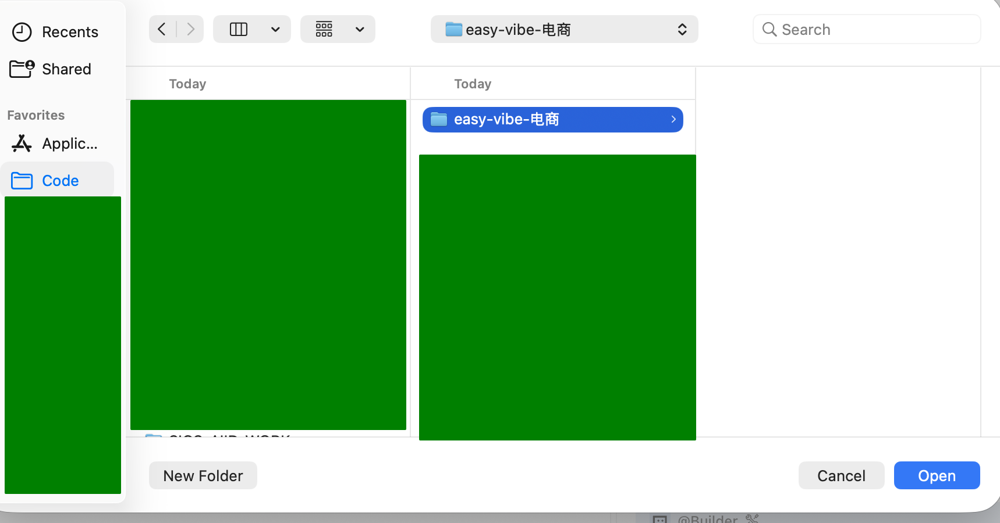
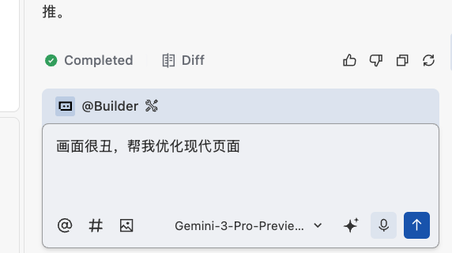
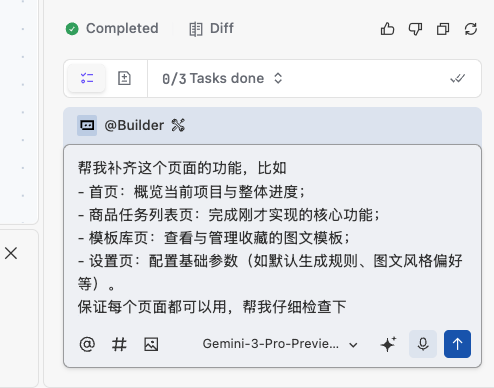
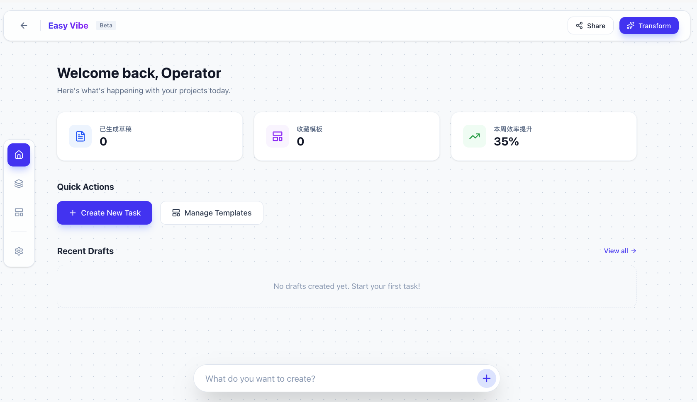
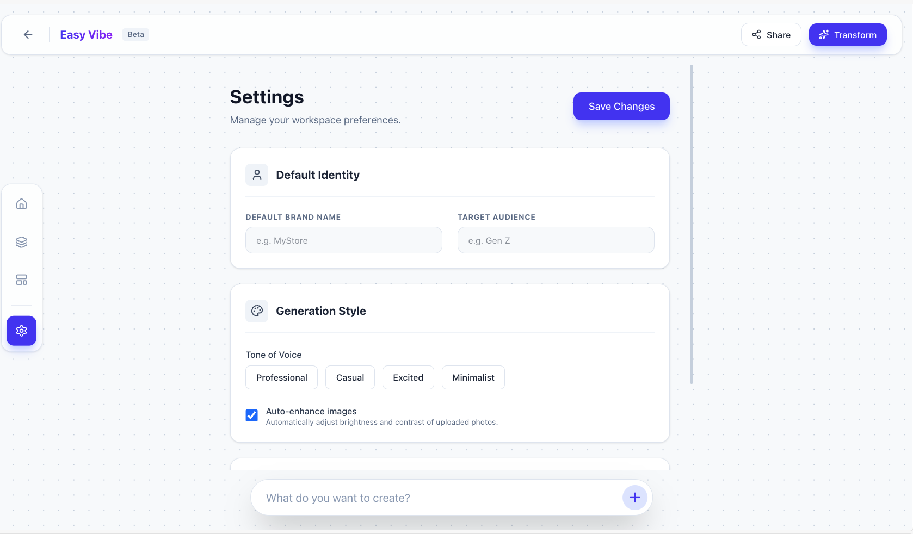
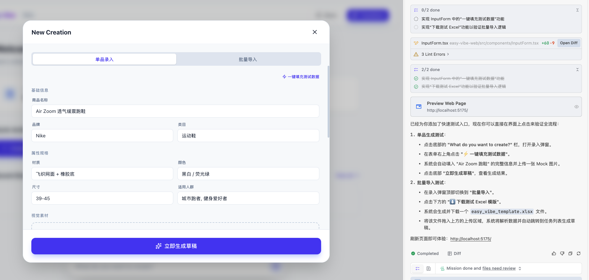
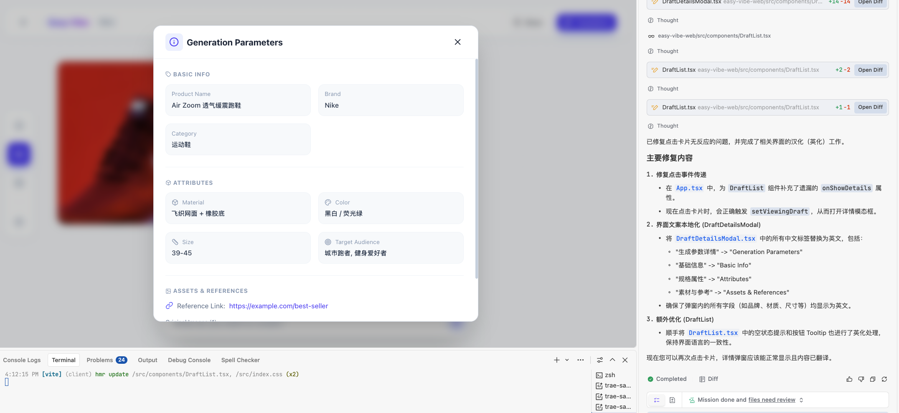

<script setup>
import { relatedArticlesMap } from '@theme/data/relatedArticles'

const duration = '约 <strong>8 小时</strong>'
const relatedArticles =
  relatedArticlesMap['zh-cn/stage-1/building-prototype'] ?? []
</script>

# 初级三：动手做出原型

## 本章导读

<ChapterIntroduction :duration="duration" :tags="['业务分析', '原型设计', 'AI 辅助编程', '多页面应用']" coreOutput="1 个电商素材工作台原型" expectedOutput="可交互的 Web 原型">

在上一章，我们学习了如何<strong>找到好点子</strong>——从用户需求出发，找到有人愿意买单的方向。但找到方向只是第一步，<strong>真正考验产品经理的是：如何把模糊的需求变成能用的产品。</strong>

这一章，我们要解决一个<strong>现实问题</strong>：老板丢给你一句"用 AI 提高商品发布到电商平台的效率" —— 你怎么把它变成<strong>能用的产品原型</strong>？

和前面做贪吃蛇、计算器不同，<strong>真实业务不能凭空想功能</strong>：

1. <strong>明确痛点</strong>：找运营聊聊，从模糊的"提高效率"里挖出<strong>真正的痛点</strong>
2. <strong>挑重点做</strong>：一堆问题里先解决<strong>最痛的那个</strong>，别想着一次性做全
3. <strong>快速验证</strong>：用 AI IDE 先做<strong>单页面原型</strong>，跑通了再扩展成多页面
4. <strong>做出能用的东西</strong>：最后交付一个<strong>能演示、能操作的电商素材工作台</strong>

我们将学会从<strong>做玩具到做应用的转变</strong>，学会<strong>共情和思考客户的真实需求</strong>。

</ChapterIntroduction>

::: info ℹ️ 说明
本篇中可能会有一些业务的名词，如果你不懂可以询问 AI 获得解释。
:::

<div style="margin: 50px 0;">
  <ClientOnly>
    <StepBar :active="0" :items="[
      { title: '需求分析', description: '从模糊到具体' },
      { title: '单页验证', description: '核心玩法落地' },
      { title: '多页扩展', description: '完善应用结构' },
      { title: '美化完善', description: '提升用户体验' }
    ]" />
  </ClientOnly>
</div>

## 1. 写代码前确定需求

在前面的教程中，我们使用 AI IDE 轻松生成了贪吃蛇和各类小游戏，但这些只能算是玩具项目，并不能运用在工作和生活当中；如果我们想要 AI 能力真正为大家所用，就应该结合生活、工作场景进行 vibe coding 编程。

上一章我们学习了如何找到<strong>有人愿意买单的好点子</strong>，但找到方向只是开始。真正做产品时，你会发现：<strong>知道"做什么"和知道"怎么做"之间，还有巨大的鸿沟。</strong>

这个鸿沟就是<strong>需求的具体化</strong>。

举个例子，在课堂或个人项目中，我们经常是从最简单的可执行功能出发做产品和应用：

- "做个看板，把任务列出来。"
- "帮我做个画画的工具。"
- "帮我做个可以收集问卷的软件。"

这些往往只是一个工具、一个功能模块，甚至都称不上是一个清晰的业务问题。更关键的是，<strong>这些想法往往只是"你觉得有用"，而不是"用户真的需要"。</strong>

在企业级项目或创业项目中，产品经理和工程师往往是从更大的业务命题出发。例如，我们可以假定这样的一个场景：

<el-card shadow="hover" style="border-left: 5px solid #409EFF; background-color: #ecf5ff; margin: 20px 0;">
  <div style="font-weight: bold; color: #303133; margin-bottom: 10px;">🛍️ 业务场景：</div>
  <div style="color: #606266; line-height: 1.6;">
    <p>你是一家店铺的电商运营产品经理。老板给了你一个模糊但压力很大的命题：</p>
    <p style="font-style: italic; margin-top: 10px;">“现在公众号里都在用 AI 做图做文案，我看都挺简单的。你帮我搞一下，让我们在抖音电商上新商品时效率高一点。”</p>
  </div>
</el-card>

这时候你可能想：“老板你又在做梦了！”，然而，实际工作中这样模糊的一句话拍板的现象是非常常见的，甚至比你一周点奶茶的次数还要多。因此，为了能够做好一个合格的职场牛马（我更希望你是新兴的创业公司 CEO），我们必须学会如何从做自用的工具转向做真正的产品原型。

由于我们学过 AI IDE，你仔细一想这个需求其实很简单，不就是让 AI 基于这个给个提示词，丢给 Agent 就万事大吉了吗？

```
请你参考我的需求 xxxx，
帮我设计一个电商素材工作台，
包含商品描述、图片、视频等素材的生成和管理功能。
```

如果你兴高采烈的直接把这个需求转换成了原型，然后发给了老板 —— 恭喜你，这个季度的奖金要取消了！

**为什么会这样？这就是我们要解决的核心痛点：**

以前我们学 AI IDE，做的都是贪吃蛇、计算器这种**自己用的玩具项目**——功能简单、自己清楚要什么、做出来自己用就行。但**真实业务场景完全不同**：

- **你不是用户**：老板要的是"提高效率"，但你不知道运营每天具体怎么工作、卡在哪里；
- **AI 也不懂业务**：你丢给 AI 一个模糊需求，它只能基于通用知识瞎猜，做出来的东西看着像那么回事，实际根本用不了；
- **好点子不等于好产品**：你以为"加个 AI 生成功能"很酷，但用户可能根本不需要，或者用起来比原来更麻烦。

**这就是为什么我们必须学会"从想到点子到理解用户"** 只有你的创意真正解决别人的问题，开口问、深入了解业务，才能做出真正意义上有价值的事情。（好的点子甚至大于好的技术）

### 1.1 从想象到真实：学会向业务提问

::: info 💡 先搞清楚：什么是需求？什么是业务？

**需求**就是用户真正想要的东西，是他们遇到的麻烦、想解决的问题。比如"老板想让我上架商品更快一点"，这就是一个需求。

**业务**就是用户每天实际在做的事情、他们的工作方式。比如电商运营每天要做的事：上架商品、改价格、做图片、看数据……这些都是业务。

**为什么要关注业务？**
因为如果你不懂业务，做出来的工具可能就是"看起来很好，但没人用"。只有真正了解用户每天怎么工作、卡在哪里，才能做出真正帮得到他们的东西。

:::

从最简单的视角出发，你可以先问自己几个问题：

- 老板说"**效率高一点**"，具体是什么意思？是想**做得更快**？还是想**少花钱**？还是想**卖更多货**？
- 现在是怎么把商品上架的？**哪里做得不顺**？
- 每天要做多少个**新商品**？每个商品要做多少**图**、写多少**字**？
- 现在的工作中，**哪件事最麻烦**、**最不想做**？

但这些都是猜测的问题，我们要向一线的抖音电商业务方直接提问，“你们的困难和关注的点在哪里？”，通过沟通获得更准确的答案：

::: info 📋 真实业务采访结果

我们问了做电商运营的人，他们说了这些烦恼：

**1. 事情太多太杂**
- 一个人要管好几个店，每个店都有很多商品要弄；
- 每天忙来忙去：**上架新商品**、**改价格**、**做图片**、**看数据**，一件事没做完又要做另一件。

**2. 做内容不是一次做好，而是边做边试**
- 先用**厂家给的图**、**以前用过的素材**或**网上找的参考图**，快速把商品**上架**试试；
- 花点小钱做推广，**看看有没有人买**；
- 只有**卖得好的商品**，才会认真做图、写详情、拍视频。

:::
做完业务方提问后，我们心怀激情，因为此时我们真正能做出完美的符合业务的产品原型了！—— 又错了，如果我们试图“一口气满足所有诉求”，产品会非常庞大，也很难在课程时间内落地。因此，还需要进一步梳理和收敛，找出真正的核心痛点。

### 1.2 从发散到收敛：锁定业务的核心痛点和功能

::: info 💡 为什么要"收敛"？什么叫"痛点"？

**问题很多，但先做哪一个？**

用户可能告诉你一堆问题：A也麻烦、B也麻烦、C也麻烦……但如果你试图一次性解决所有问题，最后可能什么都做不好。所以要**收敛**——就是从一堆问题里，挑出**最痛、最急、最能解决**的那个先动手。

**什么是痛点？**
就是用户**最烦、最花时间、最想解决**的那个具体问题。不是"我觉得有用"，而是用户**每天都在抱怨、每次做都很痛苦**的事。

:::

通过上面的采访，我们发现运营遇到的问题有很多：被活动打断节奏、要管多个店、在上架/改价/做图/看数据之间忙来忙去……

如果我们试图"这些问题我全都要解决"，最后会做出一个**大而全但不好用**的工具。

让我们把这些问题分分类（可以让 AI 帮忙），大致有三类：

1. **节奏问题**：什么时候上架、什么时候调价；
2. **效率问题**：怎么同时管好多个店、多个商品；
3. **内容问题**：怎么快速做出商品图片和文案。

对于我们的课程来说，最适合先解决的是**第3类：做内容的问题**。但"快速做内容"还是有点抽象，我们再问问业务方具体卡在哪里：

::: info 📋 业务方说：做内容有两个最痛苦的地方

**痛苦1：批量做图做文案太费劲**
- 素材到处放：网盘、微信记录、平台后台……**找起来很费劲**；
- 一次要上很多商品，**没时间逐个精心做**，只能随便拼一下；
- 要求不高，**能看、能上架就行**，不需要多精美。

**痛苦2：好用的方案没法存下来复用**
- 之前做得好的标题、排版，**下次想用却找不到了**；
- 方案散落在聊天记录、以前的商品链接里；
- 想用的时候得**翻半天、复制粘贴改半天**；
- 缺一个能**收藏、管理、直接套用**的工具。

:::

基于上面两个痛点，我们要做一个简单的小工具：**帮运营批量做图做文案，还能把好用的方案存下来下次直接用**。

它只做两件事（可以让 AI 帮忙细化，记得根据业务反馈不断删减功能）：

::: info 功能1：批量生成电商商品图和文案

**这是做什么的？**
给系统一些商品信息，它自动帮你生成能在电商平台（如抖音、淘宝）上架用的商品图和文字。

**输入**
| 类型 | 内容 |
|------|------|
| 商品信息 | 名字、类别、品牌、材质、尺寸、颜色等 |
| 商品图片 | 白底图或简单场景图 |
| 参考图 | 以前卖得好的商品截图或参考链接 |
| 导入方式 | Excel 批量导入，或直接在页面上填写 |

**输出（生成的电商素材）**
- **商品主图**：带文字卖点的产品展示图（用户刷到时第一眼看到的图）
- **商品标题**：搜索时能搜到的关键词组合
- **卖点文案**：1-2句吸引买家的话
- 都是**改改就能上架**的成品

**效果**
- 以前：每个商品都要从零开始做图写文案
- 现在：把一批商品丢给系统，生成草稿后挑挑改改就行

:::

::: info 功能2：把好用的方案存成模板

**输入**
| 类型 | 内容 |
|------|------|
| 一整套 | 主图 + 标题 + 文案 |

**输出**
| 功能 | 说明 |
|------|------|
| 套用 | 下次做新商品时，用模板自动生成 |
| 修改 | 直接改标题、改文案 |
| 管理 | 起名字、打标签（如"男包模板""大促标题"），方便找 |

**效果**
1. 导入新商品
2. 选择：让系统默认生成，或**用我存好的模板**
3. 系统自动套用模板风格，输出新的图和文案

:::

---

**回顾我们刚才做了什么：**

1. **先问问题**：不是直接动手做，而是先问运营"你们最烦什么"；
2. **找到痛点**：发现他们最痛苦的是"做图写文案太费劲"和"好用的方案没法存"；
3. **收敛范围**：不做大而全的平台，只做"批量生成图和文案 + 存模板"这两个功能。

**为什么这样做很重要？**

很多新手做产品的误区是：功能越多越好。但用户真正需要的是**解决最痛的那个问题**。做一堆功能但都不好用，不如做一两个功能但真的帮到用户。

**产品和业务思维的核心：**
- 不要自己想"我觉得用户需要什么"
- 要去问用户"你每天在做什么？哪里最痛苦？"
- 从一堆问题里**收敛**到最痛、最能解决的那个
- 先做出**最小可用**的版本，再慢慢迭代

这就是我们在写代码之前要想清楚的事。代码只是工具，**理解用户、找准问题**才是第一步。

<div style="margin: 50px 0;">
  <ClientOnly>
    <StepBar :active="1" :items="[
      { title: '需求分析', description: '从模糊到具体' },
      { title: '单页验证', description: '核心玩法落地' },
      { title: '多页扩展', description: '完善应用结构' },
      { title: '美化完善', description: '提升用户体验' }
    ]" />
  </ClientOnly>
</div>

## 2. 10分钟产出原型：让 AI IDE 落地"核心玩法"

::: info 💡 编程 Plan 建议
如果你觉得当前 IDE 不够聪明，或者觉得很快就花完了额度，你可以去买一个**编程 Plan 计划**。提前预习参考[这个文章](../../stage-2/backend/modern-cli/)使用 Claude 进行编程。
:::

Thinking 是好事，但不可 over thinking，我们就此控制过度反思，尝试从单个页面开始制作原型。

### 2.1 第一步：用大白话告诉 AI 你要什么

刚开始不用追求完美的提示词，先从你最自然的表达开始。就像跟同事描述需求一样，用大白话告诉 AI 你想做什么，然后让 AI 帮你优化成更专业的表达。

#### 2.1.1 从口述开始（推荐新手）

先用自己的话描述想法，哪怕很粗糙也没关系：

```
我想做一个工具，帮电商运营自动生成商品的主图和文案。
运营平时要一个个手动做图写文案，很麻烦。
我的想法是：他们上传商品信息，系统自动生成一批草稿，
运营挑选好用的稍微改改就能用。

先做最简单的版本：一个页面，左边填商品信息，
右边显示生成的结果。能上传图片，能填文字，
生成后显示主图预览和文案。
```

接下来，把这段话发给 AI（比如 ChatGPT、Claude 等），让它帮你扩写一下。AI 通常会帮你补充一些你没考虑到的细节，把你的想法整理得更清晰，最后生成一个适合发给 AI IDE 的提示词。

你可以这样跟 AI 说：
```
帮我把上面的想法扩写一下，整理成一份清晰的业务逻辑文档，
然后生成一个适合发给 AI IDE（比如 Cursor、Trae）的提示词，
用来生成单页面应用的原型代码。
```

AI 会返回一份结构化的需求和对应的提示词。你自己检查一遍，删减不需要的功能，确认无误后再拿去生成代码。

这样做的好处是：口述的东西是最真实的想法，可能会漏掉一些重要的细节。而 AI 帮你扩写的时候，可能会问"要不要支持批量上传？"这种没想到的问题，帮助你进一步验证。你可以根据反馈需要选择保留或删除不实际的功能，在反复修改中确定给 AI 的初版提示词。

#### 2.1.2 跳过扩写环节：直接把你整理好的业务文档丢给 AI

如果你已经在前面的章节整理好了业务逻辑文档（比如用大白话写的需求说明），可以直接套用下面的格式发给 AI IDE，省去了让 AI 扩写的中间步骤。适合需求已经很清晰、想直接动手写代码的情况：

```
帮我参考业务逻辑实现一个单页面应用，用来验证核心玩法功能。

业务逻辑参考如下：
1. 帮运营批量生成第一版图文草稿：
- **输入（支持直接上传和批量导入素材）：**
  - 商品基础信息：名称、类目、品牌、材质、尺寸、颜色、适用人群等；
  - 商品图片：白底图 / 简单场景图；
  - 每次生成支持上传额外上传历史爆款截图或参考链接，允许有参考物；
  - 支持通过 Excel 批量导入，或在页面上在线录入 / 上传。
  - 支持页面上指定是否保存商品素材到素材库，方便下次使用
- **输出（能直接拿去上架或轻改就能上架的内容）：**
  - 每个商品一张"看得过去、包含基础卖点"的主图草稿；
  - 一条"结构合理、含核心关键词"的标题 + 1–2 句卖点文案。
- **期望的使用方式变化：**
  从每批商品白手起稿变为把一批商品丢进系统，拿系统生成的草稿做筛选和微调。

先做第一个功能，第二个功能（模板库）后面再加。
```

#### 2.1.3 程序员的做法（进阶）：让 AI 帮你写 "提示词的提示词"

如果你想更精细地控制代码生成过程，可以先让 AI（如 ChatGPT）基于你的需求，生成一份专门给 AI IDE 的提示词：

```
基于下面的想法，帮我写一个发给 coding Agent 的写代码用的提示词，
我需要用这个提示词来生成代码。

[把你的业务逻辑描述贴在这里]

要求：
1. 提示词要包含清晰的页面布局描述
2. 明确数据结构和交互逻辑
3. 指定技术栈（如 React + Tailwind）
4. 列出需要实现的核心功能点
```

通常 AI 会生成类似下面的结构化提示词：


你可以把这份提示词稍作修改后，发给 AI IDE 生成代码。

### 2.2 第二步：让 AI IDE 直接生成代码

#### 2.2.1 准备工作：了解 AI IDE 的基本操作

如果你还不熟悉 AI IDE（如 Cursor、Trae、Windsurf 等）的基本使用方式，建议先看附录中的[IDE 基础教程](/zh-cn/appendix/2-development-tools/ide-basics/)，了解如何：
- 创建新项目
- 与 AI Agent 对话
- 理解 AI 的代码生成过程

#### 2.2.2 开始生成代码

此时你已经获得了初始提示词，我们以第一种提示词风格为例，让 AI 协助我们生成代码。首先创建一个窗口和对应的文件夹，打开文件夹（在你喜欢的文件夹地址下初始化一个新项目）：



在侧边栏中选择一个你喜欢的模型（推荐 gemini、gpt、glm、kimi、minimax 等），输入第一步中得到的提示词：


点击生成后，我们会看到熟悉的环节，AI 会根据提示词，规划出项目的目录结构、必要的文件，并给出每个文件的初始内容。

::: warning ⚠️ 特别注意：AI 可能会停下来等你确认
在生成过程中，AI Agent 经常会**停下来等待你的输入或确认**，比如：
- 询问你是否继续下一步
- 让你按回车确认某个操作
- 询问你某个技术细节的选择

**如果看到 AI 不动了，先检查一下对话界面，看看是不是在等你回复。** 很多新手以为 AI 在思考，其实它早就停在那等你了。主动回复或按回车，AI 就会继续工作。
:::

此时同样别忘记按回车确认信息（否则会陷入等待，有些 AI IDE 不会陷入这个问题）：


如果遇到如下场景，这个意思是已经在本地启动了一个服务，你需要点击跳过，否则会停留在这个界面（如果代码生成完没有东西出下，你就需要主动说“帮我启动这个项目”）：


::: info 💡 场景说明
**场景说明**：你用 `npm create vite@latest` 创建了一个 React + TypeScript 项目（easy-vibe-web），创建完成后，电脑会自动把这个网页“跑起来”，方便你立刻看到效果。

**本地服务**：可以理解为你的电脑临时开了一个网页展示窗口，只在你自己这台电脑上运行，别人访问不到。

**localhost（本地地址）**：`localhost` 就是“这台电脑自己”的意思，浏览器访问它，其实是在访问你电脑上正在运行的网页。

**端口**：端口可以理解为编号，用来区分同一台电脑上运行的不同网页服务，本项目使用的是 5174。

**访问链接 `http://localhost:5174/`**：这个地址表示“访问我这台电脑上编号为 5174 的网页”，在浏览器打开就能看到效果。

**本次场景说明**：系统原本想使用 5173，但该编号已被占用，所以自动换成了 5174，这属于正常情况。

**操作指引**：打开浏览器，在地址栏输入 `http://localhost:5174/` 并回车，即可看到当前项目页面。
:::

都确认完毕后，等待智能体运行片刻，我们可以得到如下结果：


可以看到已经有了初步功能图，但前端页面显示太丑了，此时我们可以尝试这样和 AI 进行直接对话，优化界面显示：


优化后我们能够得到如下更美观的界面：


你可以根据自己的需求修改网页功能，可以附上截图自由进行提问，比如：“我现在还不需要批量导入功能，帮我取消”，“左边要输入的东西太多了，帮我只留下 xxxxx”。甚至，你还可以参考其他成熟的网站，比如这里我们可以直接参考谷歌的某设计产品进行“参考”（你可以粘贴自己喜欢的某个成熟网站的截图）：


最后可以得到：


### 2.3 遇到报错怎么办

在实际操作中，遇到报错是必然的，这是正常现象，不代表你哪里做错了。你不需要看懂报错，只需要把“看到的情况”完整交给 AI。

常见的处理方式只有三种：

- **方式一：页面或终端报错**  
  页面变红、白屏，或终端出现一堆红字时，直接截图或复制全部错误信息发给 AI，让它帮你修。

- **方式二：功能不对但没报错**  
  比如按钮没反应、数据没显示、样式乱了，用大白话描述“现在发生了什么 + 你本来想要什么”，必要时加一张截图。

- **方式三：不确定有没有问题**  
  可以直接问 AI：“帮我检查一下这个功能有没有明显问题，需不需要调整。”

#### 2.3.1 新手常见疑问

- **Q：我不知道错误信息在哪里？**
- A：一般来说，看所有“红色的字”。在终端、控制台或页面上，找到红色提示，全选复制给 AI 即可。

- **Q：AI 改完还是报同样的错怎么办？**
- A：这是常见情况。继续截图或复制最新的错误信息发给它，让它在上一次修改基础上进一步修复。

- **Q：我需要完全理解 AI 的修复方案吗？**
- A：不需要一次性全部搞懂。可以每次只关注一两个点，久而久之，你会逐渐看懂越来越多代码，就像积累英语词汇一样。

- **Q：改了很多次，问题还是没解决怎么办？**
- A：可以尝试：
  - 使用 IDE 的“版本回退”功能，在智能体对话处找到撤回按钮，回到一个可运行的版本重新开始；
  - 更换模型或调整提示词，将现象、错误信息讲得更具体；
  - 将“当前代码 + 错误日志 + 预期行为”打包，一次性发给 AI，让它整体重构问题部分。

## 3. 从单页面扩展到多页面应用

<div style="margin: 50px 0;">
  <ClientOnly>
    <StepBar :active="2" :items="[
      { title: '需求分析', description: '从模糊到具体' },
      { title: '单页验证', description: '核心玩法落地' },
      { title: '多页扩展', description: '完善应用结构' },
      { title: '美化完善', description: '提升用户体验' }
    ]" />
  </ClientOnly>
</div>

当核心玩法的逻辑基本生成完毕后，我们可以生成剩下部分的内容。比如此时我们点击设置或者是一些按钮是根本无效的。

你可以让 AI 根据业务提示词的需求进行检查，生成未生成的部分，又或者是让 AI 直接补充未实现完成的页面，你也可以指定一个页面让 AI 补充实现，直到页面可以被点击，功能可以正常交互：


等待片刻后，我们能够看到程序已经在之前的基础上补充了多个页面和可交互功能：




此时你只需要人工点击每个你所关注的功能和按键，确保交互正常即可，如果有不能交互的功能，你可以和 AI 沟通，让它帮你修复。

## 4. 把原型做得“像那么回事”

<div style="margin: 50px 0;">
  <ClientOnly>
    <StepBar :active="3" :items="[
      { title: '需求分析', description: '从模糊到具体' },
      { title: '单页验证', description: '核心玩法落地' },
      { title: '多页扩展', description: '完善应用结构' },
      { title: '美化完善', description: '提升用户体验' }
    ]" />
  </ClientOnly>
</div>

有了多页面结构之后，最后一步是让原型从“能跑”变成“用起来顺手、看上去专业”。这需要我们动手体验一遍全流程（用户流程），并且把无法运行的部分让 AI 进行修复，使得我们可以每次刷新后都能从零开始模仿一个新用户走全部流程，得到预期结果。

让我们回顾最初的需求：

```
1. 帮运营批量生成第一版图文草稿：
- **输入（支持直接上传和批量导入素材）：**
  - 商品基础信息：名称、类目、品牌、材质、尺寸、颜色、适用人群等；
  - 商品图片：白底图 / 简单场景图；
  - 每次生成支持上传额外上传历史爆款截图或参考链接，允许有参考物；
  - 支持通过 Excel 批量导入，或在页面上在线录入 / 上传。
  - 支持页面上指定是否保存商品素材到素材库，方便下次使用
- **输出（能直接拿去上架或轻改就能上架的内容）：**
  - 每个商品一张“看得过去、包含基础卖点”的主图草稿；
  - 一条“结构合理、含核心关键词”的标题 + 1–2 句卖点文案。
- **期望的使用方式变化：**
  从每批商品白手起稿变为把一批商品丢进系统，拿系统生成的草稿做筛选和微调。

2. 把好用的输出沉淀成可复用的模板库：
- **什么可以被收藏？**
  - 任意一条运营觉得“好用”的输出都可以一键收藏：
    - 可以是“主图 + 标题 + 卖点”的完整组合；
    - 也可以只收藏其中一部分，例如某个标题结构、某条卖点文案。
- **收藏之后能做什么？**
  - **复用：**
    - 用这条收藏，套一批新商品参数，重新生成图文草稿；
    - 或在同一商品上，基于该模板生成多版变体做 A/B 测试。
  - **编辑：**
    - 直接修改标题文案 / 卖点文案；
    - 如果支持图片编辑，可以微调主图中的文字、贴纸等元素。
  - **管理：**
    - 给收藏起名字、打标签（如“男包主图模板”“大促标题结构”）、支持按照店铺分类，方便后续检索。
- **下次上新时如何使用？**
  - 导入新商品后，运营可以选择：
    - 使用系统默认逻辑生成，或
    - 指定“使用我收藏的某个模板来生成”；
  - 系统基于新商品数据，自动套用模板的结构与风格，输出新的主图 + 标题 + 卖点草稿。
```

如果每次测试时候都需自己新建数据进行测试，这需要花费大量时间，在这个时候我们通常会使用叫做”测试数据“的方式进行处理，我们可以按照下列方式和 AI 沟通，让 AI 在界面上生成可以测试的快速数据入口，方便我们测试功能都能正常跑通：

```
我现在需要测试这个用户使用过程，确保他能完全走通，请你结合下列需求生成测试数据入口，让我能够点击后很快测试全流程是否正常：
1. 帮运营批量生成第一版图文草稿：
- **输入（支持直接上传和批量导入素材）：**
  - 商品基础信息：名称、类目、品牌、材质、尺寸、颜色、适用人群等；
  - 商品图片：白底图 / 简单场景图；
  - 每次生成支持上传额外上传历史爆款截图或参考链接，允许有参考物；
  - 支持通过 Excel 批量导入，或在页面上在线录入 / 上传。
  - 支持页面上指定是否保存商品素材到素材库，方便下次使用
- **输出（能直接拿去上架或轻改就能上架的内容）：**
  - 每个商品一张“看得过去、包含基础卖点”的主图草稿；
  - 一条“结构合理、含核心关键词”的标题 + 1–2 句卖点文案。
- **期望的使用方式变化：**
  从每批商品白手起稿变为把一批商品丢进系统，拿系统生成的草稿做筛选和微调。
```

很容易得到结果（如果你觉得一个数据太少，你可以让 AI 生成多个可测试用例）：


点击后得到结果：


此时我们直接得到的是结果，并不是有一个“假设的生成过程”，我们想要模拟真实的生成过程，可以直接和 AI 进行对话：“请你模拟一个真实的生成过程，在点击后过一段时间才给我结果。”


走通生成功能后，我们还要确保模板库的功能正常，从页面的生成卡片上我们能够知道模版库收藏功能并没有实现，此时需要和 AI 进一步深入对话，“请你帮我确保需求 [此处粘贴上面的 2. 的内容] 正常，可以点击一个结果收藏对应的模板，点开后能看到生成参数”

生成往往不是一蹴而就，时常需要截图修正：


最后得到预期结果：


除了手动体验需求流程，你还可以让 AI 帮你直接做需求检查，例如：

- “请对照我最开始的需求，检查当前应用是否已经覆盖所有核心功能。”
- “帮我列一个功能清单，标出哪些已经完成、哪些尚未实现或体验不足。”

AI 一般会输出一个 checklist，你可以根据结果思考是否需要继续改进，经过反复修改后能够得到比较完善的原型结果。

## 5. 📚 作业：复刻属于你自己的抖音电商工作台

<el-card shadow="hover" style="margin: 20px 0; border-radius: 12px;">
  <template #header>
    <div style="font-weight: bold; font-size: 16px;">🚀 挑战任务：复刻电商素材工作台</div>
  </template>

  <p>
    参考本节课的提示词和内容，完成一次完整闭环：
  </p>

  <ul>
    <li>
      <strong>完整闭环实践</strong>
      <ul>
        <li>业务梳理提示词生成 → 单页原型生成 → 多页原型生成</li>
      </ul>
    </li>
    <li>
      <strong>成果分享</strong>
      <ul>
        <li>截图你的程序分享给大家看</li>
      </ul>
    </li>
    <li>
      <strong>思考题</strong>
      <ul>
        <li>为下一节“接入大语言模型（LLM）和文生图能力”预留空间，提前思考：你的工作台里，可以怎样嵌入“AI 写文案 / 生成配图 / 生成脚本”等能力？</li>
      </ul>
    </li>
  </ul>
</el-card>

## 下一步

在下一节中，我们将在这个内容生产工作台的基础上，接入具体的 AI 能力（文字生文字、图片生文字、文字生图片），例如：

- 为某条内容任务自动生成文案初稿和多个标题备选
- 根据任务描述自动生成配图草稿（文生图）
- 对历史内容任务做自动归类和摘要，帮助你规划下一个活动的选题

<RelatedArticlesSection
  title="继续学习"
  description="建议按“接入 AI 能力 → 完整项目闭环 → 设计工程化”顺序继续。"
  :items="relatedArticles"
/>
