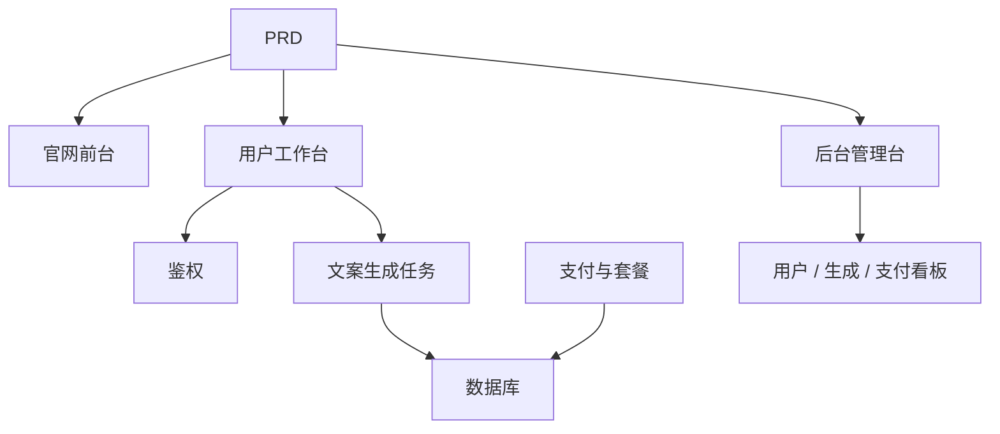

# AI 营销文案 SaaS 开发实战

## 概述

本实战项目要求你围绕一份真实的 PRD，从零完成一个面向独立开发者和内容团队的 AI 营销文案 SaaS 产品。你将使用 Supabase 作为后端服务、Stripe 作为支付系统，完成从需求分析到部署上线的全过程。

这是 Stage 2 的综合实战环节。在前面几章中，你已经分别学习了前端页面搭建、后端接口开发、数据库操作、支付集成等单项技能——这个项目要求你把它们全部串起来，交付一个可运行的产品原型。

## 前置知识

在开始本项目之前，你应该已经掌握以下内容：

- 前端页面设计与组件库使用（[UI 设计](../../frontend/ui-design/)、[现代组件库](../../frontend/modern-component-library/)）
- 后端接口设计与开发（[接口代码编写](../../backend/ai-interface-code/)）
- 数据库基础与 Supabase（[从数据库到 Supabase](../../backend/database-supabase/)）
- 支付集成（[Stripe 收费系统](../../backend/stripe-payment/)）
- Git 工作流与部署（[Git 和 GitHub](../../backend/git-workflow/)、[部署 Web 应用](../../backend/zeabur-deployment/)）

## 学习目标

完成本实战后，你将能够：

1. 阅读并理解一份真实的 PRD，从中提取开发任务清单
2. 使用 AI 辅助分步生成前端页面和后端接口
3. 使用 Supabase 实现用户鉴权、数据库操作
4. 集成 Stripe 实现付费订阅功能
5. 搭建管理后台并完成端到端联调

## 项目简介

你要构建的产品是一个 AI 营销文案 SaaS，包含三个子系统：

| 子系统 | 职责 |
|--------|------|
| **官网前台** | 产品介绍、定价、FAQ、注册转化 |
| **用户工作台** | 输入产品信息、生成文案、查看历史、升级套餐 |
| **后台管理台** | 用户管理、生成记录、支付数据、运营概览 |

后端使用 Supabase 提供数据库和鉴权能力，使用 Stripe 处理支付，使用 AI 模型生成营销文案。

::: tip PRD 入口
本项目的需求文档在 GitHub： [查看 PRD](https://github.com/datawhalechina/easy-vibe/blob/main/docs/zh-cn/stage-2/assignments/copywriting-platform-supabase/PRD.md)
:::

<div style="margin: 32px 0;">
  <ClientOnly>
    <StepBar :active="0" :items="[
      { title: '需求分析', description: '阅读 PRD，明确页面、功能、鉴权、支付范围' },
      { title: '搭建骨架', description: '用 AI 生成三套前端骨架（www / app / admin）' },
      { title: '后端集成', description: 'Supabase 鉴权、生成接口、Stripe 支付' },
      { title: '联调上线', description: '端到端跑通，部署并准备演示' }
    ]" />
  </ClientOnly>
</div>

## 第一部分：需求分析

### 1.1 阅读 PRD

打开 PRD 文档，重点回答以下问题：

- 系统有几个入口？各自覆盖哪些页面？
- 每个页面的核心功能是什么？
- 后端包含哪些模块和数据表？
- 套餐定价、支付流程、免费额度如何设计？
- MVP 范围是什么？第一版哪些做，哪些不做？

::: warning
如果以上问题没有明确答案，不要开始写代码。需求理解不清楚是导致返工的最常见原因。
:::

### 1.2 确认系统架构

根据 PRD 梳理出系统的整体架构：



## 第二部分：搭建项目骨架

### 2.1 生成前端页面

使用 AI 先生成所有页面的基本结构和假数据。

提示词参考：

```text
请基于当前 PRD，帮我生成一个 AI 营销文案 SaaS 的前端骨架。

要求：
1. 分成三个入口：www、app、admin
2. 官网包括：首页、定价、FAQ
3. app 包括：登录、注册、生成工作台、历史记录、套餐页
4. admin 包括：后台首页、用户管理、生成记录、支付订单
5. 先只生成页面结构和假数据，不接真实接口
6. 风格要像现代 SaaS，不像课堂 demo
```

### 2.2 完善核心页面

骨架搭好后，重点完善文案生成工作台（Dashboard）页面：

```text
请继续完善 /dashboard 页面。

这是一个 AI 营销文案工作台。

左侧表单字段：
- 产品名
- 一句话介绍
- 目标用户
- 3 个卖点
- 投放渠道（官网、朋友圈、小红书、抖音、邮件）

右侧结果区域预留：
- 主标题
- 副标题
- CTA
- 3 版短文案
- 长文案

先用 mock 数据跑通交互。

要求：
- 点击"生成文案"后有 loading 状态
- 结果区域设计空状态
- 响应式布局，宽屏窄屏都能正常显示
```

### 2.3 验证页面结构

逐项检查：

- [ ] 三个入口的路由是否独立
- [ ] 页面数量是否与 PRD 一致
- [ ] Dashboard 的表单和结果区域布局合理
- [ ] 假数据展示了基本的 UI 状态

### 遇到阻碍？

如果你在前端搭建阶段卡住，可以回顾这些章节：

- [UI 设计](../../frontend/ui-design/)
- [参考 UI 设计规范设计页面和按钮](../../frontend/multi-product-ui/)
- [用 LLM 和 Skills 让界面变好看](../../frontend/llm-skills-beautiful/)
- [从设计原型到项目代码](../../frontend/design-to-code/)
- [使用现代组件库更新你的界面](../../frontend/modern-component-library/)

## 第三部分：后端集成

### 3.1 接入 Supabase 登录

```text
请把我当成 0 基础，一步一步带我完成 Supabase 登录接入。

需要你帮我完成：
1. 项目接入 Supabase
2. 实现注册、登录、退出功能
3. 登录成功后跳转到 /dashboard
4. 未登录用户访问 /dashboard、/billing、/admin 时自动跳转 /login
5. 创建 profiles 表
6. 用户注册成功后自动在 profiles 表创建记录
7. profiles 表包含 email、role、plan 字段

实现要求：
- 每步都说明在修改哪些文件
- 密钥不要硬编码
- 需要在 Supabase 后台手动操作的地方请明确标注
- 完成后说明如何验证注册和登录
```

### 3.2 接入生成接口和数据库

```text
请把我当成 0 基础，帮我完成网站的核心功能：生成营销文案并保存。

目标效果：
1. 用户在 /dashboard 填写表单，点击"生成文案"
2. 后端接收：产品名、介绍、目标用户、卖点、投放渠道
3. 后端调用模型生成结果
4. 页面展示生成结果
5. 输入和输出都保存到数据库
6. 用户下次进入可查看历史记录

需要你完成：
- 创建生成接口 /api/generate
- 创建 generations 表
- 设计输入和输出字段
- Dashboard 页面读取当前用户的历史记录

用户体验：
- 按钮 loading 状态
- 生成失败时的错误提示
- 无历史记录时的空状态

完成后请说明：
- 前端页面文件位置
- 后端接口文件位置
- 数据写入数据库的逻辑位置
- 如何测试完整生成链路
```

### 3.3 接入 Stripe 付费

```text
请把我当成 0 基础，帮我给 LaunchKit 加上最简可用的 Stripe 付费。

不需要复杂系统，先跑通最基本的付费链路。

需要你完成：
1. /billing 页面展示 free 和 pro 两个套餐
2. 用户点击升级后跳转 Stripe Checkout
3. 支付成功后返回网站
4. 支付结果保存到 subscriptions 表
5. 同步更新 profile.plan 字段
6. free 用户每日限 3 次生成，pro 用户不限

实现原则：
- 先跑通主流程，暂不考虑复杂边界
- 需要在 Stripe 后台配置的地方请写清楚
- 完成后说明如何测试完整支付流程
```

### 3.4 搭建管理后台

```text
请把我当成 0 基础，帮我做一个简洁可用的管理后台。

仅限管理员访问。

需要你完成：
1. 仅 role = admin 的用户可访问 /admin
2. 后台包含 3 个 Tab：用户列表、生成记录、订阅状态
3. 用户列表显示：email、plan、创建时间
4. 生成记录显示：用户、产品名、渠道、创建时间
5. 订阅状态显示：用户、套餐、支付状态

要求：
- 界面简洁清晰
- 使用现有组件库的表格、Tab、Badge
- 完成后说明如何将账号设为 admin
```

### 遇到阻碍？

如果你在后端开发阶段卡住，可以回顾这些章节：

- [从数据库到 Supabase](../../backend/database-supabase/)
- [大模型辅助编写接口代码与接口文档](../../backend/ai-interface-code/)
- [如何集成 Stripe 等收费系统](../../backend/stripe-payment/)

## 第四部分：联调与上线

### 4.1 端到端测试

至少验证以下场景：

- 注册 → 登录 → 生成文案 → 查看历史 → 升级套餐
- 管理员登录 → 查看用户数据 → 查看生成记录 → 查看支付状态

部署前检查：

```text
请把我当成 0 基础，帮我检查项目是否具备部署条件。

检查重点：
- 环境变量是否完整
- 登录回调地址是否正确
- Stripe 支付回调地址是否正确
- 页面是否缺少 loading、空状态、错误提示
- README 是否包含启动说明和部署说明

需要你：
1. 按优先级列出待修复事项
2. 标注哪些必须先修
3. 说明修复后的部署步骤
```

### 4.2 部署

将项目部署到公网环境。部署教程参考：[Git 和 GitHub 工作流](../../backend/git-workflow/)、[如何部署 Web 应用](../../backend/zeabur-deployment/)。

## 交付物

完成本项目后，你需要提交以下内容：

- [ ] 可访问的线上演示链接
- [ ] 源码仓库链接（含 README）
- [ ] PRD 文档
- [ ] 核心页面截图（首页、Dashboard、Billing、Admin）
- [ ] 60 秒演示视频（覆盖注册 → 生成 → 支付 → 后台）

README 至少包含：项目简介、核心页面说明、技术栈、本地启动步骤、环境变量清单。

## 评分标准

| 维度 | 基本要求 | 进阶要求 |
|------|---------|---------|
| 产品完整度 | 首页、登录、Dashboard、Billing、Admin 都能访问 | 首页文案和视觉风格像真实 SaaS |
| 业务闭环 | 注册 → 登录 → 生成 → 查看历史可以跑通 | 免费/Pro 权限差异清晰可见 |
| 数据正确性 | 生成结果和支付状态都写入数据库 | 有明确的错误提示、空状态和 loading |
| 权限与安全 | 未登录不能访问受保护页面，普通用户不能进 Admin | 有基本的输入校验和服务端鉴权 |
| 工程交付 | 项目可本地启动，也可部署到公网 | README 清楚，演示视频结构完整 |

::: tip
如果你觉得任务太大，记住一个原则：**先保证"能跑通"，再去追求"做漂亮"。**
:::

## 提交前检查

<el-card shadow="hover" style="margin: 20px 0; border-radius: 12px;">
  <template #header>
    <div style="font-weight: bold; font-size: 16px;">提交前最后看一眼</div>
  </template>

  <ul style="list-style-type: none; padding-left: 0;">
    <li><label><input type="checkbox" disabled /> 首页、登录页、Dashboard、Billing、Admin 均已完成</label></li>
    <li><label><input type="checkbox" disabled /> 用户可以注册、登录、退出</label></li>
    <li><label><input type="checkbox" disabled /> 生成结果真实写入数据库</label></li>
    <li><label><input type="checkbox" disabled /> 支付主流程已跑通</label></li>
    <li><label><input type="checkbox" disabled /> 管理员可查看用户、生成记录和支付状态</label></li>
    <li><label><input type="checkbox" disabled /> 项目已部署到公网</label></li>
  </ul>
</el-card>

## 参考资料

- [UI 设计](../../frontend/ui-design/)
- [参考 UI 设计规范设计页面和按钮](../../frontend/multi-product-ui/)
- [用 LLM 和 Skills 让界面变好看](../../frontend/llm-skills-beautiful/)
- [从设计原型到项目代码](../../frontend/design-to-code/)
- [使用现代组件库更新你的界面](../../frontend/modern-component-library/)
- [从数据库到 Supabase](../../backend/database-supabase/)
- [大模型辅助编写接口代码与接口文档](../../backend/ai-interface-code/)
- [Git 和 GitHub 工作流](../../backend/git-workflow/)
- [如何部署 Web 应用](../../backend/zeabur-deployment/)
- [如何集成 Stripe 等收费系统](../../backend/stripe-payment/)
