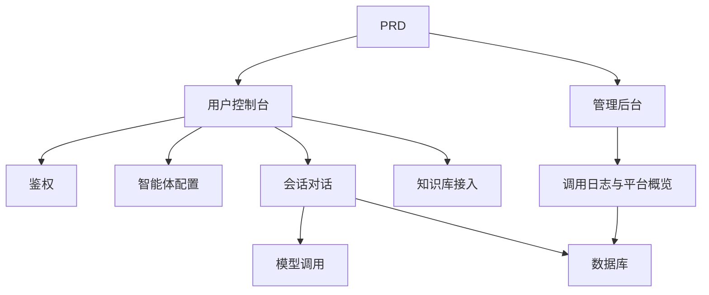

# 类 Dify 智能体平台开发实战

## 概述

本实战项目要求你围绕一份真实的 PRD，从零完成一个模仿 Dify 核心体验的智能体平台。你将构建用户控制台、管理后台和平台后端，实现智能体管理、对话、日志和知识库等核心功能。

这是 Stage 2 的综合实战环节。与前面的单页面或单功能项目不同，这个项目要求你构建一个有"平台感"的 AI 产品——包含多角色、多模块、数据持久化和模型调用链路。

## 前置知识

在开始本项目之前，你应该已经掌握以下内容：

- 前端页面设计与组件库使用（[UI 设计](../../frontend/ui-design/)、[现代组件库](../../frontend/modern-component-library/)）
- 后端接口设计与开发（[接口代码编写](../../backend/ai-interface-code/)）
- 数据库基础与 Supabase（[从数据库到 Supabase](../../backend/database-supabase/)）
- Git 工作流与部署（[Git 和 GitHub](../../backend/git-workflow/)、[部署 Web 应用](../../backend/zeabur-deployment/)）

## 学习目标

完成本实战后，你将能够：

1. 阅读并理解一份真实的 PRD，从中提取开发任务清单
2. 设计智能体平台的页面架构和数据模型
3. 实现智能体创建、对话、日志记录的完整链路
4. 使用 AI 辅助完成平台型产品开发
5. 完成端到端联调，交付一个可演示的 AI 平台原型

## 项目简介

你要构建的产品是一个类 Dify 智能体平台，包含两个子系统：

| 子系统 | 职责 |
|--------|------|
| **用户控制台** | 创建智能体、配置 Prompt、发起对话、查看日志、管理知识库 |
| **管理后台** | 查看用户数据、平台资源使用情况、调用统计 |

后端需要支持以下核心能力：智能体管理、会话管理、消息存储、模型调用、调用日志记录、知识库接入。

::: tip PRD 入口
本项目的需求文档在 GitHub： [查看 PRD](https://github.com/datawhalechina/easy-vibe/blob/main/docs/zh-cn/stage-2/assignments/custom-dify-agent-platform/PRD.md)
:::

<div style="margin: 32px 0;">
  <ClientOnly>
    <StepBar :active="0" :items="[
      { title: '需求分析', description: '阅读 PRD，明确页面、能力边界、鉴权、数据模型' },
      { title: '搭建骨架', description: '用 AI 生成用户控制台和管理后台骨架' },
      { title: '迭代开发', description: '逐模块补充智能体、对话、日志、知识库' },
      { title: '联调上线', description: '端到端跑通，部署并准备演示' }
    ]" />
  </ClientOnly>
</div>

## 第一部分：需求分析

### 1.1 阅读 PRD

打开 PRD 文档，重点回答以下问题：

- 智能体、会话、日志、知识库哪些要进 MVP？
- 页面和路由清单是否拍板？
- 模型调用和日志记录的边界是什么？
- 多租户和复杂工作流是否先不做？

::: warning
如果以上问题没有明确答案，不要开始写代码。需求理解不清楚是导致返工的最常见原因。
:::

### 1.2 确认系统架构

根据 PRD 梳理出系统的整体架构：



## 第二部分：搭建项目骨架

### 2.1 生成前端页面

提示词参考：

```text
请基于当前 PRD，帮我生成一个类 Dify 智能体平台的前端骨架。

要求：
1. 用户侧包括：登录、智能体列表、智能体配置、对话页、日志页、知识库页
2. 后台侧包括：后台首页、用户概览、资源使用概览
3. 先只生成页面结构和假数据，不接真实接口
4. 风格要像现代 AI 平台
```

### 2.2 验证页面结构

逐项检查：

- [ ] 用户控制台和管理后台入口是否分开
- [ ] 智能体列表、配置、对话、日志、知识库页面是否完整
- [ ] 管理后台首页、用户概览页面是否可访问
- [ ] 假数据展示了基本的 UI 状态

## 第三部分：迭代开发

### 3.1 按模块推进

在骨架的基础上，按以下顺序逐模块补充功能：

1. **鉴权**：注册、登录、角色区分
2. **智能体管理**：创建、编辑、删除、Prompt 配置
3. **对话功能**：会话创建、消息收发、模型调用
4. **日志记录**：耗时、token 用量、错误记录
5. **知识库接入**（加分项）：文档上传、检索、结果注入
6. **管理后台**：用户数据、资源使用、调用统计

每完成一个模块，使用下表进行自检：

| 检查项 | 验证方法 |
|--------|----------|
| 页面一致性 | 页面数量、功能是否符合 PRD |
| 接口闭环 | agents、chat、logs、knowledge 接口是否完整 |
| 权限隔离 | 用户是否只能管理自己的 agent 和会话 |
| 数据一致性 | messages、logs、documents 数据是否对得上 |
| 可演示性 | 是否能演示"创建 agent → 对话 → 查看日志"完整链路 |

### 3.2 知识库接入（加分项）

如果你想增加知识库能力，可以给每个智能体增加一个"知识库开关"：

- 开启后先检索知识片段，再和用户问题一起发送给模型
- 关闭后按普通对话模式响应

第一版不必追求复杂 RAG，只要有"检索结果可见、调用链路可解释"即可。

## 第四部分：联调与上线

### 4.1 端到端测试

至少验证以下场景：

- 注册 → 创建智能体 → 配置 Prompt → 发起对话 → 查看日志
- 管理员登录 → 查看用户数据 → 查看调用统计

部署前检查：

- [ ] 所有核心接口都做了登录校验
- [ ] 智能体归属权限检查通过
- [ ] 会话记录、日志记录真实落库
- [ ] 模型 Key 使用环境变量，不硬编码
- [ ] 错误提示可在前端看到，不只打控制台

### 4.2 部署

将项目部署到公网环境。部署教程参考：[Git 和 GitHub 工作流](../../backend/git-workflow/)、[如何部署 Web 应用](../../backend/zeabur-deployment/)。

## 交付物

完成本项目后，你需要提交以下内容：

- [ ] 可访问的线上演示链接
- [ ] 源码仓库链接（含 README）
- [ ] PRD 文档
- [ ] 核心页面截图（智能体管理页、对话页、日志页、后台首页）
- [ ] 60 秒演示视频（覆盖创建智能体 → 对话 → 查看日志）

README 至少包含：项目简介、架构说明、技术栈、本地启动步骤、环境变量清单、接口说明。

## 评分标准

| 维度 | 基本要求 | 进阶要求 |
|------|---------|---------|
| 平台完整度 | agents / chat / logs 三页可用 | 有清晰导航与统一设计语言 |
| 业务闭环 | 可创建智能体并真实对话 | 支持多智能体切换与历史会话 |
| 数据与追踪 | 消息与调用日志可查询 | 有 token / 耗时统计看板 |
| 权限安全 | 仅登录用户可访问核心接口 | 资源归属校验完善 |
| 工程交付 | 可部署、可演示、README 清晰 | 接入知识库并可解释检索结果 |

## 提交前检查

<el-card shadow="hover" style="margin: 20px 0; border-radius: 12px;">
  <template #header>
    <div style="font-weight: bold; font-size: 16px;">提交前最后看一眼</div>
  </template>

  <ul style="list-style-type: none; padding-left: 0;">
    <li><label><input type="checkbox" disabled /> 登录后可访问智能体管理、对话、日志页面</label></li>
    <li><label><input type="checkbox" disabled /> 至少可以创建 1 个智能体并成功对话</label></li>
    <li><label><input type="checkbox" disabled /> 每轮问答都能在数据库查到记录</label></li>
    <li><label><input type="checkbox" disabled /> 调用失败时前端可见错误信息且日志已记录</label></li>
    <li><label><input type="checkbox" disabled /> 项目已部署，README 和演示视频齐全</label></li>
  </ul>
</el-card>

## 参考资料

- [UI 设计](../../frontend/ui-design/)
- [使用现代组件库更新你的界面](../../frontend/modern-component-library/)
- [从数据库到 Supabase](../../backend/database-supabase/)
- [大模型辅助编写接口代码与接口文档](../../backend/ai-interface-code/)
- [Git 和 GitHub 工作流](../../backend/git-workflow/)
- [如何部署 Web 应用](../../backend/zeabur-deployment/)
