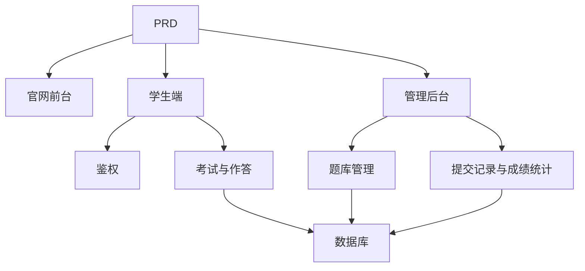

# 在线考试与管理系统开发实战

## 概述

本实战项目要求你围绕一份真实的 PRD，从零完成一个在线考试与管理系统。这个项目的特别之处在于它包含多个角色（学生和管理员），每个角色看到的页面和能执行的操作不同。你将使用 Express 构建后端，实现完整的考试业务链路。

这是 Stage 2 的综合实战环节。多角色权限系统在实际工作中非常常见，掌握这种模式后，你能够应对教培、SaaS、后台管理等各类业务场景。

## 前置知识

在开始本项目之前，你应该已经掌握以下内容：

- 前端页面设计与组件库使用（[UI 设计](../../frontend/ui-design/)、[现代组件库](../../frontend/modern-component-library/)）
- 后端接口设计与开发（[接口代码编写](../../backend/ai-interface-code/)）
- 数据库基础与 Supabase（[从数据库到 Supabase](../../backend/database-supabase/)）
- Git 工作流与部署（[Git 和 GitHub](../../backend/git-workflow/)、[部署 Web 应用](../../backend/zeabur-deployment/)）

## 学习目标

完成本实战后，你将能够：

1. 阅读并理解一份真实的 PRD，从中提取开发任务清单
2. 设计多角色系统的权限控制和页面路由
3. 使用 Express 实现完整的后端 API
4. 实现考试、提交、自动判分的业务链路
5. 完成端到端联调，交付一个可演示的业务系统原型

## 项目简介

你要构建的产品是一个在线考试与管理系统，包含三个子系统：

| 子系统 | 职责 |
|--------|------|
| **官网前台** | 平台介绍、登录入口 |
| **学生端** | 考试列表、答题、提交、成绩查看 |
| **管理后台** | 题库管理、考试管理、提交记录、成绩统计 |

后端使用 Express，需要支持：登录鉴权、角色权限、考试和题库管理、提交流程与自动判分、成绩和统计管理。

::: tip PRD 入口
本项目的需求文档在 GitHub： [查看 PRD](https://github.com/datawhalechina/easy-vibe/blob/main/docs/zh-cn/stage-2/assignments/exam-management-express/PRD.md)
:::

<div style="margin: 32px 0;">
  <ClientOnly>
    <StepBar :active="0" :items="[
      { title: '需求分析', description: '阅读 PRD，明确角色、页面、考试链路和数据模型' },
      { title: '搭建骨架', description: '用 AI 生成学生端和管理端页面骨架' },
      { title: '后端开发', description: 'Express 接通登录、考试、提交、判分' },
      { title: '联调上线', description: '端到端跑通，部署并准备演示' }
    ]" />
  </ClientOnly>
</div>

## 第一部分：需求分析

### 1.1 阅读 PRD

打开 PRD 文档，重点回答以下问题：

- 系统包含哪几个角色？各自能做什么？
- 页面清单是否完整？学生端和管理端分别有哪些页面？
- 支持哪些题型？每种题型的判分逻辑是什么？
- 考试的完整流程是什么？（发布 → 开始 → 作答 → 提交 → 判分 → 查看成绩）

::: warning
如果以上问题没有明确答案，不要开始写代码。需求理解不清楚是导致返工的最常见原因。
:::

### 1.2 确认系统架构

根据 PRD 梳理出系统的整体架构：



## 第二部分：搭建项目骨架

### 2.1 生成前端页面

提示词参考：

```text
请基于当前 PRD，帮我生成一个在线考试与管理系统的前端骨架。

技术栈要求：
- Next.js App Router
- TypeScript
- Tailwind CSS
- shadcn/ui

页面清单：
1. 首页 /
2. 登录页 /login
3. 学生考试列表页 /student/exams
4. 学生答题页 /student/exams/[id]
5. 学生成绩页 /student/history
6. 管理后台首页 /admin
7. 考试管理页 /admin/exams
8. 题库管理页 /admin/questions
9. 提交记录页 /admin/submissions

要求：
- 学生端页面强调清晰、专注、易答题
- 管理端页面使用侧边栏 + 顶部栏布局
- 先使用 mock 数据，不接真实接口
- 注意桌面端和移动端的基本可用性
```

### 2.2 完善学生答题页

答题页是学生端的核心页面，重点完善：

```text
请继续完善学生答题页。

这是一个在线考试系统的答题页面，需要包含：
- 顶部显示考试标题、倒计时、已答题数量
- 中间显示题干和选项
- 支持单选、判断、简答三种题型
- 左侧或顶部有答题卡，显示每道题是否已作答
- 点击提交前弹出确认框

先用 mock 数据实现交互，不接真实接口。

要求：
- 界面简洁，不要像后台表格页
- 倒计时要醒目，但不要制造过强压迫感
- 有空状态和 loading 状态
```

### 2.3 完善管理员后台

管理员后台第一版聚焦三个核心区域：

- **考试管理**：创建考试、设置时长、发布状态
- **题库管理**：新增题目、编辑题目、按题型筛选
- **提交记录**：查看学生提交、分数、时间

### 2.4 验证页面结构

逐项检查：

- [ ] 学生端和管理端入口是否分开
- [ ] 登录页、考试列表、答题页、成绩页是否完整
- [ ] 管理端题库、考试管理、提交记录页是否可访问
- [ ] 学生端和管理端的页面风格有明显区分

### 遇到阻碍？

如果你在前端搭建阶段卡住，可以回顾这些章节：

- [从数据库到 Supabase](../../backend/database-supabase/)
- [应用后端接口设计与开发](../../backend/ai-interface-code/)
- [使用现代组件库更新你的界面](../../frontend/modern-component-library/)

## 第三部分：后端开发

### 3.1 登录与权限控制

```text
请把我当成 0 基础，帮我完成在线考试系统的登录与权限控制。

后端使用 Express。

目标：
1. 学生和管理员都可以登录
2. 登录后返回用户角色
3. 学生只能访问 /student/* 相关接口
4. 管理员只能访问 /admin/* 相关接口
5. 未登录用户访问受保护页面时跳转 /login

实现要求：
- 给出清晰的目录结构建议
- 明确说明中间件负责什么
- 涉及环境变量的地方不要硬编码
- 完成后说明如何验证权限是否生效
```

### 3.2 考试与题库管理接口

建议按以下模块实现：

| 模块 | 推荐接口 |
|------|----------|
| 考试管理 | `GET /api/exams`、`POST /api/admin/exams`、`PATCH /api/admin/exams/:id` |
| 题库管理 | `GET /api/admin/questions`、`POST /api/admin/questions` |
| 开始考试 | `POST /api/submissions/start` |
| 提交试卷 | `POST /api/submissions/:id/submit` |
| 成绩记录 | `GET /api/student/history`、`GET /api/admin/submissions` |

提示词参考：

```text
请帮我为在线考试系统设计并实现 Express API。

功能范围：
- 管理员创建考试
- 管理员维护题库
- 学生查看已发布考试
- 学生开始考试并创建 submission
- 学生提交答案后自动判分单选题和判断题
- 简答题先标记为待复核
- 学生查看自己的历史成绩
- 管理员查看所有提交记录

要求：
- 接口命名清晰
- 返回统一 JSON 结构
- 代码中区分 controller、service、middleware、db 层
- 说明每个接口如何测试
```

### 3.3 判分逻辑

判分逻辑是考试系统的核心业务规则：

- **单选题**：用户答案与标准答案一致则得分
- **判断题**：同样可以自动判分
- **简答题**：第一版先只保存答案，分数为空，状态为 `reviewed = false`

::: tip 加分项
如果你想增加 AI 能力，可以让管理员在后台输入"主题 + 难度"，由模型先生成一批候选题，再人工审核后入库。但这属于加分项，不是必须的。
:::

## 第四部分：联调与上线

### 4.1 端到端测试

至少验证以下场景：

- 学生登录 → 查看考试列表 → 开始答题 → 提交 → 查看成绩
- 管理员登录 → 创建考试 → 添加题目 → 发布 → 查看提交记录

### 4.2 部署

- 前端部署到 Vercel / Zeabur
- Express API 部署到 Zeabur / Railway / Render
- 数据库用 Supabase Postgres 或托管 PostgreSQL

部署前检查：

- [ ] 环境变量是否齐全
- [ ] 前后端 API 地址是否正确
- [ ] 登录态在生产环境是否正常
- [ ] 管理员账号是否能真实访问后台
- [ ] README 是否包含启动、部署、测试说明

## 交付物

完成本项目后，你需要提交以下内容：

- [ ] 可访问的线上演示链接
- [ ] 源码仓库链接（含 README）
- [ ] PRD 文档
- [ ] 核心页面截图（首页、学生考试列表、答题页、管理后台）
- [ ] 60 秒演示视频（覆盖学生答题流程和管理员管理流程）

README 至少包含：项目简介、核心页面说明、技术栈、本地启动步骤、环境变量清单。

## 评分标准

| 维度 | 基本要求 | 进阶要求 |
|------|---------|---------|
| 页面完整度 | 学生端和管理端主要页面都可访问 | 页面风格统一，移动端基本可用 |
| 业务闭环 | 学生可登录、参加考试、提交并查看成绩 | 管理员可完整创建并发布考试 |
| 数据正确性 | 提交答案后能写入数据库，客观题能自动判分 | 简答题支持人工复核或 AI 辅助 |
| 权限控制 | 学生与管理员访问边界清晰 | 服务端接口也有角色校验 |
| 工程交付 | 项目可运行、可部署、README 清晰 | 有演示视频和测试说明 |

## 提交前检查

<el-card shadow="hover" style="margin: 20px 0; border-radius: 12px;">
  <template #header>
    <div style="font-weight: bold; font-size: 16px;">提交前最后看一眼</div>
  </template>

  <ul style="list-style-type: none; padding-left: 0;">
    <li><label><input type="checkbox" disabled /> 首页、登录页、学生端、管理端页面均已完成</label></li>
    <li><label><input type="checkbox" disabled /> 学生可以正常开始考试并提交答案</label></li>
    <li><label><input type="checkbox" disabled /> 管理员可以创建考试并查看提交记录</label></li>
    <li><label><input type="checkbox" disabled /> 客观题分数能够自动计算并写入数据库</label></li>
    <li><label><input type="checkbox" disabled /> 学生与管理员权限边界已验证</label></li>
    <li><label><input type="checkbox" disabled /> 项目已部署或具备完整本地运行说明</label></li>
  </ul>
</el-card>

## 参考资料

- [UI 设计](../../frontend/ui-design/)
- [使用现代组件库更新你的界面](../../frontend/modern-component-library/)
- [从数据库到 Supabase](../../backend/database-supabase/)
- [大模型辅助编写接口代码与接口文档](../../backend/ai-interface-code/)
- [Git 和 GitHub 工作流](../../backend/git-workflow/)
- [如何部署 Web 应用](../../backend/zeabur-deployment/)
