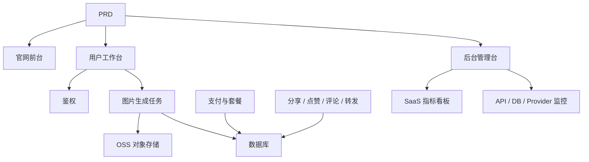

# 现代 AI 生图 SaaS 开发实战

## 概述

本实战项目要求你围绕一份真实的 PRD（产品需求文档），从零完成一个参考 Midjourney 体验的 AI 生图 SaaS 产品。你将完整经历需求分析、项目拆解、迭代开发、联调上线的全过程。

这是 Stage 2 的综合实战环节。在前面几章中，你已经分别学习了前端页面设计、后端接口开发、数据库操作、支付集成等单项技能——这个项目要求你把它们全部串起来，交付一个可运行的产品原型。

## 前置知识

在开始本项目之前，你应该已经掌握以下内容：

- 前端页面设计与组件库使用（[UI 设计](../../frontend/ui-design/)、[现代组件库](../../frontend/modern-component-library/)）
- 后端接口设计与开发（[接口代码编写](../../backend/ai-interface-code/)）
- 数据库基础与 Supabase（[从数据库到 Supabase](../../backend/database-supabase/)）
- 支付集成（[Stripe 收费系统](../../backend/stripe-payment/)）
- Git 工作流与部署（[Git 和 GitHub](../../backend/git-workflow/)、[部署 Web 应用](../../backend/zeabur-deployment/)）

## 学习目标

完成本实战后，你将能够：

1. 阅读并理解一份真实的 PRD，从中提取开发任务清单
2. 基于 PRD 拆分模块，制定分步推进计划
3. 使用 AI 辅助完成前端骨架搭建和后端接口开发
4. 对每个模块进行验证和迭代优化
5. 完成端到端联调，将项目从"能跑"推进到"能交付"

## 项目简介

你要构建的产品是一个现代 AI 生图 SaaS 平台，包含三个子系统：

| 子系统 | 职责 |
|--------|------|
| **官网前台** | 产品介绍、定价、FAQ、注册转化 |
| **用户工作台** | Prompt 输入、图片生成、图库、积分、套餐、社区互动 |
| **后台管理台** | 用户管理、任务管理、支付管理、内容审核、SaaS 指标、系统监控 |

后端需要支持以下核心能力：用户鉴权、图片生成任务、OSS 对象存储、积分与套餐支付、图片社交互动、运营数据监控。

::: tip PRD 入口
本项目的需求文档在 GitHub： [查看 PRD](https://github.com/datawhalechina/easy-vibe/blob/main/docs/zh-cn/stage-2/assignments/modern-landing-page/PRD.md)
:::

<div style="margin: 32px 0;">
  <ClientOnly>
    <StepBar :active="0" :items="[
      { title: '需求分析', description: '阅读 PRD，提取页面、模块、数据模型和边界' },
      { title: '搭建骨架', description: '用 AI 生成三套前端骨架（www / app / admin）' },
      { title: '迭代开发', description: '逐模块补充接口、权限、支付、监控' },
      { title: '联调上线', description: '端到端跑通，部署并准备演示' }
    ]" />
  </ClientOnly>
</div>

## 第一部分：需求分析

### 1.1 阅读 PRD

打开 PRD 文档，重点回答以下问题：

- 系统有几个入口？各自覆盖哪些页面？
- 每个页面的核心功能是什么？
- 后端包含哪些模块和数据库表？
- MVP 范围是什么？第一版哪些做，哪些不做？

::: warning
如果以上问题没有明确答案，不要开始写代码。需求理解不清楚是导致返工的最常见原因。
:::

### 1.2 确认系统架构

根据 PRD 中的描述，梳理出系统的整体架构：



建议你用自己的话把架构图画一遍，确认你对系统的理解是完整的。

## 第二部分：搭建项目骨架

### 2.1 生成前端页面

使用 AI 先生成所有页面的基本结构和假数据。这一步的目标是搭出信息架构和路由，不需要接真实接口。

提示词参考：

```text
请基于当前 PRD，帮我生成一个现代 AI 生图 SaaS 的前端骨架。

要求：
1. 分成三个入口：www、app、admin
2. 官网包括：首页、定价、FAQ
3. app 包括：登录、注册、生成工作台、图库、套餐、积分、社区、作品详情、个人中心
4. admin 包括：后台首页、用户管理、任务管理、内容管理、套餐管理、支付订单、运营配置、SaaS 指标、系统监控
5. 先只生成页面结构和假数据，不接真实接口
6. 风格参考 Midjourney，简洁、现代、带产品感
```

### 2.2 验证页面结构

骨架生成后，逐项检查：

- [ ] 三个入口的路由是否独立（`/`、`/app`、`/admin`）
- [ ] 页面数量是否与 PRD 一致
- [ ] 每个页面是否可以正常访问和导航
- [ ] 假数据是否展示了基本的 UI 状态（列表、空状态、表单等）

## 第三部分：迭代开发

### 3.1 按模块推进

在骨架的基础上，按以下顺序逐模块补充功能：

1. **鉴权**：注册、登录、角色区分
2. **数据库**：数据表创建、读写接口
3. **核心业务**：图片生成任务、结果存储
4. **OSS 存储**：图片上传与访问
5. **支付**：套餐、积分、Stripe 集成
6. **社交互动**：分享、点赞、评论
7. **后台管理**：用户管理、任务管理、内容审核
8. **数据监控**：SaaS 指标看板、系统监控

每完成一个模块，使用下表进行自检：

| 检查项 | 验证方法 |
|--------|----------|
| 页面一致性 | 页面数量、入口、功能是否符合 PRD |
| 接口正确性 | 请求参数、返回结构、状态处理是否合理 |
| 权限隔离 | 普通用户和管理员是否互相隔离 |
| 数据一致性 | 数据库、OSS、支付、积分是否对得上 |
| 可演示性 | 是否能给别人完整演示一条业务链路 |

::: tip
如果发现 AI 生成的内容偏离了 PRD，不要整页推翻重来，直接让它修改具体模块即可。
:::

### 3.2 角色与分工

在迭代过程中，你需要同时扮演三个角色：

- **产品经理**：确认每个模块的功能是否符合 PRD
- **技术负责人**：确认实现方案是否合理
- **测试工程师**：确认功能是否跑得通

## 第四部分：联调与上线

### 4.1 端到端测试

最后阶段的重点不是补新页面，而是把完整业务链路跑通。至少验证以下场景：

- 注册 → 购买积分 → 生成图片 → 查看历史 → 分享互动
- 管理员登录 → 查看用户数据 → 查看任务统计 → 查看系统监控

### 4.2 部署

将项目部署到公网环境，确保：

- 环境变量配置完整
- 登录回调地址正确
- 支付回调地址正确
- 页面无缺失的 loading、空状态、错误提示

部署教程参考：[Git 和 GitHub 工作流](../../backend/git-workflow/)、[如何部署 Web 应用](../../backend/zeabur-deployment/)。

## 交付物

完成本项目后，你需要提交以下内容：

- [ ] 可访问的线上演示链接
- [ ] 源码仓库链接（含 README）
- [ ] PRD 文档
- [ ] 核心页面截图（官网首页、生图工作台、图库、套餐页、后台首页）
- [ ] 60 秒演示视频（覆盖注册 → 生成 → 查看 → 后台管理）

README 至少包含：项目简介、核心页面说明、技术栈、本地启动步骤、环境变量清单。

## 评分标准

| 维度 | 基本要求 | 进阶要求 |
|------|---------|---------|
| PRD 对齐 | 页面、功能、数据结构基本符合 PRD | 能清晰说明每个设计决策与 PRD 的对应关系 |
| 产品闭环 | 注册 → 购买积分 → 生成图片 → 查看历史 → 分享互动可跑通 | 支付状态、积分余额、生成次数数据一致 |
| 后台能力 | 用户、任务、支付、内容管理可查看 | SaaS 指标看板和系统监控页完整可用 |
| 工程完整度 | 前端、后端、数据库、OSS、支付链路已接通 | 有错误处理、空状态、loading 状态 |
| 交付质量 | 可部署、可运行 | README 清楚、演示视频结构完整 |

## 参考资料

- [UI 设计](../../frontend/ui-design/)
- [参考 UI 设计规范设计页面和按钮](../../frontend/multi-product-ui/)
- [用 LLM 和 Skills 让界面变好看](../../frontend/llm-skills-beautiful/)
- [从设计原型到项目代码](../../frontend/design-to-code/)
- [使用现代组件库更新你的界面](../../frontend/modern-component-library/)
- [从数据库到 Supabase](../../backend/database-supabase/)
- [大模型辅助编写接口代码与接口文档](../../backend/ai-interface-code/)
- [Git 和 GitHub 工作流](../../backend/git-workflow/)
- [如何部署 Web 应用](../../backend/zeabur-deployment/)
- [如何集成 Stripe 等收费系统](../../backend/stripe-payment/)
