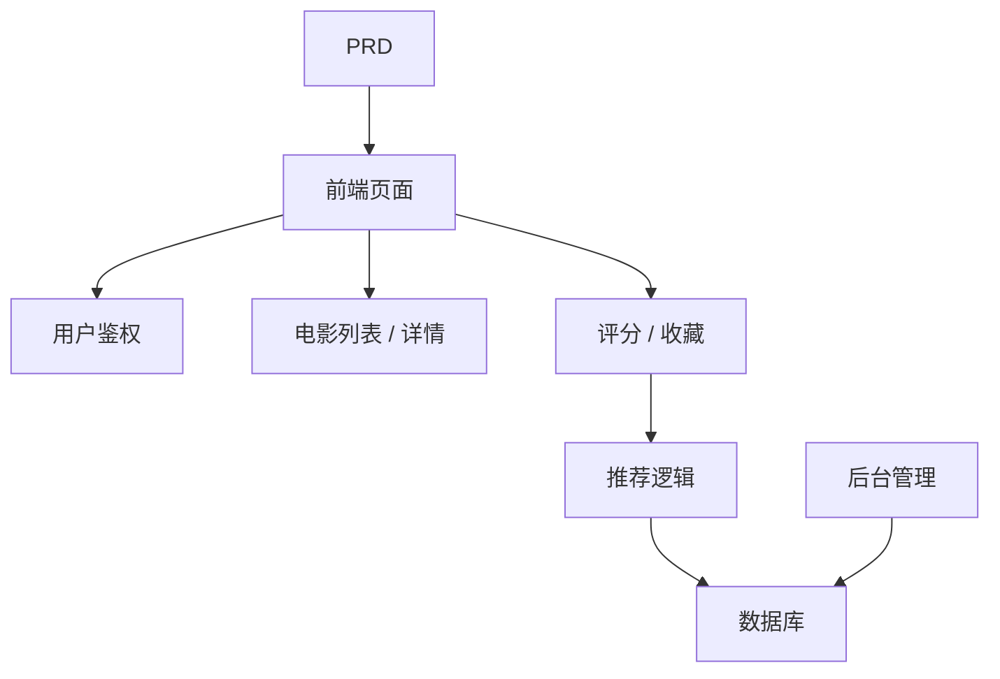

# Spring Boot 电影推荐系统开发实战

## 概述

本实战项目要求你围绕一份真实的 PRD，使用 Spring Boot 完成一个带推荐能力的电影网站。这个项目的核心挑战在于：它不是简单的增删改查，而是需要你思考"用户行为如何影响推荐结果"以及"推荐如何可解释"。

这是 Stage 2 的综合实战环节。你将第一次接触"内容 + 行为 + 推荐"型产品的开发模式，这种模式在电商、内容平台、个性化 Feed 等场景中非常常见。

## 前置知识

在开始本项目之前，你应该已经掌握以下内容：

- 前端页面设计与组件库使用（[UI 设计](../../frontend/ui-design/)、[现代组件库](../../frontend/modern-component-library/)）
- 后端接口设计与开发（[接口代码编写](../../backend/ai-interface-code/)）
- 数据库基础与 Supabase（[从数据库到 Supabase](../../backend/database-supabase/)）
- Git 工作流与部署（[Git 和 GitHub](../../backend/git-workflow/)、[部署 Web 应用](../../backend/zeabur-deployment/)）

## 学习目标

完成本实战后，你将能够：

1. 阅读 PRD 并从中提取推荐系统的开发任务清单
2. 使用 Spring Boot 搭建后端项目并实现 RESTful API
3. 设计"用户行为 → 推荐"的完整数据链路
4. 实现可解释的推荐逻辑
5. 完成端到端联调，交付可演示的产品原型

## 项目简介

你要构建的产品是一个带推荐能力的电影网站：

| 功能 | 描述 |
|------|------|
| **浏览与搜索** | 用户可以浏览和搜索电影 |
| **评分与收藏** | 用户可以给电影评分、添加收藏 |
| **个性化推荐** | 系统根据用户行为给出推荐结果 |
| **管理后台** | 管理员维护电影数据、查看推荐效果 |

::: tip PRD 入口
本项目的需求文档在 GitHub： [查看 PRD](https://github.com/datawhalechina/easy-vibe/blob/main/docs/zh-cn/stage-2/assignments/movie-recommendation-springboot/PRD.md)
:::

<div style="margin: 32px 0;">
  <ClientOnly>
    <StepBar :active="0" :items="[
      { title: '需求分析', description: '阅读 PRD，明确推荐策略、行为数据和后台范围' },
      { title: '搭建骨架', description: '用 AI 生成列表页、详情页、推荐页和后台页' },
      { title: '迭代开发', description: '补充推荐逻辑、行为记录和后台管理' },
      { title: '联调上线', description: '端到端跑通，部署并准备演示' }
    ]" />
  </ClientOnly>
</div>

## 第一部分：需求分析

### 1.1 阅读 PRD

打开 PRD 文档，重点回答以下问题：

- 推荐策略是什么？第一版是否使用可解释版本（如基于评分相似度）？
- 用户行为数据要存哪些？（评分、收藏、浏览记录等）
- 管理员需要看哪些推荐效果指标？
- 页面清单是否完整？

::: warning
如果以上问题没有明确答案，不要开始写代码。需求理解不清楚是导致返工的最常见原因。
:::

### 1.2 确认系统架构



## 第二部分：搭建项目骨架

### 2.1 生成前端页面

提示词参考：

```text
请基于当前 PRD，帮我生成一个 Spring Boot 电影推荐系统的前端骨架。

要求：
1. 页面包括：首页、电影列表、电影详情、推荐页、个人中心、后台管理
2. 先只生成页面结构和假数据，不接真实接口
3. 风格要像真实内容产品，而不是课堂 demo
```

### 2.2 验证页面结构

逐项检查：

- [ ] 电影列表页支持搜索和筛选
- [ ] 电影详情页包含评分和收藏按钮
- [ ] 推荐页能展示推荐结果和推荐理由
- [ ] 管理后台能展示电影数据和推荐效果

## 第三部分：迭代开发

### 3.1 按模块推进

1. **Spring Boot 项目搭建**：项目结构、数据库配置、基础 CRUD
2. **电影数据管理**：电影列表、详情、搜索接口
3. **用户行为**：评分、收藏接口，行为数据写入
4. **推荐逻辑**：基于用户行为的推荐算法实现
5. **推荐展示**：推荐结果展示，包含推荐理由
6. **管理后台**：电影数据维护、推荐效果查看

### 3.2 模块自检

| 检查项 | 验证方法 |
|--------|----------|
| 基础功能 | 列表、详情、评分、收藏是否闭环 |
| 推荐联动 | 用户行为是否影响推荐结果 |
| 推荐可解释性 | 用户能理解为什么被推荐这些电影 |
| 后台数据 | 管理员能查看电影数据和推荐效果 |

## 第四部分：联调与上线

### 4.1 端到端测试

至少验证以下场景：

- 浏览电影 → 评分 → 收藏 → 查看推荐页，确认推荐结果发生变化
- 管理员登录 → 添加电影 → 查看推荐效果统计

## 交付物

完成本项目后，你需要提交以下内容：

- [ ] 可访问的线上演示链接
- [ ] 源码仓库链接（含 README）
- [ ] PRD 文档
- [ ] 核心页面截图（电影列表、电影详情、推荐页、管理后台）
- [ ] 60 秒演示视频

## 评分标准

| 维度 | 基本要求 | 进阶要求 |
|------|---------|---------|
| PRD 对齐 | 页面、功能、数据结构基本符合 PRD | 能清晰说明设计决策 |
| 产品闭环 | 浏览 → 评分 → 收藏 → 推荐可跑通 | 评分行为明显影响推荐结果 |
| 推荐质量 | 推荐结果合理、推荐理由可解释 | 支持多种推荐策略 |
| 后台能力 | 电影数据和推荐效果可查看 | 有推荐准确率等统计指标 |
| 工程完整度 | 前端、Spring Boot 后端、数据库链路已接通 | 推荐接口有缓存或性能优化 |

## 参考资料

- [UI 设计](../../frontend/ui-design/)
- [使用现代组件库更新你的界面](../../frontend/modern-component-library/)
- [从数据库到 Supabase](../../backend/database-supabase/)
- [大模型辅助编写接口代码与接口文档](../../backend/ai-interface-code/)
- [Git 和 GitHub 工作流](../../backend/git-workflow/)
- [如何部署 Web 应用](../../backend/zeabur-deployment/)
