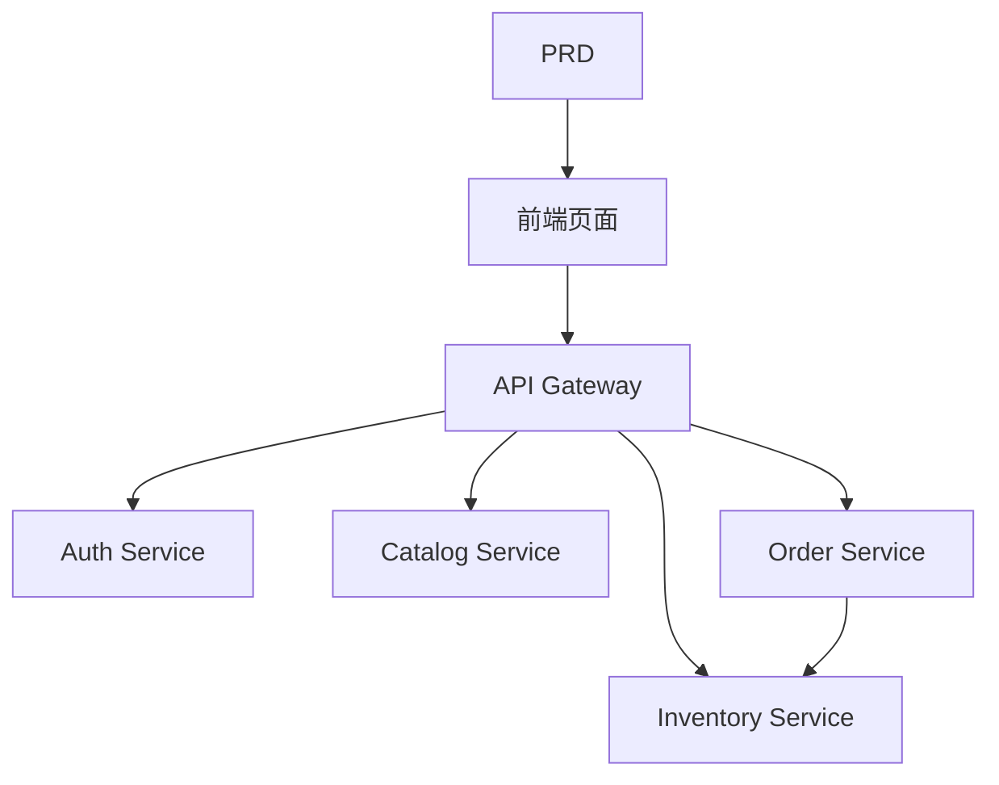

# 生鲜电商微服务系统开发实战

## 概述

本实战项目要求你围绕一份真实的 PRD，从零完成一个生鲜电商微服务系统。与前面的单服务项目不同，这个项目的后端按业务拆分成多个独立服务，通过 API 网关统一对外。你将学习如何设计服务边界、如何处理跨服务的数据一致性问题。

这是 Stage 2 的综合实战环节。微服务架构在实际工作中非常常见，掌握服务拆分和网关路由的基本思路后，你能够应对更复杂的后端系统设计。

## 前置知识

在开始本项目之前，你应该已经掌握以下内容：

- 前端页面设计与组件库使用（[UI 设计](../../frontend/ui-design/)、[现代组件库](../../frontend/modern-component-library/)）
- 后端接口设计与开发（[接口代码编写](../../backend/ai-interface-code/)）
- 数据库基础与 Supabase（[从数据库到 Supabase](../../backend/database-supabase/)）
- Git 工作流与部署（[Git 和 GitHub](../../backend/git-workflow/)、[部署 Web 应用](../../backend/zeabur-deployment/)）

## 学习目标

完成本实战后，你将能够：

1. 阅读 PRD 并提取微服务系统的开发任务清单
2. 按业务领域拆分服务边界（鉴权、商品、库存、订单）
3. 设计和实现 API 网关路由
4. 处理库存扣减和订单一致性等跨服务问题
5. 完成端到端联调，交付可演示的微服务原型

## 项目简介

你要构建的产品是一个生鲜电商微服务系统：

| 子系统 | 职责 |
|--------|------|
| **用户端** | 浏览商品、下单、查看订单 |
| **管理端** | 商品管理、库存管理、订单管理 |

后端按业务拆分为以下服务：

| 服务 | 职责 |
|------|------|
| **API Gateway** | 统一入口、路由转发、鉴权校验 |
| **Auth Service** | 用户注册、登录、JWT 颁发 |
| **Catalog Service** | 商品信息管理 |
| **Inventory Service** | 库存数量管理 |
| **Order Service** | 订单创建、状态管理 |

::: tip PRD 入口
本项目的需求文档在 GitHub： [查看 PRD](https://github.com/datawhalechina/easy-vibe/blob/main/docs/zh-cn/stage-2/assignments/simple-grocery-microservices/PRD.md)
:::

<div style="margin: 32px 0;">
  <ClientOnly>
    <StepBar :active="0" :items="[
      { title: '需求分析', description: '阅读 PRD，明确服务拆分、页面和交易链路' },
      { title: '搭建骨架', description: '生成前端、网关和各服务骨架' },
      { title: '迭代开发', description: '逐模块补接口、修库存与订单一致性' },
      { title: '联调上线', description: '端到端跑通，部署并准备演示' }
    ]" />
  </ClientOnly>
</div>

## 第一部分：需求分析

### 1.1 阅读 PRD

打开 PRD 文档，重点回答以下问题：

- 服务如何拆分？每个服务的职责边界是什么？
- 前台和管理端分别有哪些页面？
- 下单后库存扣减的策略是什么？成功 / 失败 / 超时各怎么处理？
- 第一版哪些复杂能力（如分布式事务、消息队列）先不做？

::: warning
如果以上问题没有明确答案，不要开始写代码。需求理解不清楚是导致返工的最常见原因。
:::

### 1.2 确认系统架构



## 第二部分：搭建项目骨架

### 2.1 生成项目结构

提示词参考：

```text
请基于当前 PRD，帮我生成一个生鲜电商微服务系统的项目骨架。

要求：
1. 生成前端用户端和管理端骨架
2. 生成 api-gateway、auth-service、catalog-service、inventory-service、order-service 五个目录
3. 每个服务先只做最小可运行入口
4. 先不接真实数据库和支付
```

### 2.2 验证项目结构

逐项检查：

- [ ] 五个服务目录结构清晰
- [ ] API Gateway 可以启动并转发请求
- [ ] 各服务健康检查接口可用
- [ ] 前端用户端和管理端页面可访问

## 第三部分：迭代开发

### 3.1 按模块推进

1. **API Gateway**：路由配置、JWT 校验中间件
2. **Auth Service**：注册、登录、JWT 颁发
3. **Catalog Service**：商品 CRUD、列表查询
4. **Inventory Service**：库存查询、库存扣减
5. **Order Service**：订单创建、状态流转、库存联动
6. **管理端**：商品管理、库存管理、订单管理

### 3.2 模块自检

| 检查项 | 验证方法 |
|--------|----------|
| 网关路由 | 各服务接口是否通过网关正确转发 |
| 权限隔离 | 用户端和管理端接口是否隔离 |
| 数据一致 | 商品和库存数据是否同步 |
| 交易闭环 | 下单后库存扣减、订单状态是否一致 |
| 失败处理 | 库存不足或超时时是否有补偿机制 |

## 第四部分：联调与上线

### 4.1 端到端测试

至少验证以下场景：

- 浏览商品 → 加入购物车 → 下单 → 查看订单
- 管理员 → 添加商品 → 更新库存 → 查看订单

## 交付物

完成本项目后，你需要提交以下内容：

- [ ] 可访问的线上演示链接
- [ ] 源码仓库链接（含 README）
- [ ] PRD 文档
- [ ] 核心页面截图（商品列表、下单页、订单页、管理后台）
- [ ] 60 秒演示视频

## 评分标准

| 维度 | 基本要求 | 进阶要求 |
|------|---------|---------|
| PRD 对齐 | 页面、功能、服务拆分基本符合 PRD | 能清晰说明服务拆分的理由 |
| 产品闭环 | 浏览 → 下单 → 库存扣减 → 查看订单可跑通 | 订单超时或库存不足有补偿机制 |
| 服务架构 | 各服务可独立启动，通过网关统一访问 | 服务间通信有错误处理和重试 |
| 后台能力 | 商品、库存、订单管理可操作 | 管理端有数据统计 |
| 工程完整度 | 前端、网关、服务、数据库链路已接通 | 有 Docker Compose 或类似编排 |

## 参考资料

- [UI 设计](../../frontend/ui-design/)
- [使用现代组件库更新你的界面](../../frontend/modern-component-library/)
- [从数据库到 Supabase](../../backend/database-supabase/)
- [大模型辅助编写接口代码与接口文档](../../backend/ai-interface-code/)
- [Git 和 GitHub 工作流](../../backend/git-workflow/)
- [如何部署 Web 应用](../../backend/zeabur-deployment/)
