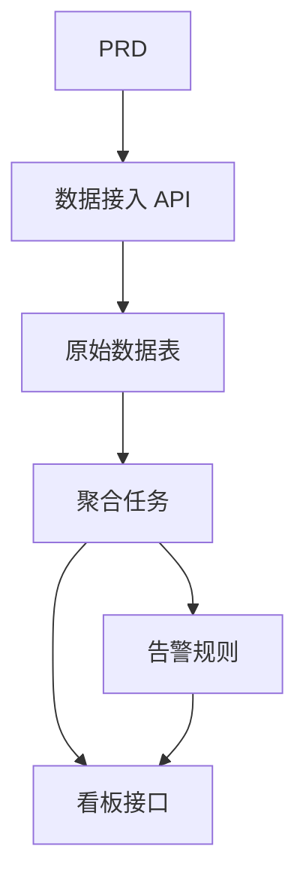

# Go 交通数据分析平台开发实战

## 概述

本实战项目要求你围绕一份真实的 PRD，使用 Go 完成一个交通数据分析平台。这个项目的方向与前面的增删改查系统不同——你需要构建一条"数据接入 → 聚合 → 告警 → 可视化"的完整数据链路。这种数据产品在 IoT、监控、运营分析等场景中非常常见。

这是 Stage 2 的综合实战环节，也是你第一次接触 Go 语言。不用担心，有了前面 JavaScript / TypeScript 的基础，学习 Go 并不难——重点是理解数据链路的设计思路。

## 前置知识

在开始本项目之前，你应该已经掌握以下内容：

- 前端页面设计与组件库使用（[UI 设计](../../frontend/ui-design/)、[现代组件库](../../frontend/modern-component-library/)）
- 后端接口设计与开发（[接口代码编写](../../backend/ai-interface-code/)）
- 数据库基础与 Supabase（[从数据库到 Supabase](../../backend/database-supabase/)）
- Git 工作流与部署（[Git 和 GitHub](../../backend/git-workflow/)、[部署 Web 应用](../../backend/zeabur-deployment/)）

## 学习目标

完成本实战后，你将能够：

1. 阅读 PRD 并提取数据产品的开发任务清单
2. 使用 Go（Gin 或 Fiber）搭建后端 API 服务
3. 设计数据接入、窗口聚合和告警的完整链路
4. 让后端数据和前端看板保持一致
5. 完成端到端联调，交付可演示的数据产品原型

## 项目简介

你要构建的产品是一个 Go 交通数据分析平台：

| 模块 | 职责 |
|------|------|
| **数据接入** | 接收原始交通事件并入库 |
| **数据聚合** | 按时间窗口计算趋势和拥堵指标 |
| **告警** | 基于规则生成告警记录 |
| **看板展示** | 在前端展示趋势图、排行榜和告警列表 |

::: tip PRD 入口
本项目的需求文档在 GitHub： [查看 PRD](https://github.com/datawhalechina/easy-vibe/blob/main/docs/zh-cn/stage-2/assignments/traffic-data-visualization-go/PRD.md)
:::

<div style="margin: 32px 0;">
  <ClientOnly>
    <StepBar :active="0" :items="[
      { title: '需求分析', description: '阅读 PRD，明确数据来源、指标口径和告警规则' },
      { title: '搭建骨架', description: '用 AI 生成 Go API 服务和前端看板骨架' },
      { title: '迭代开发', description: '补充聚合逻辑、告警规则和看板接口' },
      { title: '联调上线', description: '端到端跑通，部署并准备演示' }
    ]" />
  </ClientOnly>
</div>

## 第一部分：需求分析

### 1.1 阅读 PRD

打开 PRD 文档，重点回答以下问题：

- 数据来源是什么？字段有哪些？
- 核心指标的定义是什么？（比如"拥堵"的具体标准）
- 告警规则是什么？第一版是否先收敛到简单规则？
- 看板包含哪些页面和图表？

::: warning
如果以上问题没有明确答案，不要开始写代码。需求理解不清楚是导致返工的最常见原因。
:::

### 1.2 确认数据链路



## 第二部分：搭建项目骨架

### 2.1 生成 Go API 服务

提示词参考：

```text
请基于当前 PRD，帮我生成一个 Go 交通数据分析平台骨架。

要求：
1. 使用 Gin 或 Fiber
2. 提供数据接入接口
3. 提供聚合任务骨架
4. 提供 dashboard 和 alerts 接口骨架
5. 先不做真实复杂分析，只做可运行结构
```

### 2.2 验证项目结构

逐项检查：

- [ ] Go 服务可以正常启动
- [ ] 数据接入接口可接收并存储数据
- [ ] 聚合任务框架已搭好
- [ ] 前端看板页面可展示基本图表

## 第三部分：迭代开发

### 3.1 按模块推进

1. **数据接入 API**：接收原始交通事件，写入数据库
2. **数据聚合**：按时间窗口聚合，计算趋势和拥堵指标
3. **告警规则**：基于阈值生成告警记录
4. **看板接口**：提供趋势数据、排行数据、告警列表
5. **前端看板**：趋势图、排行榜、告警列表页面

### 3.2 模块自检

| 检查项 | 验证方法 |
|--------|----------|
| 数据接入 | 原始数据是否正确入库 |
| 聚合口径 | 趋势、排名指标的计算逻辑是否一致 |
| 告警规则 | 告警触发条件是否符合预期 |
| 数据一致性 | 看板展示和后端数据是否对得上 |
| API 规范 | 是否有统一返回结构和错误处理 |

## 第四部分：联调与上线

### 4.1 端到端测试

至少验证以下场景：

- 接入一批测试数据 → 聚合任务执行 → 看板展示更新
- 触发告警条件 → 告警记录生成 → 告警页面显示

## 交付物

完成本项目后，你需要提交以下内容：

- [ ] 可访问的线上演示链接
- [ ] 源码仓库链接（含 README）
- [ ] PRD 文档
- [ ] 核心页面截图（数据接入演示、趋势看板、告警列表）
- [ ] 60 秒演示视频

## 评分标准

| 维度 | 基本要求 | 进阶要求 |
|------|---------|---------|
| PRD 对齐 | 功能和数据结构基本符合 PRD | 能清晰说明指标口径和聚合逻辑 |
| 数据链路 | 接入 → 聚合 → 告警 → 看板可跑通 | 聚合任务支持增量更新 |
| 分析能力 | 趋势、排行、告警三个模块可用 | 指标可配置、告警规则可自定义 |
| 前端展示 | 看板能展示基本图表 | 图表支持时间范围筛选 |
| 工程完整度 | Go API、数据库、前端链路已接通 | API 有统一错误处理和日志 |

## 参考资料

- [UI 设计](../../frontend/ui-design/)
- [使用现代组件库更新你的界面](../../frontend/modern-component-library/)
- [从数据库到 Supabase](../../backend/database-supabase/)
- [大模型辅助编写接口代码与接口文档](../../backend/ai-interface-code/)
- [Git 和 GitHub 工作流](../../backend/git-workflow/)
- [如何部署 Web 应用](../../backend/zeabur-deployment/)
