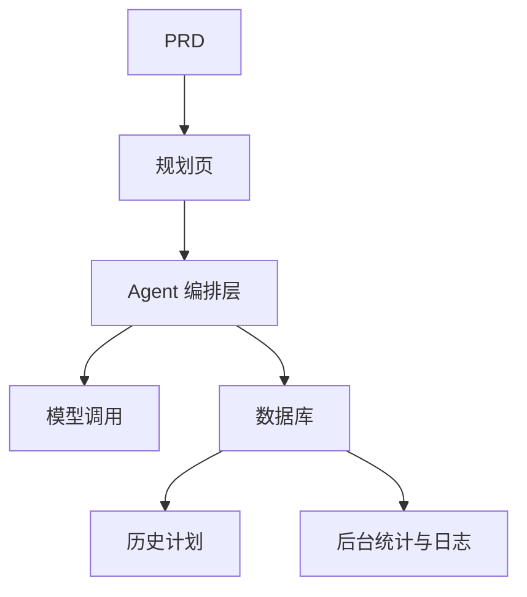

# 智能旅游规划 Agent 平台开发实战

## 概述

本实战项目要求你围绕一份真实的 PRD，从零完成一个智能旅游规划 Agent 平台。你将构建一个能接收结构化输入、生成每日行程、支持保存和重用的完整 AI 产品——不只是聊天机器人，而是一个有任务管理能力的产品。

这是 Stage 2 的综合实战环节。这个项目的核心挑战在于：如何让 AI 生成结构化、可用的行程规划，而不是一大段不可操作的文字。

## 前置知识

在开始本项目之前，你应该已经掌握以下内容：

- 前端页面设计与组件库使用（[UI 设计](../../frontend/ui-design/)、[现代组件库](../../frontend/modern-component-library/)）
- 后端接口设计与开发（[接口代码编写](../../backend/ai-interface-code/)）
- 数据库基础与 Supabase（[从数据库到 Supabase](../../backend/database-supabase/)）
- Git 工作流与部署（[Git 和 GitHub](../../backend/git-workflow/)、[部署 Web 应用](../../backend/zeabur-deployment/)）

## 学习目标

完成本实战后，你将能够：

1. 阅读 PRD 并从中提取 Agent 平台的开发任务清单
2. 设计结构化的输入表单和结构化的输出格式
3. 实现 Agent 编排层，处理用户输入、模型调用和结果存储
4. 构建"生成 → 保存 → 重用"的业务闭环
5. 完成端到端联调，交付可演示的 AI 产品原型

## 项目简介

你要构建的产品是一个智能旅游规划 Agent 平台：

| 功能 | 描述 |
|------|------|
| **行程规划** | 用户输入出发地、目的地、日期、预算和偏好，系统生成每日行程 |
| **预算拆分** | 行程结果包含预算分配和建议 |
| **历史管理** | 用户可以保存历史计划、再次生成、导出 |
| **管理后台** | 管理员查看热门目的地、失败任务和用户反馈 |

::: tip PRD 入口
本项目的需求文档在 GitHub： [查看 PRD](https://github.com/datawhalechina/easy-vibe/blob/main/docs/zh-cn/stage-2/assignments/travel-planning-agent-platform/PRD.md)
:::

<div style="margin: 32px 0;">
  <ClientOnly>
    <StepBar :active="0" :items="[
      { title: '需求分析', description: '阅读 PRD，明确页面、Agent 编排、输入输出结构' },
      { title: '搭建骨架', description: '用 AI 生成首页、规划页、历史页、后台页骨架' },
      { title: '迭代开发', description: '逐模块补充结构化输出、任务状态、历史管理' },
      { title: '联调上线', description: '端到端跑通，部署并准备演示' }
    ]" />
  </ClientOnly>
</div>

## 第一部分：需求分析

### 1.1 阅读 PRD

打开 PRD 文档，重点回答以下问题：

- 第一版是否只做单目的地？
- 行程输出是否必须结构化？结构是什么？
- 导出能力做多深？（分享链接 / PDF / 图片）
- 后台统计和任务日志的范围是什么？

::: warning
如果以上问题没有明确答案，不要开始写代码。需求理解不清楚是导致返工的最常见原因。
:::

### 1.2 确认系统架构



## 第二部分：搭建项目骨架

### 2.1 生成前端页面

提示词参考：

```text
请基于当前 PRD，帮我生成一个智能旅游规划 Agent 平台的前端骨架。

要求：
1. 页面包括：首页、规划页、行程详情页、历史记录页、管理页
2. 规划页左侧是表单，右侧是结果预览
3. 先只生成页面结构和假数据，不接真实接口
4. 风格要像现代 AI 产品
```

### 2.2 验证页面结构

逐项检查：

- [ ] 规划页的表单字段是否与 PRD 一致
- [ ] 结果预览区域能展示结构化的行程数据
- [ ] 历史记录页可以展示多条计划
- [ ] 管理后台页可以展示统计数据

## 第三部分：迭代开发

### 3.1 按模块推进

1. **鉴权**：注册、登录
2. **规划表单**：结构化输入（出发地、目的地、日期、预算、偏好）
3. **Agent 编排**：接收输入 → 调用模型 → 解析结构化输出
4. **结果展示**：行程按天展示、预算拆分、建议
5. **历史管理**：保存计划、再次生成、导出
6. **管理后台**：热门目的地、失败任务、用户反馈
7. **任务状态**：生成中 / 成功 / 失败的状态管理和错误记录

### 3.2 模块自检

| 检查项 | 验证方法 |
|--------|----------|
| 输入完整性 | 表单字段是否与 PRD 一致 |
| 输出结构化 | 行程结果是不是结构化数据（而非一大段文字） |
| 数据一致性 | trip、itinerary、logs 数据是否对得上 |
| 闭环验证 | 是否能演示"输入 → 生成 → 保存 → 再次生成" |

## 第四部分：联调与上线

### 4.1 端到端测试

至少验证以下场景：

- 输入行程参数 → 生成每日行程 → 查看预算拆分 → 保存到历史
- 从历史记录中再次生成行程
- 管理员查看任务统计和失败日志

## 交付物

完成本项目后，你需要提交以下内容：

- [ ] 可访问的线上演示链接
- [ ] 源码仓库链接（含 README）
- [ ] PRD 文档
- [ ] 核心页面截图（规划页、行程详情页、历史记录页、管理后台）
- [ ] 60 秒演示视频

## 评分标准

| 维度 | 基本要求 | 进阶要求 |
|------|---------|---------|
| PRD 对齐 | 页面、功能、数据结构基本符合 PRD | 能清晰说明设计决策 |
| 产品闭环 | 规划 → 保存 → 历史 → 重生成可跑通 | 支持导出和分享 |
| 输出质量 | 行程结果结构化且可读 | 预算拆分合理、建议有针对性 |
| 后台能力 | 任务统计和失败日志可查看 | 有热门目的地分析 |
| 工程完整度 | 前端、后端、数据库、模型调用链路已接通 | 任务状态管理完善，错误可追溯 |

## 参考资料

- [UI 设计](../../frontend/ui-design/)
- [使用现代组件库更新你的界面](../../frontend/modern-component-library/)
- [从数据库到 Supabase](../../backend/database-supabase/)
- [大模型辅助编写接口代码与接口文档](../../backend/ai-interface-code/)
- [Git 和 GitHub 工作流](../../backend/git-workflow/)
- [如何部署 Web 应用](../../backend/zeabur-deployment/)
