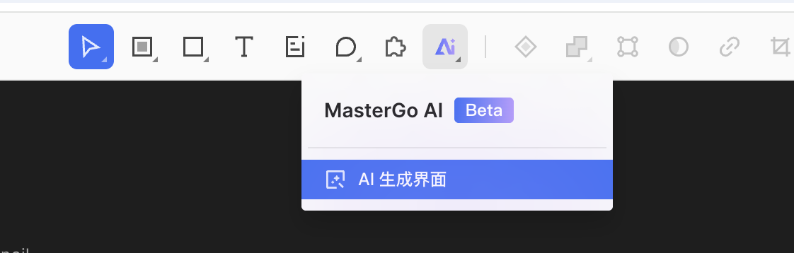
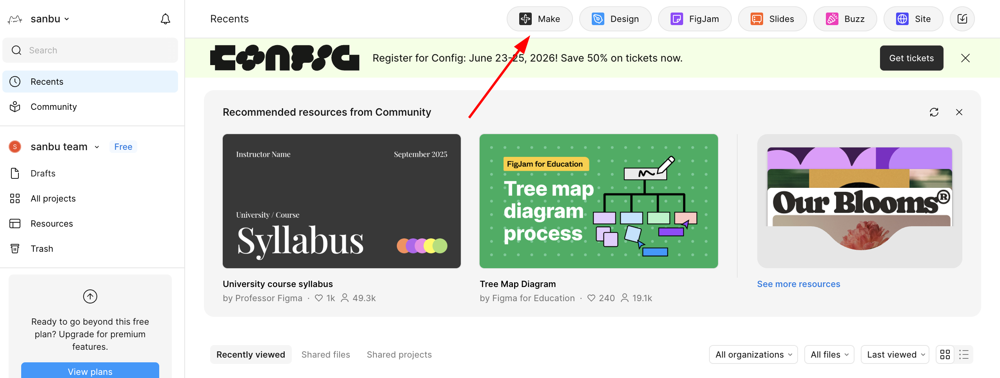
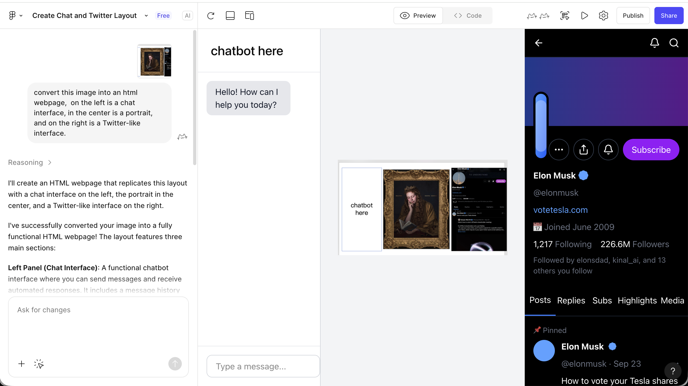

# 从设计原型到项目代码

::: tip 🎯 核心问题
**如何将设计工具中的原型转化为真正能在浏览器里运行的前端代码？**
:::

---

## 1. 从原型到代码的三种路径

在使用 Figma、MasterGo 等现代前端设计工具完成界面设计后，一个很实际的问题自然会浮现：这些看起来结构完整的设计稿，要怎么转化成真正能在浏览器里运行的前端代码？

一般而言，从原型到代码的落地，本质上有三种典型路径：

| 路径 | 方法 | 特点 | 适用场景 |
|------|------|------|----------|
| **路径一** | 根据图片，使用多模态大模型直接还原出代码 | 灵活、无需特定工具 | 快速原型验证、简单页面 |
| **路径二** | 通过平台自身能力或插件导出可用代码 | 还原度高、可编辑性强 | Figma/MasterGo 用户 |
| **路径三** | 平台结合 MCP 能力导出可用代码 | 自动化程度高、可定制 | 需要深度集成的工作流 |

本文将详细介绍这三种路径的具体实现方法，帮助你根据项目需求选择最合适的工作流。

::: tip 📚 前置知识
在开始本节之前，建议你先学习 [Figma 与 MasterGo 入门](../figma-mastergo/) 教程，掌握前端设计工具的基础操作。
:::

---

## 2. 路径一：多模态 AI 直接还原代码

拥有视觉能力的大模型天生具备将图片转为代码的能力。我们只需要将设计稿截图直接导入对话框，随后让大模型生成完整的结果代码。

### 2.1 操作流程

1. **截取设计稿图片**
   - 在 Figma 或 MasterGo 中，将设计好的页面导出为 PNG 或 JPG
   - 确保截图包含完整的页面布局

2. **选择多模态 AI 模型**
   - 可以使用 Gemini、Qwen、Claude 等支持图像输入的模型
   - 这里以 Gemini 为例进行演示

3. **编写提示词**
   ```
   请根据这张设计图生成对应的 HTML/CSS 代码。
   要求：
   - 使用现代 CSS 布局（Flexbox/Grid）
   - 响应式设计，适配不同屏幕尺寸
   - 包含所有可见的 UI 元素
   - 颜色、字体大小尽量还原设计稿
   ```


4. **获取并保存代码**
   - 要求模型返回完整的 HTML 代码
   - 保存为单个 `.html` 文件，方便本地测试
   - 后续可以在本地 IDE 中将其转换为 React 等框架

### 2.2 常见问题与解决方案

生成页面并非简单的任务，在具体过程中你可能会遇到很多问题：

| 问题 | 解决方案 |
|------|----------|
| 界面排布不均 | 向 AI 描述具体的布局问题，要求调整 CSS 的 margin/padding |
| 界面显示不全 | 检查是否设置了正确的 viewport，要求添加响应式断点 |
| 颜色还原不准 | 使用取色工具获取设计稿的精确色值，提供给 AI |
| 字体不匹配 | 指定具体的字体名称或要求使用 Google Fonts 替代 |

::: tip 💡 小技巧
推荐先生成 HTML 代码，获取后再使用本地 IDE 将其转换为 React 框架。这样可以获得多个独立的 HTML 文件，统一进行框架转换。
:::

### 2.3 MasterGo AI 生成页面

MasterGo 同样提供了强大的 AI 页面生成功能，可以根据参考图直接生成可用的网页代码。

#### 找到 AI 功能入口

在 MasterGo 编辑界面的上方工具栏中，可以找到 AI 工具按钮：



#### 生成流程

1. **上传参考图**
   - 使用与多模态 AI 相同的方式上传设计参考图
   - 添加文字描述需求

2. **查看生成结果**


3. **获取代码**
   - 点击蓝色按钮"插入到画布"，可直接编辑生成后的网页
   - 或点击右侧的"代码"按钮，复制代码内容到本地


---

## 3. 路径二：平台自身能力或插件导出代码

### 3.1 Figma Make 生成代码

Figma Make 是 Figma 官方推出的 AI 设计工具，能够根据用户输入的提示词或者参考图，高精度地还原网页原型 UI 界面。

#### 功能特点

- **高精度还原**：相比原生 AI 生成代码，效果更佳
- **可编辑性**：生成结果可以转换为可编辑的 Figma Design 文件
- **GitHub 集成**：支持直接将代码同步到 GitHub

::: tip 🔑 权限说明
使用 Figma Make 的完整功能需要 Pro 用户权限，学生可以通过教育认证免费获得 Pro 权限。
:::

#### 操作步骤

1. **进入 Figma Make**
   - 在 Figma 首页点击 Make 按钮
   - 或者访问 [Figma Make](https://www.figma.com/make)

2. **上传参考图**
   - 将你想要还原的设计图上传到对话框
   - 添加描述需求的提示词



3. **查看生成结果**
   - 稍等片刻后即可看到渲染结果
   - 点击右上角的播放按钮可进行全屏预览



4. **细节调整**
   - 点击右上角的编辑器图标（鼠标和尺子图标）
   - 回到熟悉的 Figma Editor 界面进行详细调整


5. **导出代码**
   - 调整满意后，选择导出代码
   - 可以直接连接到 GitHub 保存代码


### 3.2 插件导出代码

除了平台原生的 AI 功能，Figma 和 MasterGo 都支持通过插件导出代码：

**常用 Figma 插件：**
- **Figma to Code**：将设计稿转换为 React、Vue、HTML 等代码
- **Anima**：高保真代码生成，支持交互效果
- **Locofy**：AI 驱动的设计转代码工具

**使用步骤：**
1. 在 Figma 中打开插件面板（Plugins）
2. 搜索并安装需要的代码导出插件
3. 选中要导出的设计元素
4. 运行插件，选择目标框架和代码格式
5. 复制或下载生成的代码

---

## 4. 路径三：平台结合 MCP 能力导出代码

### 4.1 什么是 MCP？

MCP（Model Context Protocol，模型上下文协议）是一套开放标准协议，它允许 AI 模型安全、可控地访问外部工具和数据源。在前端设计工具的场景中，MCP 让大模型能够直接读取设计文件的结构、样式和组件信息，从而更精准地生成代码。

### 4.2 MCP 的工作原理

```
┌─────────────┐     ┌─────────────┐     ┌─────────────┐
│   AI 模型    │ ←→  │  MCP 服务器  │ ←→  │  设计工具    │
│  (Claude等)  │     │  (协议适配)  │     │(Figma/MasterGo)│
└─────────────┘     └─────────────┘     └─────────────┘
```

**工作流程：**
1. AI 模型通过 MCP 协议向设计工具发送请求
2. 设计工具返回结构化的设计数据（图层、样式、组件等）
3. AI 模型理解设计结构并生成对应代码
4. 代码可以直接导出或同步到开发环境

### 4.3 Figma + MCP 实战

#### 环境准备

1. **安装 MCP 服务器**
   ```bash
   # 使用 npx 安装 Figma MCP 服务器
   npx figma-mcp-server
   ```

2. **配置 Claude Desktop 或其他支持 MCP 的 AI 工具**
   ```json
   {
     "mcpServers": {
       "figma": {
         "command": "npx",
         "args": ["figma-mcp-server"],
         "env": {
           "FIGMA_ACCESS_TOKEN": "your-figma-token"
         }
       }
     }
   }
   ```

3. **获取 Figma Access Token**
   - 登录 Figma → Settings → Personal Access Tokens
   - 生成新的 Token 并保存

#### 使用流程

1. **在 AI 工具中启用 MCP 连接**
   - 打开 Claude Code 或其他支持 MCP 的 IDE
   - 确认 MCP 服务器已连接

2. **提供设计文件链接**
   ```
   用户：请帮我将这个 Figma 设计转换为 React 代码
   链接：https://www.figma.com/file/xxxxx
   
   AI：我已通过 MCP 连接到 Figma，正在读取设计文件结构...
   ```

3. **AI 自动分析并生成代码**
   - MCP 服务器获取设计文件的图层树
   - AI 理解组件结构和样式属性
   - 生成带有正确命名和结构的 React/Vue 组件

4. **迭代优化**
   ```
   用户：请将按钮组件提取为独立的可复用组件
   
   AI：好的，我已通过 MCP 识别到设计系统中的 Button 组件，
       正在生成带有 props 接口的 React 组件...
   ```

### 4.4 MCP 的优势

| 特性 | 传统方式 | MCP 方式 |
|------|----------|----------|
| **数据精度** | 依赖截图，可能丢失细节 | 直接读取原始设计数据 |
| **组件识别** | AI 需要猜测组件边界 | 精确获取组件定义 |
| **样式还原** | 基于像素估算 | 获取精确的设计 token |
| **迭代效率** | 每次修改需重新截图 | 实时同步设计变更 |
| **自动化程度** | 手动复制粘贴 | 可直接写入项目文件 |

### 4.5 当前可用的 MCP 工具

**设计工具 MCP：**
- **Figma MCP Server**：官方支持的 MCP 实现
- **MasterGo MCP**：社区开发的 MasterGo 适配器

**开发环境 MCP：**
- **Claude Code**：原生支持 MCP 协议
- **Cline**：VS Code 插件，支持 MCP 连接
- **Trae**：可通过配置启用 MCP 功能

::: tip 🔮 未来展望
MCP 协议正在快速发展，未来设计工具与开发环境的集成将更加紧密。预计会出现更多一键同步设计到代码的解决方案，进一步缩短设计与开发之间的距离。
:::

---

## 5. 代码导出后的工作

### 5.1 本地测试

获取代码后，在本地 IDE 中打开并进行测试：

1. **创建新项目**
   ```bash
   # 如果是 HTML 文件，直接用浏览器打开
   open index.html
   
   # 如果是 React/Vue 项目
   npm install
   npm run dev
   ```

2. **与 AI IDE 协作**
   - 将生成的代码导入 Trae 或其他 AI IDE
   - 让 AI 帮助修复布局问题、添加交互功能

### 5.2 常见问题处理

| 阶段 | 问题 | 解决方案 |
|------|------|----------|
| 布局 | 元素错位 | 检查 CSS 的 display 和 position 属性 |
| 样式 | 颜色不一致 | 使用浏览器开发者工具检查实际应用的色值 |
| 响应式 | 移动端显示异常 | 添加 media query 断点 |
| 交互 | 按钮无响应 | 检查 JavaScript 事件绑定 |

---

## 6. 三种路径对比与选择建议

### 6.1 路径对比

| 维度 | 路径一：多模态 AI | 路径二：平台能力 | 路径三：MCP |
|------|------------------|------------------|-------------|
| **上手难度** | ⭐ 简单 | ⭐⭐ 中等 | ⭐⭐⭐ 较复杂 |
| **还原精度** | ⭐⭐⭐ 中等 | ⭐⭐⭐⭐ 高 | ⭐⭐⭐⭐⭐ 最高 |
| **灵活性** | ⭐⭐⭐⭐⭐ 高 | ⭐⭐⭐ 中等 | ⭐⭐⭐⭐ 较高 |
| **自动化程度** | ⭐⭐ 低 | ⭐⭐⭐ 中等 | ⭐⭐⭐⭐⭐ 高 |
| **成本** | 低（按 API 调用） | 中（可能需要 Pro） | 低（开源工具） |

### 6.2 选择建议

**选择路径一（多模态 AI）如果：**
- 需要快速验证想法
- 设计工具不固定，经常切换
- 对还原精度要求不高
- 预算有限

**选择路径二（平台能力）如果：**
- 团队主要使用 Figma 或 MasterGo
- 需要高精度的代码还原
- 设计师和开发者需要频繁协作
- 愿意投资 Pro 版本

**选择路径三（MCP）如果：**
- 追求最高程度的自动化
- 有技术能力配置 MCP 环境
- 项目需要频繁迭代设计到代码
- 希望建立标准化的设计开发工作流

---

## 7. 总结

通过本章节的学习，你已经掌握了从设计原型到代码的三种核心路径：

1. **多模态 AI 直接转换**：灵活快速，适合原型验证
2. **平台原生能力**：还原度高，适合专业设计工作流
3. **MCP 协议集成**：自动化程度最高，代表未来趋势

::: tip 💡 最佳实践
- **新手推荐**：从路径一（多模态 AI）开始，快速上手
- **团队协作**：使用路径二（平台能力），保证设计一致性
- **效率优先**：尝试路径三（MCP），建立自动化工作流
- **混合使用**：根据项目阶段灵活切换不同路径
:::

---

## 参考资源

- [Figma 与 MasterGo 入门](../figma-mastergo/) - 学习设计工具基础
- [一起做霍格沃茨画像](../hogwarts-portraits/) - 完整项目实战
- [MCP 官方文档](https://modelcontextprotocol.io/) - 了解协议详情
- [Figma Make 官方文档](https://help.figma.com/hc/en-us/sections/360007453634-Figma-Make)
- [MasterGo AI 教程](https://mastergo.com/tutorials)
