# Figma 与 MasterGo 入门

::: tip 🎯 核心问题
**如何从零开始使用现代设计工具创建网页原型？**
:::

---

## 1. 为什么要学前端设计工具？

在开始之前，我们需要理解一个问题：为什么需要学"前端设计工具"？反正直接写 HTML / CSS 代码也能把页面搭出来，多学一个软件和技术，真的有必要吗？

实际上，把页面运行起来，和把产品设计好根本是两个概念。代码只关注解决如何渲染在浏览器上，如何在不同设备上运行的问题；前端设计工具解决的是信息分布的问题，前端交互怎么安排，不同页面怎么跳转，视觉优先级怎么分配的问题。只需要在设计工具里搭一块画布，就能把版式、信息层级、交互方式在一块屏幕上对比确定，选择最适当的呈现效果。

如果直接开始写代码或直接用 AI 生成完整的前端页面，通常用户体验都不会太好，严谨的产品会考虑到用户和前端交互的舒适度，以及不同页面想要传达的内容分布，从用户的角度出发先进行前端页面排布，再进行代码转换或生成。

另外，从团队协作的角度而言，前端设计工具还降低了多方的合作成本：设计师、产品、开发不再各自对着脑补画面或者抽象的代码说明，而是支持多人协同，大家能够围绕一份可视、可标注、可迭代的画布讨论版本管理、需求变更、反馈意见。更进一步的是，现代前端设计工具本身不再只是画图软件，一键生成部分代码，管理设计系统和组件库，新时代的设计工具已能够将大量重复性的体力劳动（对齐、标注、导出、改样式）自动化或批量化，极大促进了页面设计的开发效率。

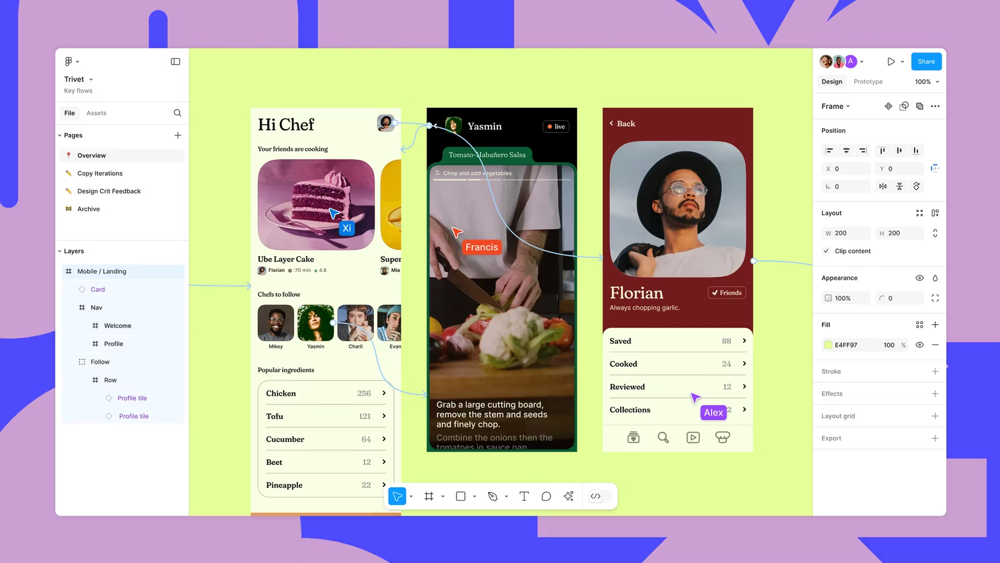

### 1.1 前端设计工具的演变

在时间的长河中，所谓前端设计工具其实是一条持续演化的技术。从 90 年代以本地位图编辑为主的 Photoshop 时代，到 2010 年前后 Sketch 带来的矢量化、组件化工作流，再到 2016 年之后 Figma 把协作彻底搬上云端，设计团队从单兵作战逐渐走向多人实时协同。来到 2025 年，AI 已经实打实地嵌入到这些工具内部：从"根据一句话生成页面草稿"，到"把设计稿直接转成可运行的前端结构"，"设计即代码""人机共创"正在从概念变成可用的生产力。

本节中，我们会选取最具代表的两种现代前端设计工具进行介绍，Figma 和 MasterGo。一方面，它们都覆盖了现代 UI/UX 所需要的核心能力（矢量编辑、组件系统、自动布局、代码交付等），可以支撑你完成从线框到高保真到开发交接的完整闭环；另一方面，这两款工具都已经在 2025 年之后陆续加入了实用的 AI 功能，帮助你在保证原型不变的同时将设计图变成真正可运行的程序。

## 1.2 诞生之旅

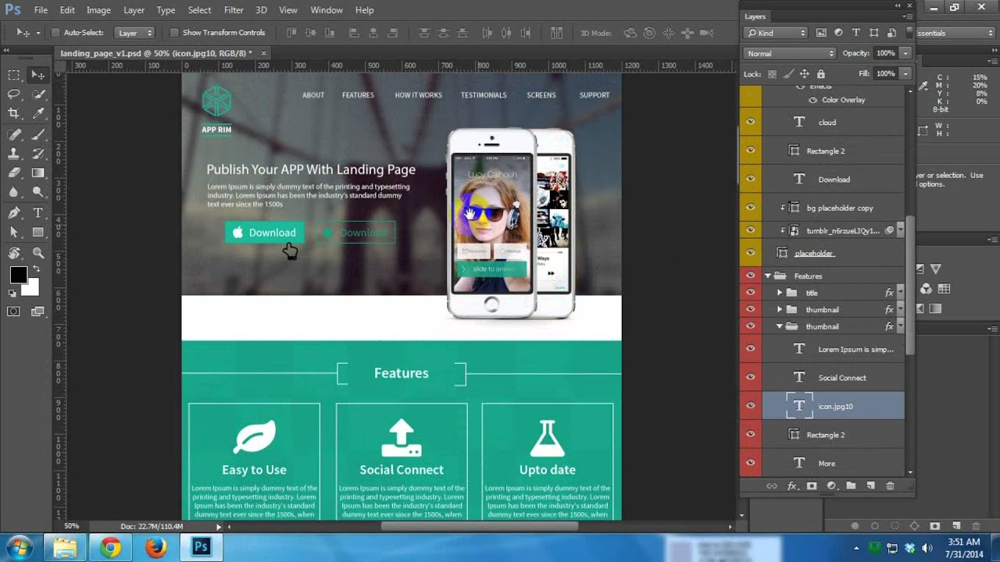

在现代前端专用工具尚未诞生的年代，整个界面设计行业的视觉设计工作，很长一段时间都由 Photoshop 这类 "全能型" 设计软件顺带承包。设计师会在本地通过一层层叠加的图层，细致完成页面整体视觉效果的设计，最终将体积不小的 .psd 源文件交付给前端工程师 —— 而前端要精准还原设计图，还必须手动完成三项繁琐且关键的工作：

一是 "切图"：需要从 .psd 文件的多层结构里，把按钮、图标、Logo、背景模块等独立视觉元素逐一拆分提取，再导出为 PNG、JPG 等网页能直接加载的图片格式（毕竟网页无法直接识别 PSD 的图层信息，只能依赖这些拆分后的图片呈现细节）；

二是 "量尺寸"：得用软件自带的测量工具，逐一确认每个元素的宽高、不同模块间的间距（margin/padding）等数据，确保所有尺寸都精准到像素；

三是 "抠标注"：要从设计图中提取那些 "看不见却必须有的" 隐性参数 —— 比如文字的字号、字重、行距，每个色块的 RGB 或 HEX 色值等，相当于把设计师没写在纸上的 "设计规格" 手动 "抠" 出来记录。

在此之后，前端的实现阶段才真正展开。无论使用的是原生 HTML/CSS/JS，还是基于 Vue、React 等框架，本质过程是一致的。前端会以 "容器为核心载体"，根据设计中各模块的层级与语义重建页面结构。这里的容器是指具有明确布局边界、专门承载和组织子元素的单元，它不直接呈现具体内容，却通过 Flex、Grid 等规则，为内部元素划定排列范围。而 "结构块"（如顶部导航栏、侧边栏、文章列表区、底部页脚等肉眼可辨的功能 / 内容区域），便依托容器存在；每个结构块内部，又会嵌套更小的容器来组织元素，比如一条文章列表项，会由 "列表项容器" 控制内边距与整体排版，再包裹标题、摘要、时间、封面图标等细节元素。

在现代前端框架里，这些 "结构块（及关联的容器与元素）" 通常会被实现为 "组件"。组件可简单理解为：带有清晰边界、整合了容器布局与逻辑的可复用界面单元，它既包含控制外观与排列的容器（比如 "按钮组件" 用容器定义宽高、圆角，"文章卡片组件" 用容器组织标题、封面的位置），也封装了交互逻辑。设计稿中重复出现、形态一致的部分（如统一风格的按钮、反复使用的文章卡片），在代码中会被抽象成组件：既能在不同页面 / 场景复用，减少重复开发，也能通过组件内容器的统一规则，确保所有复用处的布局与风格高度一致

随后，前端会使用样式系统还原视觉和布局。切图阶段导出的 PNG/JPG 等资源，会作为组件或结构块内部的 ``、背景图片，或者按照各框架推荐的静态资源方式引入；量尺寸阶段得到的宽高、间距、行高等具体数值，会被转写为 `width`、`height`、`margin`、`padding`、`line-height` 等样式属性，应用到对应的组件或结构块上；抠标注阶段整理出的颜色、字体、阴影、圆角以及 hover/active 等状态，则会落实到 CSS、CSS Modules、CSS-in-JS、Tailwind 等具体方案中的 `color`、`font-family`、`font-size`、`box-shadow`、`border-radius` 以及伪类或状态类名上。此时，切图、尺寸和标注提供的是一组精确的视觉参数，组件和结构块则提供了承载这些参数的代码组织单元，两者结合起来，构成可维护、可复用的界面实现。

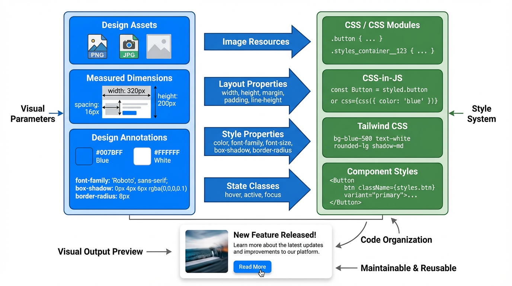

但是，以本地文件为中心的模式天然是低效率的。版本通过邮件和网盘传输，新旧稿件容易混淆，设计和开发之间大量依赖上述的复杂交互方法，协作成本和出错概率都不低。

移动互联网兴起后界面复杂度和迭代速度需求快速上升，Photoshop 的"大而全"逐渐显得笨重。这个阶段，出现了 Sketch。Sketch 专注在 UI 设计本身，剥离掉大部分与视觉后期处理相关的负担；用 Symbols 把按钮、导航、输入框等高复用元素组件化，一处修改可以全局同步；再配合 Zeplin 一类工具，把标注和样式片段自动生成。Sketch 把"组件思维"引入了设计工作流。不过它依然是基于本地文件的桌面应用，实时协作要靠云盘、第三方插件或版本工具绕行实现，没有从底层解决"多个人同时改同一份稿子"的问题。

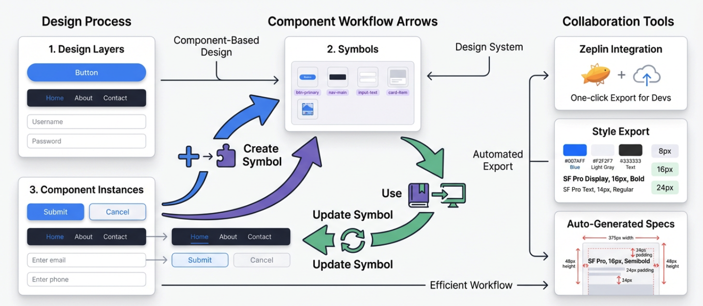

真正改变游戏规则的是 Figma。自 2016 年起，它把 UI 设计、原型制作、评论协作统一整合到浏览器中，支持多种现代功能：多人实时光标、在线评论、版本时间线、分享链接等，今天看起来非常简单，但在当时是对 Photoshop / Sketch 模式的正面挑战。

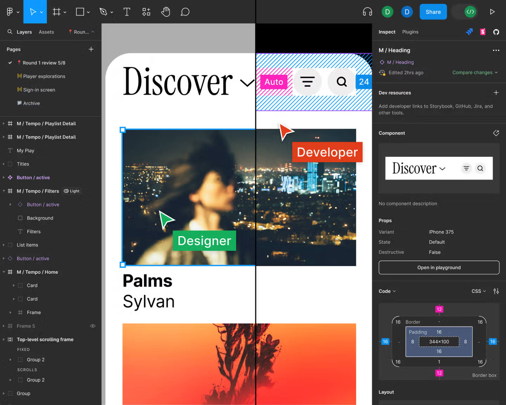

至此，界面设计不再是散落在各自电脑里的文件，而是集中在一份在线、实时更新的云端画布上。围绕这块画布，我们可以想象更进一步，用自动化或 AI 的方式模糊设计和前端代码的边界。

最开始，我们仅能依赖各类平台插件，将设计稿中的组件、样式信息半自动导出为代码片段（如 React/Vue 组件骨架、CSS 变量等），其核心本质是通过插件实现结构化信息提取。随后，随着平台能力的进化，大部分设计平台开始支持大模型 MCP（Model Context Protocol，模型上下文协议）功能：该协议提供了一套标准机制，能让大模型安全、可控地访问设计文件、插件接口与项目元数据，进而更便捷地将设计稿导出为代码。

再往后，在插件与 MCP 的基础上，前端代码自动化进一步迈入到原生支持从设计稿直接推导代码结构的阶段。我们可在设计工具内一键生成前端项目骨架、组件层次、样式体系及对应的代码结果。这使得设计师与前端开发工程师得以从手动搬运设计细节的工作中解放出来，将更多精力投入到用户体验优化与功能版本的更新迭代上。

---

## 2. Figma 入门

接下来我们从抽象的概念部分来到实际的操作环节。由于时间关系，我们只会学习 Figma 的基本操作逻辑，确保即便你完全没用过设计工具，也能跟着完成练习。如果你想进行完整的 Figma 功能学习，请你参考 Figma 提供的详细官方教程进行学习：https://help.figma.com/hc/en-us/sections/30880632542743-Figma-Design-for-beginners

或者参考如下教程，进行类似个人作品集简单网页的快速搭建：https://help.figma.com/hc/en-us/sections/35895585621655-Figma-Sites-collectio

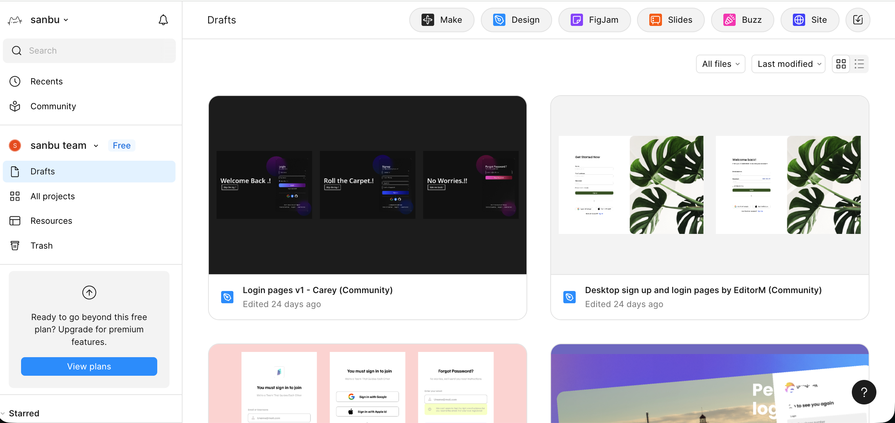

左侧是项目的新建和资源管理入口，右上角的几个按钮是 Figma 的常见功能。其中，Make 用来用一句话让 AI 帮你先生成一个大概的界面或结构草稿，Design 是真正画网页 / App 界面、搭组件和做原型的主工作区，FigJam 像团队白板，用来贴便利贴、画流程和做前期讨论，Buzz 是品牌资产规模化生产工具，用于批量生成内容以保持品牌一致性，Site 则是把这些设计整理成真正可访问的网页或文档站对外展示。

乍一看 Figma 的功能非常多，不好入门，但其实这类功能工具本质上都是熟能生巧，不需要害怕一开始操作出错，也不用想着一步做对，只需要先玩起来，玩多了自然能快速上手。

本篇教程中，为了快速入门，我们会对 Design 功能做简单讲解。

### 2.1 新建 Design 文件

在首页或者右上角的入口里，选择 **Design** ，新建一个文件，你会进入一个空白的设计画布。
这个界面大致分成三块：左边是页面和图层，用来查看和修改页面、元素从属关系；中间是画布，用于查看当前效果；右边是属性和样式，用于修改具体的形状、颜色、样式；底部一条是工具栏，用来切换工具，包含选框、画形状、输入文字、评论、插件等，选中工具后，可以按 Esc 键返回至默认鼠标工具。

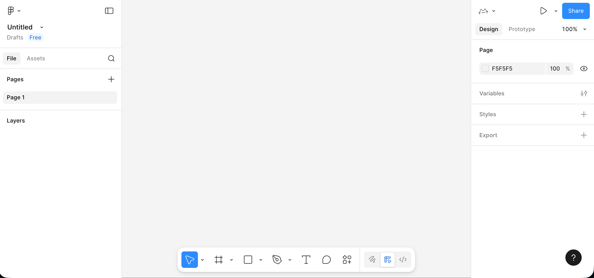

### 2.2 创建你的第一个 Frame（画板）

在正式放置元素之前，需要先为页面确定一个清晰的边界，这个边界由 Frame 来承担。你可以在底部工具栏中选择 Frame 工具，或者直接按键盘 F，然后在画布上拖出一个矩形区域。

1. 使用底部工具栏里的 Frame 工具，或者直接按键盘 `F`。
2. 在画布中拖出一个矩形区域，右侧属性栏里把宽度改成比如 `1440`，高度改成 `900`。
3. 在左侧图层栏，把这个 Frame 重命名，比如叫 `My First Page` 或者你项目的名字。

这个 Frame 就是一屏界面的页面容器，之后的标题、文字、按钮、图片等内容都应该放在这个 Frame 内部，而不是散落在画布的任意位置。以 Frame 为边界来组织内容，有助于在后续进行滚动设置、适配不同设备尺寸、导出画面及制作原型时，保持结构可控。

### 2.3 在 Frame 里放文字和简单元素

有了容器，接下来我们来学习如何放置最基本的组件，例如：标题、副标题、按钮、占位图块。

1. 选择文字工具（底部工具栏中的 `T`），在 Frame 里点击一下，输入页面标题，比如：`My Portfolio`。
   在右侧属性里，把字体大小调大一点（例如 96），字重调粗一点。
2. 在标题下面，再用文字工具输入一行简单说明，比如一两句描述这个页面要做什么。
   字号可以小一些，行高略放大一点，读起来不那么挤。
3. 画一个按钮雏形：
   用矩形工具在标题下面画一个大概 `200 × 48` 的矩形，右侧给它一个比较明显的填充颜色，再适当加一点圆角。
   
4. 然后用文字工具在矩形上方输入按钮文字，比如 `Get Started`，把矩形和文字一并选中，用顶部的对齐工具让文字水平、垂直都居中。
5. 在按钮一侧或下方，再画一个较大的浅灰色矩形作为"图片占位区"，后面可以用来放展示图片。

做到这里，其实你已经有了一个非常简陋但结构完整的"首页草稿"：一个标题、一段话、一个按钮、一个主要展示区域。

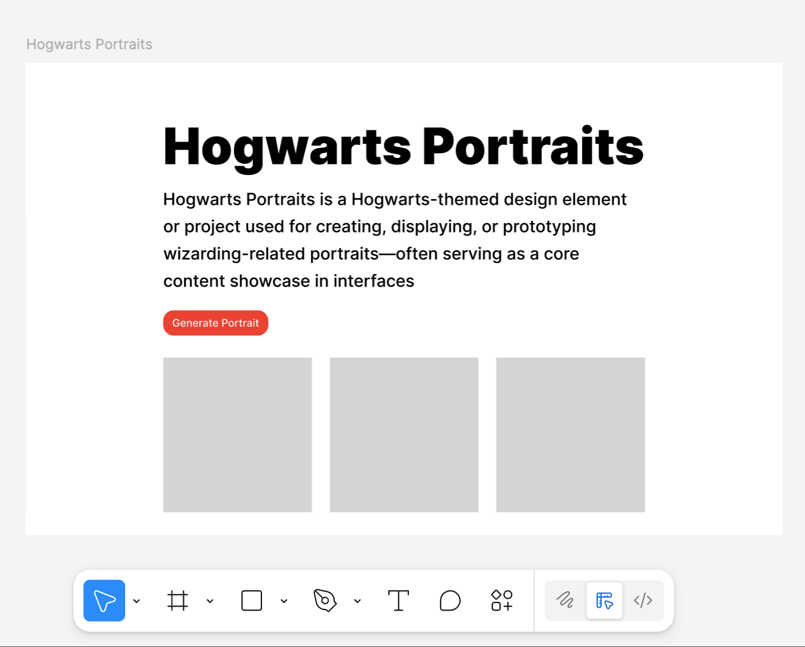

### 2.4 善用 Auto Layout 整合元素

如果所有元素只是随手拖拽，页面很快会乱。Figma 里一个很重要的概念就是 **Auto Layout** ，它可以把一组元素变成一个带规则的容器。

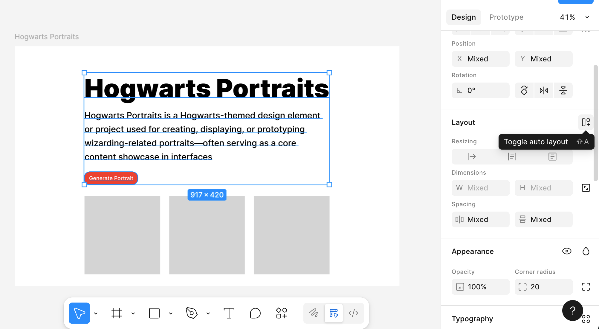

你可以选中"主标题 + 副标题 + 按钮"这三样，在右侧属性栏里点击 **Add Auto layout** 。

这时这三样会被包在一个容器里，你可以在右侧调整参数，其中的元素布局会根据参数自动适应调整：

- 它们是竖着排还是横着排。
- 元素之间的间距是多少。
- 整个这一块离容器边缘有多少内边距（padding）。

同样，按钮内部也可以用 Auto Layout，我们能够实现这样的一个效果：当我调整了文字，按钮的长度也会自动调整。

先把按钮背景的矩形和按钮文字选中，添加 Auto Layout，让这两个东西变成一个"按钮容器"。接着选中这个按钮容器，把宽高都设置成 **Hug contents** 。这样一来，文字会一直保持在按钮正中间，文字多一点、少一点，按钮的宽度都会自动跟着变化。

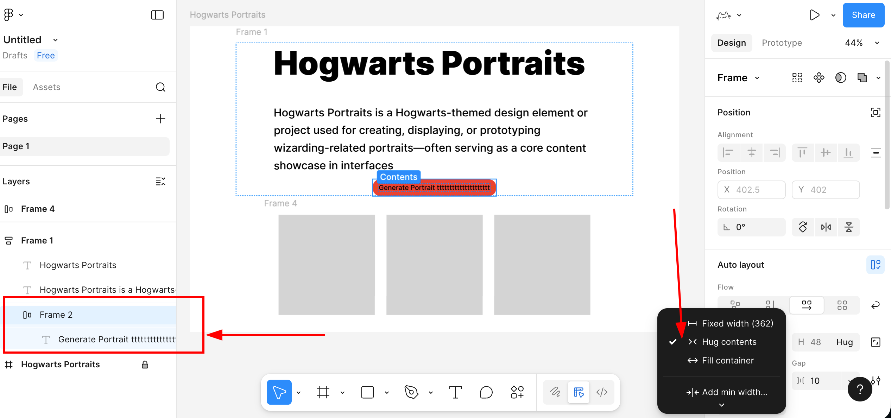

### 2.5 将按钮变为可复用组件

现在我们要学习一个新的概念，组件。组件的意思就是可以被反复利用的元素，比如按钮这种元素，只要你预感之后还会反复用到，就可以考虑把它做成组件。我们在刚才已经加好 Auto Layout 的按钮基础操作：

1. 选中整个按钮容器。
2. 右键选择 Create component（创建组件）。
   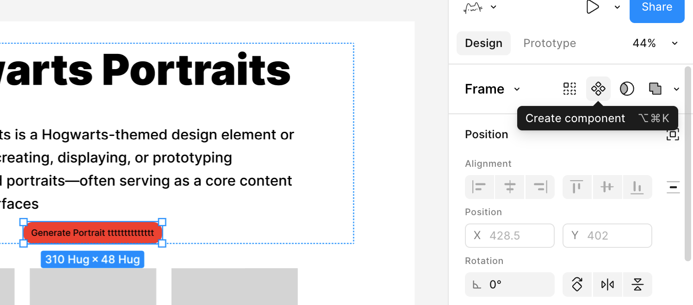

这样，这个按钮就从一组普通图层，变成了一个组件母版。之后如果你在其他页面或 Frame 里需要同样风格的按钮，可以直接从左侧的 Assets 面板里拖出来使用。

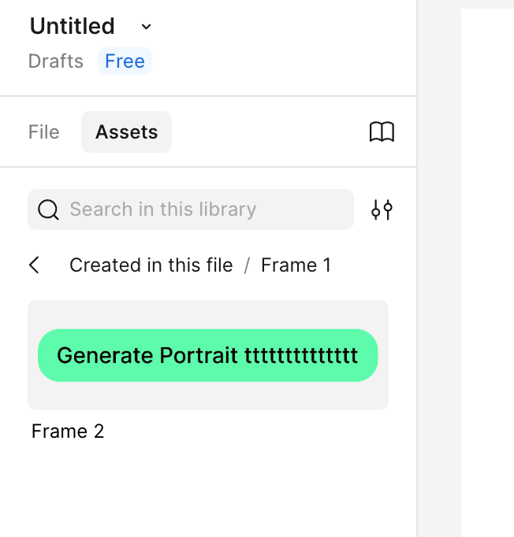

此时所有用到的按钮，都是这个母版的同步拷贝。当你修改母版的颜色、圆角或间距时，所有实例都会自动保持同步更新。

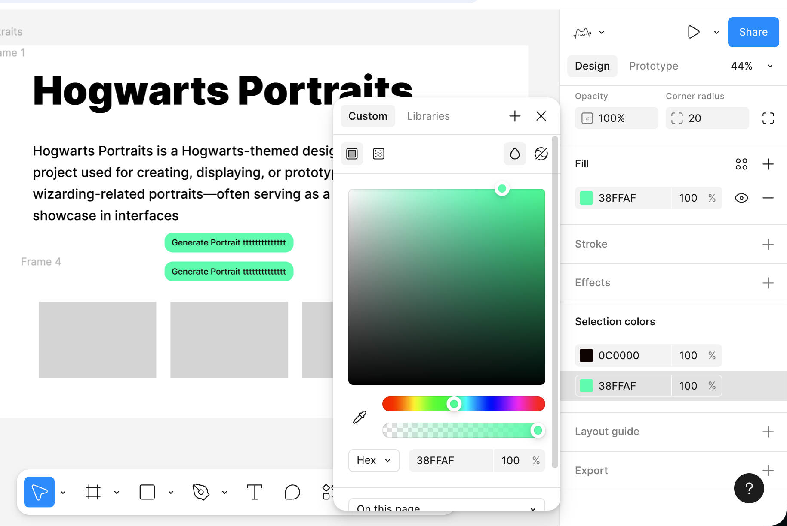

至此，你已经初步掌握了 Figma 的简单用法。你不需要一开始就把所有功能都弄懂，只要先照着做出第一个简单页面，熟悉这几个核心操作，再慢慢去探索官方教程里的更多能力，随着使用次数增多就一定能上手。

---

## 3. MasterGo 入门

在理解了 Figma 的基础工作流程之后，我们再来看 MasterGo，你可以把 MasterGo 简单看做是中国版的 Figma，但在部分功能上有一定区别。整体上，它延续了与 Figma 相似的界面布局和操作理念：同样有画布、图层树和属性面板，同样支持组件、样式、自动布局和多人协作。更详细的内容可参考 MasterGO 的官方教程：https://mastergo.com/tutorials/12?%E5%85%A8%E7%A8%8B%E9%AB%98%E8%83%BD%EF%BC%8CMasterGo%20%E6%9C%80%E5%AE%8C%E6%95%B4%E5%AE%9E%E7%94%A8%E6%95%99%E7%A8%8B%EF%BC%8C%E8%AE%A9%E4%BD%A0%E4%BB%8E%E9%9B%B6%E5%88%B0%E7%B2%BE%E9%80%9A%EF%BC%81

### 3.1 新建设计文件

1. **进入 MasterGo 后台**
   1. 打开 MasterGo 官网并登录账号。
   2. 进入后，你会看到类似「文件列表 / 项目列表」的首页区域，用来管理你的设计文件。
      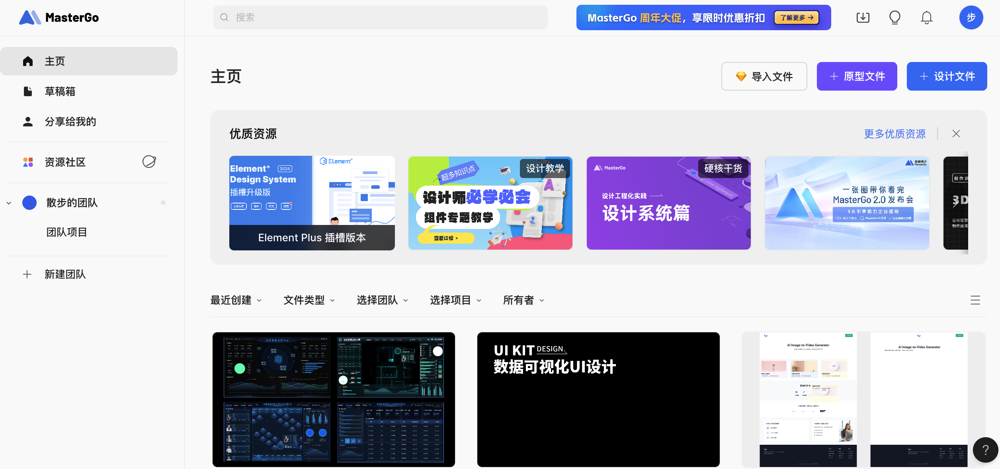

2. **创建新文件**
   1. 在右上角看到 + 设计文件的按钮选项进行点击，或者选择导入 Figma 等文件。
   2. 点击后，你会进入一个空白画布，这就是 MasterGo 的设计工作区。

3. **认识基本界面区块**
   当你学会使用 Figma 后，MasterGo 的使用方式大同小异，主要分为几个区域：

   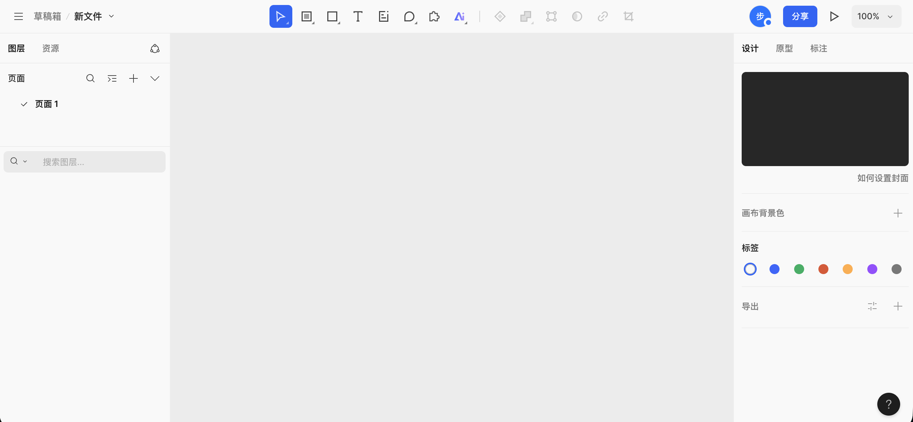
   1. 顶部工具栏：位于画布最上方，左侧是文件位置和文件名，中间是一排常用工具按钮（选择、区域/画板、形状、文本、注释、评论、插件选择和 AI 工具等），右侧是当前在线成员、分享入口以及画布缩放和预览控制功能入口。
   2. 左侧面板：主要分为图层和资源，当前停留在图层标签，可看到页面列表，以及该页面下所有图层的结构和层级。
   3. 中间画布区：具体绘制和排版的工作区，所有 Frame、组件和图形都会展示在这里。
   4. 右侧属性面板：用于查看和编辑选中对象的属性，例如大小、位置、对齐方式、背景填充、描边、圆角等。如果没有选中任何对象，会显示画布相关设置，如画布背景色、标签和导出选项。

### 3.2 创建你的第一个 Frame

在正式放东西之前，我们需要一个页面容器用来确定界面的边界和尺寸。这个容器在 MasterGo 里，通常叫 Frame。

**步骤：**

1. **选择 Frame 工具**
   1. 在工具栏中找到 Frame / 画板工具，点击后可使用预设参数直接将内容创建到画板。
   2. 或者使用快捷键（通常是 `F`，如果有差异以实际界面为准）。
2. **在画布中拖出一个矩形区域**
   1. 拖出后，你会看到一个带选中框的区域。
   2. 右侧属性面板里，可以看到这个 Frame 的宽度和高度。
   3. 把宽度改成比如 `1440`，高度改成 `900`（一屏网页常用尺寸之一）。
3. **重命名 Frame**
   1. 在左侧图层面板里找到这个 Frame。
   2. 双击名称，把它改成你项目的名字，比如：`My First Page`，或者你自己随便起的页面名。

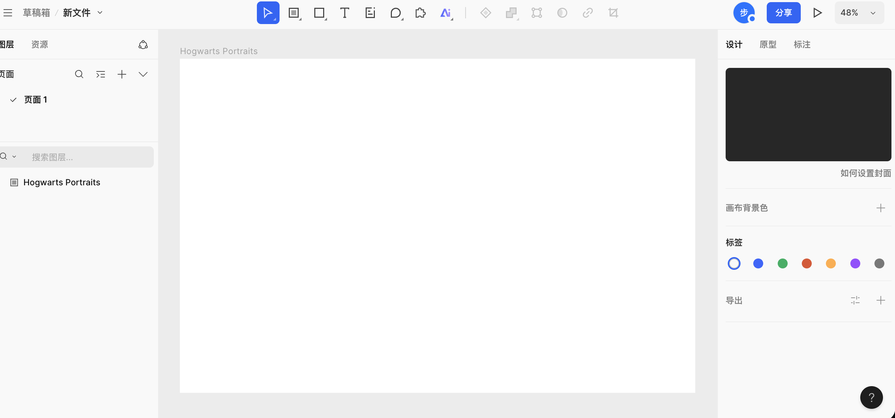

### 3.3 创建画板内容

有了容器，使用与 Figma 中我们已教过的类似方式，很容易可以得到相似的展示页面。（你可以尝试复制 Figma 画板中的文字元素，能够支持文本组件的直接粘贴导入）

值得注意的是 Auto Layout 功能行为稍微的不一致性，在 MasterGo 中，如果你想实现和 Figma 相似的按钮长度随着文字的长度变化，你需要先在对应矩形元素的基础上创建一个容器或组件，如图所示：

成功创建容器后，将按钮矩形和文字放到对应并列的容器中，再在右侧找到 Auto Layout 的按钮启用自动功能，即可成功实现按钮宽度能够随着文字长度变化的功能。

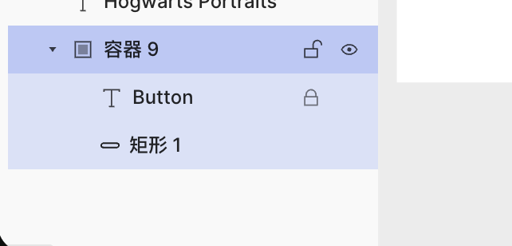

### 3.4 AI 生成页面

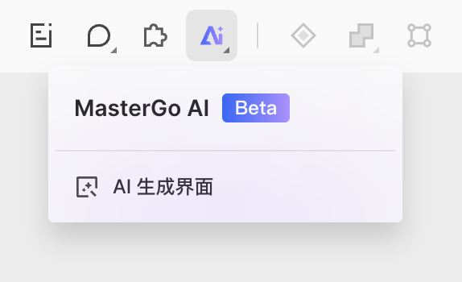

在 MasterGo 中，一个值得注意的有趣功能是 AI 生成页面。你可以用一句话或携带参考图，生成对应的 MasterGo 可编辑版组件，并得到可直接使用的代码。你可以使用中文或者英文直接输入需求，页面会根据需求返回结构清晰的页面排布文档，效果如下：

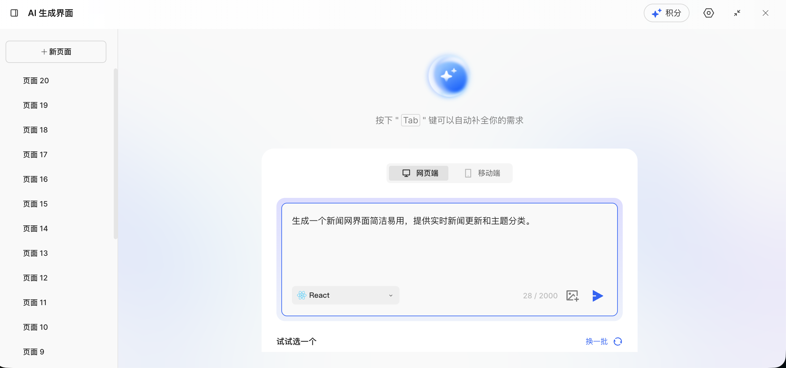

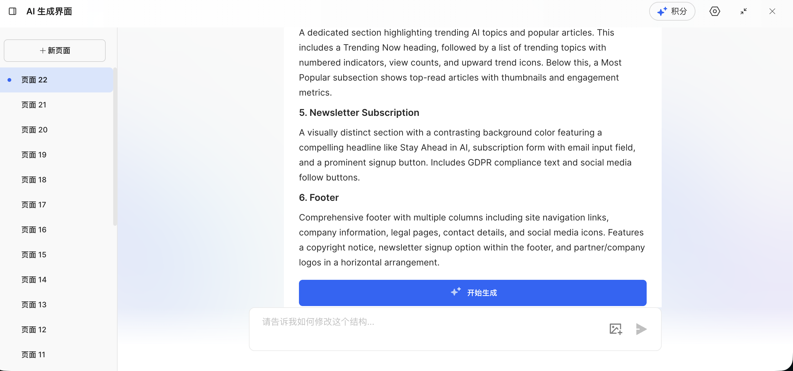

设计文档生成结束后，点击开始生成，稍作等待便能获取对应的实际网页效果：

此时你有两种操作选择：一是点击蓝色按钮将生成结果直接插入画布，二是点击代码预览功能，直接获取当前完整页面的代码，具体操作界面如下：

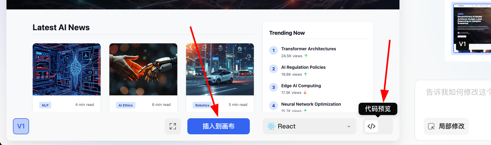

将结果插入画布后，你还能对网页的整体布局、元素细节（如字体、颜色、间距等）进行更精细的调整，直至最终效果完全符合你的预期。

---

## 4. 下一步：从原型到代码

在前面的内容中，我们已经学习了 Figma 和 MasterGo 的基础操作，能够创建出结构完整的界面原型。接下来的关键步骤是：**如何将这些设计稿转化为真正能在浏览器里运行的前端代码？**

::: tip 📚 后续教程
详细的方法介绍请参考 [从设计原型到项目代码](../design-to-code/)，你将学习到：

- **多模态 AI 直接转换**：将设计稿截图发给 AI，直接生成 HTML/React 代码
- **Figma Make**：使用 Figma 官方 AI 工具高精度还原设计并导出代码
- **MasterGo AI**：一键生成可编辑页面并获取代码

这些方法各有优劣，适用于不同的场景，建议根据项目需求选择合适的工作流。
:::

---

## 5. 总结

通过本章节的学习，你已经掌握了：

1. **前端设计工具的价值**：理解了为什么需要设计工具，以及它们如何解决信息分布、团队协作的问题。

2. **Figma 基础操作**：
   - 创建 Design 文件和 Frame 画板
   - 添加文字、形状等基础元素
   - 使用 Auto Layout 实现自适应布局
   - 创建可复用的组件系统

3. **MasterGo 基础操作**：
   - 熟悉与 Figma 相似的界面布局
   - 创建 Frame 和基础画板内容
   - 使用 AI 生成页面功能快速创建原型

::: tip 💡 下一步
现在你已经掌握了前端设计工具的基础使用方法，可以尝试：
- 为自己设计一个个人作品集页面
- 为接下来的项目设计界面原型
- 学习 [从设计原型到项目代码](../design-to-code/)，将设计稿转化为可运行的代码

如果你在完成 [一起做霍格沃茨画像](../hogwarts-portraits/) 项目，可以先设计界面原型，再导出代码与 AI 对话功能结合。
:::

<RelatedArticlesSection
  title="相关文章"
  description="建议继续学习 UI 设计深化与设计转代码实战。"
  :items="relatedArticles"
/>
