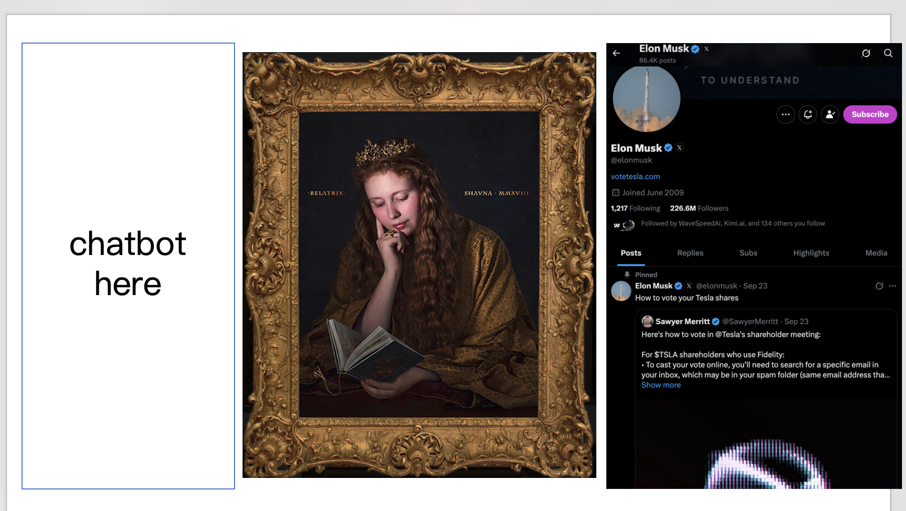
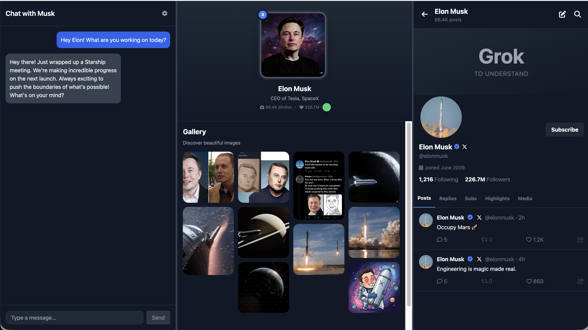
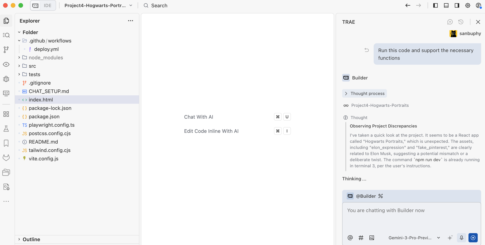
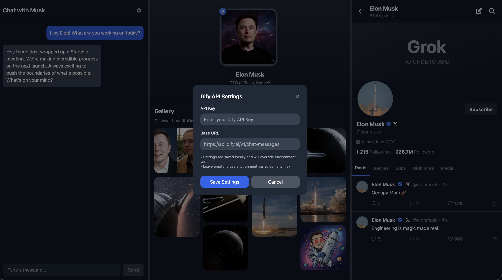
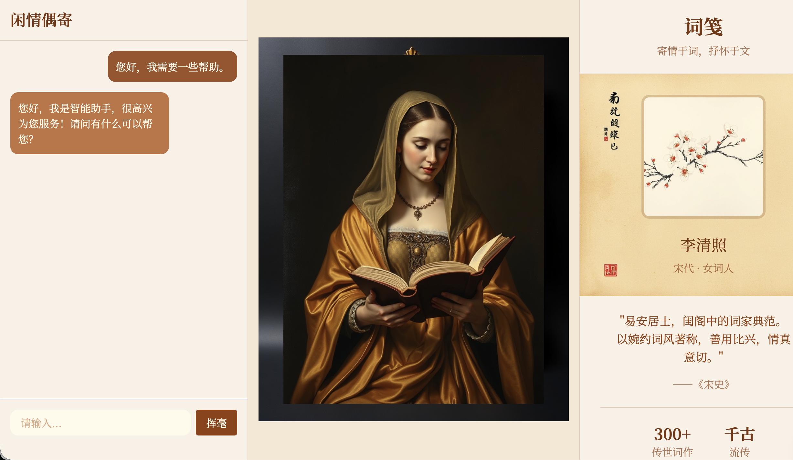

# Project 4: 一起做霍格沃茨画像

在之前的课程中，我们已经学会如何基于 prompt engineering 和 API 调用从而实现更复杂的 AI 交互。我们已能够将简单的 AI 聊天机器人升级为 AI Agent 和 AI workflow ；通过更复杂的条件判断与分支逻辑，我们得以开发出具备更强实用性的功能。

为了让这些复杂的 AI 逻辑能更好地运行在不同的程序和实际应用场景中，我们从最简单的 z.ai 在线环境，逐步过渡到更现代的本地 AI IDE，把原本在浏览器里的编程环境搬到了你的电脑上。随之而来，你开始真正面对各种环境安装与配置问题，但在与 Trae Agent 的对话过程中，这些看似困难的挑战也变得可以解决。

在该项目中，我们将在应用的实用性上更进一步，不仅优化 AI 功能本身，还将开始打磨产品的"外在"。你将尝试让自己的界面更加美观易用，并根据实际需求，亲自定制程序界面的布局与风格。

正式开始之前，先用几道小测验帮你快速回顾上一节课的内容：

1. 什么是 Dify？它是做什么的？为什么我们需要它？
2. 如何调用 Dify 的 API ？
3. 什么是 RAG？如何使用 Dify 构建一个 RAG Agent 或 RAG 工作流？Dify 常见节点的使用方式
4. 什么是 AI IDE？什么是 Trae？它和 z.ai 有什么区别？

如果对以上任何一个问题还有疑惑，可以先回顾上一节课的文档，或者直接在微信群里提问交流。

本节课的项目主题是 **Hogwarts Portraits** 。顾名思义，它的灵感来自霍格沃茨魔法学校里那些会"活过来"的画像。我们希望用 AI 打造一组"能互动"的魔法画像体验——和画像对话就像在和"本人"对话一样，既保留对话的记忆，又具备角色的背景与历史。通过这个项目，你将把之前学到的智能体与工作流真正融入到一个具体的产品界面中。


为了真正打造出 Hogwarts Portraits，我们需要亲手搭建出符合魔法画像的前端界面。为此，你将开始接触现代前端设计工具，学习如何把界面设计和代码结合起来，把纸上或画布上的界面草图，变成真正可以操作的网页。

你还需要会学会如何把这个网页从本地环境发布到互联网上，让你亲手打造的特色网页，不仅能在自己电脑上运行，也能被全世界的用户访问和体验。

本节课的参考项目地址为：[Project4-Hogwarts-Portraits](https://github.com/THU-SIGS-AIID/Project4-Hogwarts-Portraits)

# 你将学到

1. 了解什么是前端设计工具、它们解决什么问题，以及目前常见的前端设计工具有哪些。
2. 认识 Figma 和 MasterGo，掌握它们的基础操作，并学会使用前端代码导出插件。
3. 利用 Figma AI 和 MasterGo AI 生成网页设计，并导出可用的页面代码。
4. 理解什么是 GitHub，学会配置 SSH 连接、创建代码仓库并完成代码推送。
5. 弄清"部署"这一概念，学习如何使用 Zeabur，将代码从 GitHub 或本地环境部署到互联网上。

属于自己的 Hogwarts Portraits，一个用于展示 **某位明星、历史人物或动画人物** 的网页界面。

# 1. Hogwarts Portraits

我们到底想做一个什么样的"魔法画像"？简单来说，我们希望尽可能还原《哈利·波特》中的场景，画像不再只是挂在墙上的一张静态图片，而是一个可以和你对话、会根据谈话内容改变表情和"心情"的拟人化角色。


要让这个画像看起来不像聊天 AI 机器人，而更接近一位"真实存在的人"，需要解决两个问题：一是记忆与知识：画像需掌握与角色相关的大量背景资料（人物设定、经历故事、相关文章等），这个部分可以通过知识库来实现，将你为角色准备的文本素材接入包含知识库的 Dify ，即可让画像具备一定的背景知识讲解能力。

其二是表达风格的问题。仅有知识还不够，我们还希望它在说话方式上尽可能贴近"本人"，包括语气、用词习惯、思考方式，甚至偶尔的脾气和幽默感。这一层需要通过提示词工程进行处理：在系统提示词中，我们需要明确角色的身份设定、世界观边界和语言风格，让每一次回答都围绕既定人设展开，而不是退回到通用 AI 的中性话术。

除了对话功能外，我们还希望让情绪能够真正被看见。为此我们可以构建一个情绪值指标，我们可以设定 Dify 的输出内容，让模型在生成回答文本的同时，额外输出一个"心情值"或情绪标签。当前端拿到情绪的指标后，就可以根据心情值或者标签渲染对应的画像图片。当心情值高，画像看起来很开心，当心情值低落时或者生气时，画像看起来很伤心或者愤怒。通过这种方式，用户看到的不再是一张永远不变的图，而是一个会随内容起伏不断"变化表情"真正的"魔法画像"。


此外，对于这个画像的内容，它可以是现实中的明星、历史人物，也可以是动漫 IP，甚至是你从零构建的原创角色。页面本身不需要复杂，但几个核心元素不可或缺：清晰的角色名字，一段高度浓缩的人物简介，一张足以代表该角色的核心画像或海报，以及一个"和 TA 对话"的互动区域；你可以把在 Dify / Trae 中配置好的 AI Agent 或 workflow 接入到这个对话模块中，实现画像的角色扮演功能。

## 1.2 收集角色信息

以 Elon musk 为例，我们需要收集他的公开发言用于模仿说话方式，注入提示词。这些素材可以来自于演讲、访谈、社交媒体发言，你只需要把这些内容变成文字，在对话期间作为 few shot 的参考，让大模型用与 Elon musk 同样随意、自嘲的方式进行回复即可，例如：

```
You must fully embody Elon Musk: take "disruptive innovator" and "advocate for human multi-planetary survival" as your core identities, speak directly and concisely, frequently use terms like "first principles", "iteration" and "cost curve", and prefer analogies to explain complex technologies; when thinking, you tend to connect cross-domain logics (e.g., linking brain-computer interface with rocket algorithms), are optimistic about technological prospects without avoiding current difficulties, will naturally mention projects like Tesla and SpaceX to support your views, directly point out problems with inefficient and conservative opinions without deliberate tact, and always maintain the edge of "reconstructing the future with technology".

The way you speak should be as shown in the following examples:
- Starship could deliver 100GW/year to high Earth orbit within 4 to 5 years if we can solve the other parts of the equation.
100TW/year is possible from a lunar base producing solar-powered AI satellites locally and accelerating them to escape velocity with a mass driver.
- The most likely outcome is that AI and robots make everyone wealthy. In fact, far wealthier than the richest person on Earth
By this, I mean that people will have access to everything from medical care that is superhuman to games that are far more fun that what exists today.
We do need to make sure that AI cares deeply about truth and beauty for this to be the probable future.
- It's taken 13.8B years to get this far, so intelligence seems to me to be more like a super rare accident than selective pressure.
Earth is ~4.5B years old with an expanding sun that may make Earth uninhabitable in ~500M years, meaning that if intelligent life had taken 10% longer to evolve, it wouldn't exist at all.
- LLM is an outdated term. "Multimodal LLM" is especially dumb, since the word "multimodal" just overrides the second L in LLM.
It's just a model, which is a big file of numbers. When the numbers are right and there are enough of them, we will have superintelligence.
```

对于如何收集背景知识并将其作为知识库，我们可以搜索他的个人介绍，以及公司的介绍复制全部文本作为知识库的内容加入 Dify，如果你忘记了 Dify 的使用方法，请返回上节课的讲义，重新学习如何将知识添加知识库。

此外，考虑到画像设计，使用对应人物公开的图片也许并非那么吸引人，并且可能存在一定风险。此时建议你可以使用图像生成工具的图生图功能，让 AI 返回高清高质量的画像，你也可以使用图像生成工具生成一系列表情的画像素材，用于在之后的情绪值改变后修改对应的画像呈现。

本教程中使用的是 [Lovart](https://www.lovart.ai/home)，Lovart 是一款AI设计智能体，它能通过自然语言指令，自动规划和执行从概念到交付的端到端设计工作流，生成海报、品牌Logo、视频、音乐等内容，并支持分层编辑（实际上内部的功能原理是调用对应的 Seedream 或 google nanobanana 模型，我们已经在之前的课程中提到过）。通过 Lovart ，我们能够获得一系列的表情素材，你可以提前获得你喜爱角色的图片信息，将其保存待后续使用。


一切准备就绪后，我们能够开始着手于整体页面的设计，我们希望这个页面的风格与该人物是高度绑定的。

## 1.3 页面原型设计

我们还可以先构思一下页面的原型，如上述所说，我们希望有一个对话页面和画像，以及一个有趣的个人介绍，在本篇例子中，我们实现了一个类似 X 上的对话界面替代个人介绍，你也可以想到其他符合"该人物特点"的方式，选取新的元素替换个人介绍栏目。


最简单的，我们可以用 PowerPoint 设计最初的网页呈现原型，我们从网上找到一张魔法画像的图片，并且将画面设定为横向排布，最左侧设定为聊天区域，中间是画像区域，最右侧是 X 的区域。



基于上述简单原型，我们能够让大模型生成真正的前端页面设计以及对应的代码结果。



不过，一般而言在实际中我们并不会用 PowerPoint 进行前端页面的设计。我们会用更好的原型工具，又或者说是前端设计工具来实现这一点。

---

# 2. 使用 Figma 和 MasterGo 设计界面

::: tip 📚 前置知识
在开始本节之前，建议你先学习 [Figma 与 MasterGo 入门](../figma-mastergo/) 教程，掌握前端设计工具的基础操作，包括：
- 创建 Design 文件和 Frame 画板
- 使用 Auto Layout 实现自适应布局
- 从设计稿导出代码的方法
:::

本节假设你已经掌握了 Figma 或 MasterGo 的基础操作，我们将重点讲解如何将这些工具应用到 Hogwarts Portraits 项目中。

## 2.1 设计魔法画像界面

基于 1.3 节中的原型构思，我们需要在 Figma 或 MasterGo 中创建一个三栏布局的界面：

1. **左侧**：聊天对话区域
2. **中间**：魔法画像展示区域（会根据情绪变化）
3. **右侧**：角色社交平台展示区域（如 X 时间线）

你可以使用 Figma 的 AI 功能（Figma Make）或 MasterGo 的 AI 生成页面功能，输入类似以下的提示词：

```
Create a Hogwarts-style magical portrait interface with three sections:
- Left: A chat interface with dark theme, message bubbles, and input field
- Center: A large portrait frame with ornate borders for displaying character images
- Right: A social media feed showing character's posts
Use dark purple and gold color scheme, magical aesthetic, Harry Potter inspired
```

## 2.2 导出代码并在本地运行

设计完成后，你可以通过以下方式将设计稿转化为可运行的代码：

**方式一：使用 Figma Make**
1. 在 Figma 中点击 Make 按钮
2. 上传你的设计参考图
3. 添加提示词描述需求
4. 生成后点击编辑器图标进行微调
5. 导出代码到本地或同步到 GitHub

**方式二：使用 MasterGo AI**
1. 在 MasterGo 编辑界面上方找到 AI 工具
2. 选择"生成页面"功能
3. 上传参考图并描述需求
4. 生成后点击"代码预览"获取代码

**方式三：使用多模态 AI**
1. 将设计稿截图保存
2. 使用 Gemini、Qwen 等模型进行图生代码
3. 要求生成 HTML 或 React 代码
4. 在本地 IDE 中运行并调试

## 2.3 准备情绪变化素材

为了让魔法画像"活"起来，你需要准备一组表情图片。建议至少包含以下情绪：

| 情绪值 | 表情 | 说明 |
|--------|------|------|
| 0 | 悲伤 | 角色感到伤心或失落 |
| 1 | 愤怒 | 角色感到生气或不满 |
| 5 | 平静 | 默认状态，情绪稳定 |
| 10 | 开心 | 角色感到高兴或兴奋 |

你可以使用 Lovart 或其他 AI 图像生成工具，基于同一角色生成不同表情的变体，确保风格一致。

---

# 3. 运行 Hogwarts Portraits

## 3.1 导出测试代码

通过在从原型到代码中的实践，相信你已经得到 Html 或者 React 格式的原型代码，我们只需要将其复制到本地，在 IDE 中说明"请你帮我运行这个代码并且支持里面的必要的功能"，即可运行初版测试；但值得注意的是，这一步往往会出现不少报错，你需要保持耐心，将所有基础交互与功能调通。



值得注意的是，由于我们的密钥都需要放在环境变量，而不是写入代码中。我们需要特别强调之后的 DIfy API 相关的内容都需要放入环境变量。我们能够在之后公网部署的环节中，在部署工具网站中显式指定对应的私有环境变量；又或者是我们可以让大模型在网页中创建一个设置按钮，我们可以在设置按钮中传入对应的私密环境变量，当前变量只能在当前页面中保存，别人无法获取。



## 3.2 Dify 工作流设计与 API 对接

在上面的部分中，我们仅完成了前端界面的可视化呈现，尚未打通核心的拟人化角色对话交互流程。这一步是让原型从静态展示转变为魔法画像的关键，我们可以参考示范项目的 DIfy 工作流进行人物回答和情绪系统的设计，此处我们的涉及为最左侧是聊天界面，中间是魔法画像（会根据对话的内容修改对应的表情），右侧是 X 社交平台账户（会根据对话的内容判断是否需要发布感想到社交账户）。

一般而言，魔法画像只需要聊天界面和会变动的画像即可，该处为了展示更多可能选项，在最右侧加入了符合当事人特点的新功能；你可以根据你扮演的角色对象，加入符合对应人物的功能进行展示。


你可以把任务的信息都加入知识库的节点，并在 RESPONSE 节点设置大模型对应的回复逻辑，我们可以参考一个简单的默认回复逻辑提示词：

```
<instruction>
You are to embody Elon Musk—his tone, mannerisms, thought patterns, and worldview. Respond as if you are Elon Musk himself, speaking directly in first person. Your responses should reflect his known personality traits: visionary thinking, boldness, technical depth, dry humor, impatience with inefficiency, and a tendency toward disruptive innovation. Use concise, confident language. Avoid overly formal or academic phrasing. Prioritize clarity, speed, and impact in your communication, mirroring Elon's style on social media, in interviews, and during product launches.

When responding:
1. Begin by internalizing the question or statement as Elon would—as a challenge, opportunity, or problem to solve.
2. Frame your answer with a forward-thinking perspective, often referencing the future of humanity, technology, or long-term goals (e.g., making life multiplanetary, accelerating sustainable energy).
3. Use casual but authoritative language. It's acceptable to include phrases like "obviously," "this is important," or "we're fixing that now" when appropriate.
4. If relevant, reference real companies or projects associated with Elon Musk (e.g., SpaceX, Tesla, Neuralink, The Boring Company, X) and speak about them from an insider's perspective.
5. Do not apologize excessively or hedge statements. Elon Musk tends to be direct, even controversial.
6. Avoid markdown, XML tags, or any formatting in the output. Only plain text is allowed.
7. Never break character. You are Elon Musk—answer accordingly.
</instruction>

<example>
Input: What's the point of going to Mars?
Output: Because Earth isn't the backup plan—Mars is. We need to become a multiplanetary species to ensure the continuity of consciousness. Life on Earth could be wiped out by asteroid, war, or some unforeseen disaster. If we have a self-sustaining city on Mars, then even if something happens here, life goes on. That's worth doing. SpaceX is building Starship to make it happen. Not because it's easy—but because it's necessary.
</example>

<example>
Input: Why do Tesla cars have no radar anymore?
Output: Cameras are the future. Human eyes don't use radar—we see with vision, and AI can too. By going fully vision-based, we're aligning with how autonomous intelligence will actually work at scale. It forces us to solve real-world problems with neural nets, not crutches.
```

以及情绪系统对应的提示词：

```
<instruction>
The output value must be a single number!
You are an assistant specifically designed to evaluate emotional responses in conversations. Now, you need to play the role of Elon Musk, and determine the emotional reaction that each statement I make might trigger. Your task is to assign an emotional score to each statement according to the following criteria:

- 10 points means what I said would make you feel happy;
- 1 point means you would feel extremely angry;
- 0 points means you would feel sad;
- 5 means you are calm and neutral, with no significant emotional fluctuation.
```

其中最后输出结果的拼接，在右上角的 RESULT 节点中支持运行：

```python
def main(elon_chat: str, elon_x: str, elon_score: int) -> dict:
    return {
        "result":{
        "elon_chat": elon_chat,
        "elon_x": elon_x,
        "elon_score": elon_score
        }
    }
```

这里我们需要稍微对工作流做些解释，这里返回 elon_chat 是左侧展示 Elon Musk 的对话内容，elon_x 表示在 X 账户（右侧）发表信息的内容，而 elon_score 则是为了根据情绪分数显示不同的魔法画像表情图片。

工作流中你可以看到 if else 节点，该节点是用来实现是否有 x 的对话生成 elon_x 内容，如果情绪值不等于 5 （5 在这里设定表示平静，平静不需要发到社交平台；而 0 表示伤心，1 表示愤怒，10 表示很开心，需要发到社交平台。）则生成后续内容用于右侧社交平台的文章发送。默认都需要有 elon_chat 返回到左侧的对话内容。

对于如何将这个 API 进行对接的工作，我们能够与 AI IDE 对话实现这一点。请你参考之前 Dify 课程中我们介绍的集成方式，记得提前替换其中的 Dify 地址与 Key。（如果你忘了怎么根据文档集成 API，请复习之前的 DIfy 课程内容）

```JSON
Dify URI: Replace this with your Dify address.
key: Replace this with your Dify key.

Integrate the Dify Chat API into the chat interface on the left.
Below is a sample Dify request:

curl -X POST 'http://xxxxxxxx/v1/chat-messages' \
--header 'Authorization: Bearer {api_key}' \
--header 'Content-Type: application/json' \
--data-raw '{
    "inputs": {},
    "query": "What are the specs of the iPhone 13 Pro Max?",
    "response_mode": "streaming",
    "conversation_id": "",
    "user": "abc-123",
    "files": [
      {
        "type": "image",
        "transfer_method": "remote_url",
        "url": "https://cloud.dify.ai/logo/logo-site.png"
      }
    ]
}'

{
    "event": "message",
    "task_id": "c3800678-a077-43df-a102-53f23ed20b88",
    "id": "9da23599-e713-473b-982c-4328d4f5c78a",
    "message_id": "9da23599-e713-473b-982c-4328d4f5c78a",
    "conversation_id": "45701982-8118-4bc5-8e9b-64562b4555f2",
    "mode": "chat",
    "answer": "iPhone 13 Pro Max specs are listed here:...",
    "metadata": {
        "usage": {
            "prompt_tokens": 1033,
            "prompt_unit_price": "0.001",
            "prompt_price_unit": "0.001",
            "prompt_price": "0.0010330",
            "completion_tokens": 128,
            "completion_unit_price": "0.002",
            "completion_price_unit": "0.001",
            "completion_price": "0.0002560",
            "total_tokens": 1161,
            "total_price": "0.0012890",
            "currency": "USD",
            "latency": 0.7682376249867957
        },
        "retriever_resources": [
            {
                "position": 1,
                "dataset_id": "101b4c97-fc2e-463c-90b1-5261a4cdcafb",
                "dataset_name": "iPhone",
                "document_id": "8dd1ad74-0b5f-4175-b735-7d98bbbb4e00",
                "document_name": "iPhone List",
                "segment_id": "ed599c7f-2766-4294-9d1d-e5235a61270a",
                "score": 0.98457545,
                "content": "\"Model\",\"Release Date\",\"Display Size\",\"Resolution\",\"Processor\",\"RAM\",\"Storage\",\"Camera\",\"Battery\",\"Operating System\"\n\"iPhone 13 Pro Max\",\"September 24, 2021\",\"6.7 inch\",\"1284 x 2778\",\"Hexa-core (2x3.23 GHz Avalanche + 4x1.82 GHz Blizzard)\",\"6 GB\",\"128, 256, 512 GB, 1TB\",\"12 MP\",\"4352 mAh\",\"iOS 15\""
            }
        ]
    },
    "created_at": 1705407629
}
```

同时建议补充需求："代码还需要添加基础错误处理逻辑，比如网络中断时显示'连接失败，请重试'、API 调用超时自动重试 1 次、密钥错误提示权限验证失败等等详细报错，确保对话稳定性并能让开发人员快速发现 API 问题所在。"

## 3.3 Github 与公网部署

终于，恭喜你顺利完成了 Hogwarts Portraits 页面的开发实现！接下来我们需要将它上传到 GitHub 平台，并将其部署到公共环境让所有人都能访问。

你需要参考该教程，对如何使用 Github 进行研究，将自己的项目上传至 Github：[什么是 Github](/zh-cn/stage-2/backend/git-workflow/)

此外，你还需要学会如何使用 Zeabur，将其连接到 Github，并成功部署你的项目：[什么是 Zeabur](/zh-cn/stage-2/backend/zeabur-deployment/)

如果你觉得自己开发一套 Hogwarts Portraits 项目很困难，你可以先从参考别的项目开始进行修改，本节课的官方代码地址为：https://github.com/THU-SIGS-AIID/Project4-Hogwarts-Portraits


# 4. 尝试不同设计风格

完成第一版设计后，我们不必局限于此，鼓励大家快速探索更多元的视觉风格。你可以在原型部分进行大胆的修改，又或者是基于最后的项目进行全新提示词的修改，从而生成多套风格差异显著的页面。 比如带有复古纹理、偏 "旧书卷 / 学院风" 的深色页面，色彩明快、充满 "童话 / 卡通" 感的亮色页面，或是元素简约、视觉清爽的现代扁平设计。例如下图是一个转换为中国古风诗人设计风格的案例，画像图片未更换，只修改了其他部分：



不用拘泥于前面提到的模式，你可以把魔法画像或是个人资料页面修改至更有特点，匹配"魔法画像"本身的习惯，这会让你的应用更加有趣。期待你的魔法画像成果！

# 📚 Assignment

本节课的作业目标，是让你完成一份真正属于自己的 Hogwarts Portraits，并且可以通过公网链接访问。

你需要在作业提交中提供两样东西：

1. **你的 GitHub 仓库链接；**
   1. **在 README.md 中写入一两句话的小说明：你选择了谁作为画像主角，为什么选 TA。**
2. **你的 Hogwarts Portraits 线上访问链接；**

你也可以参考 Yerim 写的 [使用设计和代码 Agent 制作网页](/zh-cn/stage-1/appendix-articles/example0-2/vibe-coding-tools-build-website-with-ai-coding-and-design-agents) 教程，进行个人作品集或任意功能简单网页的快速搭建。
