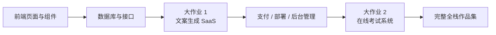

# 初中级开发

欢迎来到 **初中级开发** 阶段！在这里，你将深入全栈开发，掌握前端组件化、数据库设计、后端 API 开发与部署上线。

## 你将学到什么

### 前端开发

掌握现代前端开发，学习组件库与设计工具的使用：

<NavGrid>
  <NavCard
    href="/zh-cn/stage-2/frontend/lovart-assets/"
    title="从Lovart出发，搭建自己的素材生产Agent"
    description="从零开始，利用Nanobanana和Lovart批量生成高质量的设计素材，并动手构建一个能意图识别的绘图Agent"
  />
  <NavCard
    href="/zh-cn/stage-2/frontend/figma-mastergo/"
    title="Figma 与 MasterGo 入门"
    description="掌握专业 UI 设计工具的基础操作，从设计稿到代码的协作流程"
  />
  <NavCard
    href="/zh-cn/stage-2/frontend/ui-design/"
    title="构建第一个现代应用程序 - UI 设计"
    description="学习现代应用程序的 UI 设计基础"
  />
  <NavCard
    href="/zh-cn/stage-2/frontend/multi-product-ui/"
    title="参考 UI 设计规范设计页面和按钮"
    description="学习主流 UI 设计规范，设计更清晰的页面层级与按钮层级"
  />
  <NavCard
    href="/zh-cn/stage-2/frontend/llm-skills-beautiful/"
    title="用 LLM 和 Skills 让界面变好看"
    description="使用提示词与插件实战，让 AI 生成美观独特的界面"
  />
  <NavCard
    href="/zh-cn/stage-2/frontend/hogwarts-portraits/"
    title="一起做霍格沃茨画像"
    description="实战项目：结合 AI 生成的图像，构建一个交互式的霍格沃茨画像应用"
  />
  <NavCard
    href="/zh-cn/stage-2/frontend/design-to-code/"
    title="从设计原型到项目代码"
    description="学习如何将设计工具中的原型转化为真正能在浏览器里运行的前端代码"
  />
  <NavCard
    href="/zh-cn/stage-2/frontend/modern-component-library/"
    title="使用现代组件库更新你的界面"
    description="学习使用组件库快速构建专业级界面"
  />
</NavGrid>

### 后端开发

学习 API 设计、数据库管理以及应用部署策略：

<NavGrid>
  <NavCard
    href="/zh-cn/stage-2/backend/git-workflow/"
    title="学会使用 Git 与 Github"
    description="掌握 Git 版本控制系统的核心操作与协作流程"
  />
  <NavCard
    href="/zh-cn/stage-2/backend/database-supabase/"
    title="从数据库到 Supabase"
    description="掌握关系型数据库基础，并学习使用 Supabase 这一现代 BaaS 平台"
  />
  <NavCard
    href="/zh-cn/stage-2/backend/ai-interface-code/"
    title="应用后端接口设计与开发"
    description="利用 AI 辅助生成后端接口代码及标准的接口文档，提升开发效率"
  />
  <NavCard
    href="/zh-cn/stage-2/backend/zeabur-deployment/"
    title="发布你的产品原型"
    description="学习使用 Zeabur 快速部署你的全栈应用到云端"
  />
  <NavCard
    href="/zh-cn/stage-2/backend/modern-cli/"
    title="从 IDE 到 CLI AI 编程工具"
    description="探索现代 CLI 工具，提升命令行环境下的开发体验"
  />
  <NavCard
    href="/zh-cn/stage-2/backend/stripe-payment/"
    title="如何集成 Stripe 等收费系统"
    description="实战：为你的应用集成 Stripe 支付功能，实现商业化变现"
  />
</NavGrid>

### 大作业

前面的章节是在学“零件”，大作业才是在学“怎么把零件装成一个能跑、能演示、能上线的产品”。

建议你按 **大作业 1 -> 大作业 2** 的顺序来做：

- **大作业 1** 先带你跑通现代 SaaS 最常见的主链路：登录、生成、数据库、支付、管理后台。
- **大作业 2** 再带你进入更像业务系统的场景：角色权限、题库、考试、提交记录、管理台。

如果你不知道先做哪个，可以直接参考下面这张对比表：

| 项目 | 你会重点练到什么 | 最适合谁 | 最终交付物 |
|------|------|------|------|
| 大作业 1：文案生成网站 | SaaS 页面结构、用户登录、AI 生成、Stripe 支付、后台管理 | 第一次做完整商业化网站的人 | 一个可注册、可生成、可付费、可管理的 SaaS 雏形 |
| 大作业 2：在线考试与管理系统 | 角色权限、题库建模、考试流程、提交记录、批改与统计 | 想把“业务系统”真正做完整的人 | 一个有学生端和管理端的考试平台 |

无论做哪一个，大作业都建议至少准备这 3 个交付物：

- 一个可运行的项目仓库
- 一个可访问的演示链接
- 一份 README 和一段演示视频

<NavGrid>
  <NavCard
    href="/zh-cn/stage-2/assignments/copywriting-platform-supabase/"
    title="大作业 1：第一个 SaaS 全栈应用——文案生成网站"
    description="从零打造一个 AI 营销文案工作台，涵盖登录、生成、支付、管理后台"
  />
  <NavCard
    href="/zh-cn/stage-2/assignments/exam-management-express/"
    title="大作业 2：在线考试与管理系统"
    description="构建在线考试系统，支持自动出题、答题、后台管理"
  />
</NavGrid>

如果你已经完成了上面两个主线项目，或者想按自己的技术方向做作品集，可以继续从下面这些扩展选题里选一题深入：

<NavGrid>
  <NavCard
    href="/zh-cn/stage-2/assignments/modern-landing-page/"
    title="扩展作业：现代 Web 落地页工程"
    description="练习价值表达、转化路径、CTA 设计与基础埋点，做一个真正能承接流量的页面"
  />
  <NavCard
    href="/zh-cn/stage-2/assignments/custom-dify-agent-platform/"
    title="扩展作业：类 Dify 智能体编排平台"
    description="实现智能体管理、对话、日志与权限控制，做一个最小可用的 AI 平台"
  />
  <NavCard
    href="/zh-cn/stage-2/assignments/travel-planning-agent-platform/"
    title="扩展作业：智能旅游规划 Agent 编排平台"
    description="围绕结构化输入、Agent 编排和历史计划管理，做一个可执行的 AI 旅行规划产品"
  />
  <NavCard
    href="/zh-cn/stage-2/assignments/movie-recommendation-springboot/"
    title="扩展作业：Spring Boot 电影推荐系统"
    description="结合 Spring Boot、评分收藏与可解释推荐，完成一个完整推荐系统原型"
  />
  <NavCard
    href="/zh-cn/stage-2/assignments/simple-grocery-microservices/"
    title="扩展作业：生鲜电商微服务系统"
    description="练习服务拆分、网关转发、库存与订单协作，体验从单体到微服务的工程思路"
  />
  <NavCard
    href="/zh-cn/stage-2/assignments/traffic-data-visualization-go/"
    title="扩展作业：Go 交通数据分析与可视化平台"
    description="从数据接入、窗口聚合到趋势看板与告警，做一个完整的数据产品原型"
  />
</NavGrid>

### AI 能力扩展

<NavGrid>
  <NavCard
    href="/zh-cn/stage-2/ai-capabilities/dify-knowledge-base/"
    title="Dify 入门与知识库集成"
    description="学习使用 Dify 构建 AI 应用，并集成私有知识库"
  />
</NavGrid>

## 适合人群

- 有一定编程基础，想系统学习全栈开发的开发者
- 希望从产品经理转型为全栈工程师的学习者
- 想要掌握现代开发工具和工作流的初中级开发者
- 希望独立开发完整产品的创业者

## 前置要求

- 完成「新手与产品原型」阶段，或具备同等基础知识
- 了解基本的 HTML/CSS/JavaScript 概念
- 对 AI 编程工具有初步了解

准备好深入全栈开发了吗？点击左侧导航开始学习吧！
