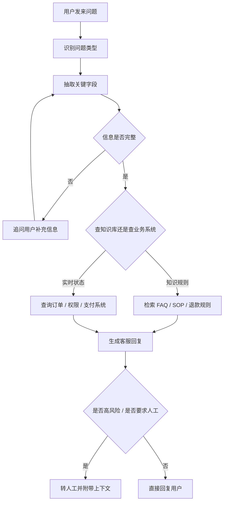
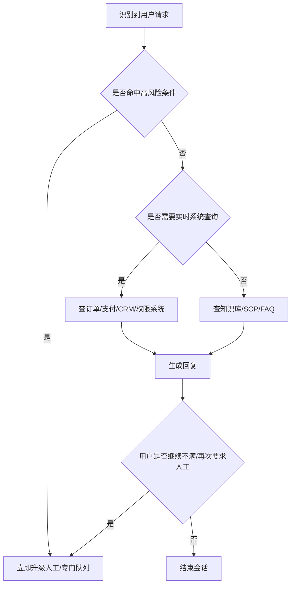

# 企业级客服 Agent 实战：用 LangGraph 搭建可升级、可审计的客服系统

如果你已经做过知识库问答，下一步最值得学习的，不是再堆更多提示词，而是开始理解：一个真正进入企业客服流程的 Agent，到底应该怎样设计。

这一章只做一件事：用 LangGraph 的思路，拆解一个商业级智能客服系统。重点不是代码细节，而是业务 sense、异常处理、人工升级、数据设计和上线边界。

# 快速开始

如果你现在就想开始，可以先想象这样一个场景：

用户晚上 10 点发来一句话：“我明明付了钱，为什么课程还是打不开？” 这时候，一个真正能上线的客服 Agent，不是立刻编个答案，而是先判断这是不是权限问题、需不需要补订单号、要不要查支付系统、有没有必要直接转人工。

如果你只能记住一句话，那就是：

> 企业级客服 Agent 的目标不是“多回答一点”，而是“在该自动时自动，在不确定时补问，在高风险时转人工”。

# 1. 业务侧：先决定这个客服系统要做什么

企业里的客服 Agent，不是先从“模型很强，能不能做点什么”开始设计的，而是先从“业务到底希望它承担什么工作”开始设计的。

最常见的判断方式，是先看下面这些问题：

1. 哪些问题出现频率最高？
2. 哪些问题规则明确、最适合自动化？
3. 哪些问题风险太高，不能自动做决定？
4. 哪些问题必须接业务系统，不能只靠知识库？

如果这些问题没想清楚，后面无论你用 LangGraph、Dify，还是别的 Agent runtime，系统都很容易做成“演示时很聪明，真实业务里不敢放出去”的样子。

## 1.1 先把客服当成业务流程，而不是聊天机器人

LangGraph 适合客服，不是因为它“更会聊天”，而是因为客服本身就是状态流转问题。

比如用户说：

> “我昨天买的课程还是打不开，能帮我看一下吗？”

一个成熟客服系统不会立刻回答，而是会先判断：

1. 这属于支付、权限、退款还是账号问题？
2. 订单号、账号、时间是否齐全？
3. 该查知识库，还是该查业务系统？
4. 是普通请求，还是高风险投诉？
5. 这件事该自动处理，还是该升级给人工？

下面是一张最小但足够真实的客服流程图：



这张图里最重要的不是节点名字，而是它表达的企业逻辑：

1. 信息不完整时先停下来
2. 文档问题和实时数据问题分开处理
3. 高风险问题不要硬答

## 1.2 用一个真实业务场景把系统搭起来

为了让这一章更像企业方案，而不是抽象框架介绍，我们用一个在线教育平台客服来举例。这个 Agent 主要处理四类问题：

1. 课程打不开、会员没开通
2. 订单支付成功但页面状态异常
3. 退款规则解释与退款进度查询
4. 投诉、重复扣费、人工请求

对应的真实用户输入可能是：

- “我昨天付了钱，但是课程还是锁着的。”
- “为什么我登录后还是看不了高级章节？”
- “订单扣款了，但是页面没显示成功。”
- “我这个订单现在能不能退款？”
- “我要找人工，你们这个机器人一直没解决。”

这些输入都不结构化，所以企业客服系统的第一原则不是“尽快回答”，而是“先把任务理解清楚”。

你可以先用一个 prompt，把第一步的业务判断做出来：

```text
你是企业客服系统里的“问题分流与补信息助手”。

你的任务不是直接解决所有问题，而是先做这几件事：
1. 判断用户问题属于哪一类：FAQ、订单/权限查询、退款/投诉、高风险人工升级。
2. 抽取关键字段：账号、订单号、时间、商品名、渠道。
3. 如果字段不足，不要猜测，不要直接给结论，而是生成一句最短、最自然的追问。
4. 如果用户明确要求人工，或者出现重复扣费、投诉、法务、隐私、情绪激烈表达，直接标记为高风险升级。

输出格式：
- 问题类型：
- 关键信息：
- 是否缺信息：
- 下一步动作：
- 给用户的话：
```

这类 prompt 最大的价值，不是为了“让模型显得聪明”，而是为了让系统第一步就有业务边界。

## 1.3 商业级客服真正关心的，不只是回复，而是路由

如果你去看 Zendesk、Intercom、Salesforce 这一类商业客服方案，会发现它们几乎都在做同一件事：先把请求按业务价值和风险等级分开。

一个更接近企业实践的分层，通常是这样的：

### 高并发、低风险、自助可闭环

这类问题最适合优先自动化，因为频率高、规则清楚、ROI 直接。

例如：

1. 密码重置
2. 课程 / 会员 / 权限是否已开通
3. 订单是否支付成功
4. 发票、下载、登录入口
5. 基础退款规则解释

### 需要补信息才能继续的问题

很多用户不会一次把信息说全，所以系统要学会先追问。

例如：

- “我付款了但课程还是打不开。”
- “帮我看一下这个订单是不是有问题。”
- “为什么我的会员还没到账？”

这类问题最常见的 badcase，就是系统直接猜。

### 需要系统查询的半自动问题

这类问题不能只看知识库，因为真正答案在业务系统里。

例如：

1. 订单有没有支付成功
2. 退款是否进入财务流程
3. 用户是不是 VIP
4. 某个课程权限是否真的开通

### 必须升级到人工或专门队列的问题

这才是企业级系统的分水岭。

典型高风险问题包括：

1. 重复扣费
2. 投诉与激烈情绪
3. 法务、隐私、合规请求
4. 盗刷、封号、欺诈
5. 高价值客户负面请求

下面是一张更接近商业客服方案的升级路由图：



# 2. 技术侧：再决定这些功能怎么实现

当业务侧已经想清楚“哪些问题要自动化、哪些问题必须转人工、哪些需要查系统”之后，技术侧的目标才会清楚。

这时你真正要实现的，不是一个“会聊天”的机器人，而是下面这些模块：

1. 意图分类模块
2. 关键信息抽取模块
3. 补信息模块
4. 知识库查询模块
5. 业务系统查询模块
6. 风险判断模块
7. 人工交接模块

## 2.1 模块流转怎么落地

如果你想把整套流程落到工程里，可以先把它理解成一个很简化的模块流转骨架：

```ts
type CustomerServiceState = {
  userMessage: string
  intent?: "faq" | "order" | "refund" | "risk"
  missingFields: string[]
  riskLevel?: "low" | "medium" | "high"
  knowledgeResult?: string
  businessResult?: string
  finalReply?: string
  handoffToHuman: boolean
}

function runCustomerServiceFlow(state: CustomerServiceState) {
  state = classifyIntent(state)
  state = extractFields(state)

  if (state.missingFields.length > 0) return askForMoreInfo(state)
  if (state.intent === "faq") state = searchKnowledgeBase(state)
  else state = queryBusinessSystems(state)

  state = evaluateRisk(state)
  if (state.handoffToHuman) return handoffWithContext(state)
  return generateReply(state)
}
```

这段代码故意写得很省略。你不用先关心框架 API，先看懂一件事就够了：企业客服 Agent 的本质不是“模型回答一次”，而是“状态在几个模块之间流转”。

## 2.2 数据、监控和异常处理

真正的商业客服系统依赖的数据，远不只是聊天记录。

至少要有三层：

1. 输入侧数据：用户原话、渠道、语言、最近对话、是否重复提问、是否要求人工
2. 业务侧数据：账号、订单、支付状态、权限状态、客户等级、历史投诉、地区、套餐
3. 运营侧数据：自动解决率、升级率、首次响应时间、重复进入率、失败率、满意度

如果这些数据没有被结构化，系统就很难真正 enterprise。

同样重要的是异常处理。企业客服最不能接受的，不是模型回答短，而是它在不确定时还假装知道答案。

这里有四类常见 badcase：

1. 信息不全却强行回答
2. 系统超时却假装查到了结果
3. 用户已经明显不满，却继续自动回复
4. 高风险问题仍然走普通 FAQ 流程

你可以用下面这个 prompt，把异常处理和人工升级写成系统规则：

```text
你是企业客服系统里的“异常与升级判断助手”。

请对当前会话判断是否需要人工升级或降级处理。

满足以下任一条件时，优先升级人工：
1. 用户明确要求人工
2. 出现重复扣费、投诉、法务、隐私、欺诈、封号、退款争议
3. 用户情绪明显激烈，或连续两轮表达不满
4. 业务系统查询失败、超时、返回冲突结果
5. 当前证据不足，无法保证结论正确

如果不升级人工，也必须输出：
1. 当前风险等级
2. 是否允许自动回复
3. 如果自动回复，最保守的回复方式是什么
4. 如果查询失败，应该如何向用户解释

输出格式：
- 风险等级：
- 是否升级人工：
- 原因：
- 给用户的话：
```

如果要把“路由”这件事落成最小代码，通常长这样：

```ts
function routeTicket(state: CustomerServiceState) {
  if (state.riskLevel === "high") return "human_handoff"
  if (state.missingFields.length > 0) return "ask_user"
  if (state.intent === "faq") return "knowledge_lookup"
  return "business_lookup"
}
```

真正的企业项目当然会更复杂，但落点通常就是这四种去向：补信息、查知识库、查业务系统、转人工。

# 3. 结尾：怎样判断它够不够企业级

一个真正能进入企业正式链路的客服 Agent，通常至少要满足这几条：

1. 有明确服务边界：哪些能自动处理，哪些不能
2. 有人工接管机制：升级时不能让用户重复讲一遍
3. 有审计追踪：事后能复盘为什么这么路由
4. 有灰度与回滚：不能一改 prompt 就全量上线
5. 有运营指标：不是只看“像不像会聊天”

更完整一点，你至少还要准备：

- 权限层：不同角色能查不同数据
- SLA 与超时回退：查不到结果时怎么处理
- 离线评测集：覆盖常见问题、边界问题、高风险问题
- 人工反馈闭环：把升级后的人工处理结果反哺系统

如果没有这些，系统最多只是一个演示不错的客服 Demo。

# 4. 推荐你的落地顺序

如果你真的要做，建议这样推进：

1. 先只做一个高频低风险场景
2. 先写真实用户输入，再写状态与路由
3. 先接一个知识源和一个业务系统
4. 再补人工升级、异常处理和运营指标
5. 最后才考虑更复杂的 Agent 编排

# 总结

LangGraph 适合企业客服，不是因为它会让回答更花哨，而是因为它能把客服系统真正最重要的东西写清楚：路由、状态、补问、查询、升级、追踪。

当你开始把客服看成一个受治理的业务流程，而不是一个会说话的机器人，你才真正进入了企业级智能客服设计。

# 更多公开案例与延伸阅读

如果你想继续往企业级方向深入，下面这些资料最值得看：

1. **LangChain 官方 `Thinking in LangGraph`**
   最适合拿来理解“客服流程为什么应该先拆状态，再写节点”。

2. **Klarna**
   适合看大规模客服场景里，自动化、升级率和响应效率为什么比“语气自然”更重要。

3. **Minimal**
   适合看多 Agent 如何真正接进 Zendesk、Front、Gorgias 这类客服平台，而不是停留在聊天窗口。

4. **Podium**
   适合看企业级客服为什么离不开 trace、评测和回归测试。

5. **Zendesk / Intercom / Salesforce**
   适合看商业产品如何处理 handoff、sentiment、VIP 路由、procedure handoff 和运营指标。

6. **CFPB**
   适合看监管视角下，为什么糟糕的 chatbot 会把用户困进 “doom loops”，以及为什么人工支持不是可选项。

# Reference

- LangGraph Overview: [https://docs.langchain.com/oss/python/langgraph/overview](https://docs.langchain.com/oss/python/langgraph/overview)
- Thinking in LangGraph: [https://docs.langchain.com/oss/python/langgraph/thinking-in-langgraph](https://docs.langchain.com/oss/python/langgraph/thinking-in-langgraph)
- Built with LangGraph: [https://www.langchain.com/built-with-langgraph](https://www.langchain.com/built-with-langgraph)
- Klarna Customer Story: [https://blog.langchain.dev/customers-klarna/](https://blog.langchain.dev/customers-klarna/)
- Minimal Customer Support System: [https://blog.langchain.dev/how-minimal-built-a-multi-agent-customer-support-system-with-langgraph-langsmith/](https://blog.langchain.dev/how-minimal-built-a-multi-agent-customer-support-system-with-langgraph-langsmith/)
- Podium Customer Story: [https://blog.langchain.dev/customers-podium/](https://blog.langchain.dev/customers-podium/)
- Zendesk AI for Service: [https://www.zendesk.com/service/ai/](https://www.zendesk.com/service/ai/)
- Intercom Fin: [https://www.intercom.com/fin](https://www.intercom.com/fin)
- Salesforce AI for Service: [https://www.salesforce.com/service/ai/](https://www.salesforce.com/service/ai/)
- CFPB Chatbot Guidance: [https://www.consumerfinance.gov/about-us/newsroom/cfpb-issues-guidance-to-prevent-harmful-chatbot-practices/](https://www.consumerfinance.gov/about-us/newsroom/cfpb-issues-guidance-to-prevent-harmful-chatbot-practices/)
