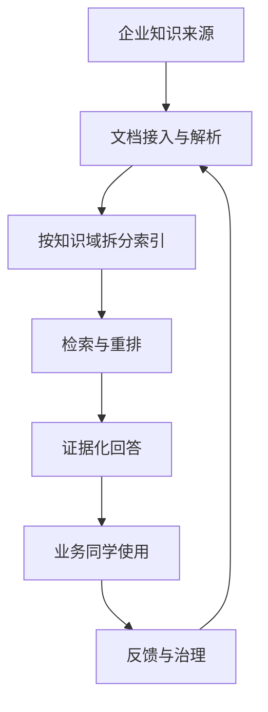
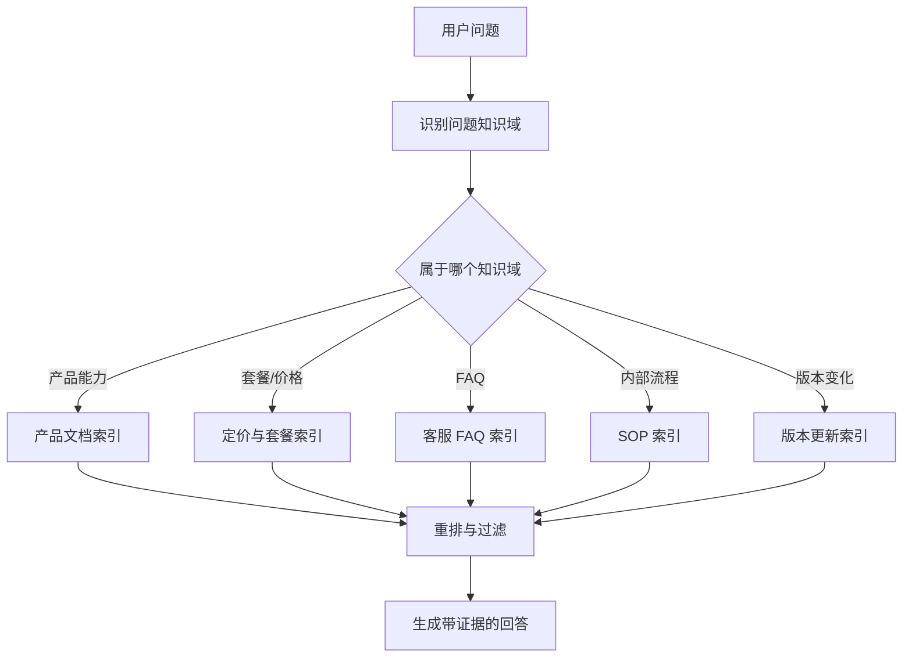

# 企业级知识库实战：用 LlamaIndex 搭建能落地的 RAG 系统

如果说 LangGraph 更适合解决“客服或 Agent 应该怎么跑”，那么 LlamaIndex 更适合解决另一个同样重要的问题：企业的知识，应该怎样被接入、组织、检索和回答。

这一章只聚焦企业知识库。重点不是写很多代码，而是理解一个真正能进入企业内部使用的知识系统，到底要解决什么问题。

# 快速开始

如果你现在就想开始，可以先想象这样一个很简单的场景：

你的销售同事每天都会来问你同样几类问题，比如“企业版到底支不支持这个功能”“最新版和旧版差在哪里”“这段话怎么发给客户更合适”。你要做的，就是把这些分散在产品文档、FAQ、更新日志里的答案，整理成一个能随时被问、而且尽量答得稳的内部知识助手。

如果你只能记住一句话，那就是：

> 企业级知识库不是“把 PDF 塞给模型”，而是“把分散知识变成一个可维护、可检索、可追溯的入口”。

# 1. 业务侧：先决定这个知识库要解决什么问题

企业知识库不是先从“接哪种检索框架”开始设计的，而是先从“业务团队每天到底在反复问什么”开始设计的。

如果这些问题没想清楚，后面无论你用 LlamaIndex、别的 RAG 框架，还是自建方案，系统都很容易做成“能搜，但不好用”的样子。

## 1.1 先把知识库当成知识系统，而不是上传页面

很多人第一次做知识库，会很自然地想：

> “把文档都上传进去，不就行了吗？”

但真实企业环境里，知识至少有这些特点：

1. 来源很多，不只是一堆 PDF
2. 更新很频繁，旧答案很快会过时
3. 不同文档可信度不一样
4. 有些是文档，有些是数据库或配置表
5. 有些问题只靠文档回答不了，还要结合实时系统

所以企业级知识库真正要解决的，不是“有没有文档”，而是：

1. 去哪里找
2. 找哪份最可信
3. 如何避免旧版本干扰
4. 找到之后怎么稳定组织成回答

下面是一张非常适合企业知识库入门的结构图：



这张图最重要的信号是：企业知识库不是一次性工程，而是一个持续治理的循环。

## 1.2 用一个真实业务场景来设计

为了避免太抽象，我们设定一个很常见的企业知识库场景：

你要做的是一个 **企业内部产品知识助手**，服务对象包括客服、销售和实施团队。

它要回答的问题通常像这样：

- “企业版到底能不能配置多个审批流？”
- “客户问我们和基础版相比，多出来的权限管理具体是什么？”
- “这个功能是只有管理员能看到，还是普通成员也能用？”
- “为什么我记得以前文档里写的是 100 人上限，现在好像不是了？”
- “能不能整理一段适合发给客户的更新说明？”

这些问题都很像真实工作语言，而不是数据库查询语句。

也正因为如此，企业知识库的第一步不是“向量化”，而是先承认：

> 用户怎么问，和企业文档怎么写，往往不是同一种语言。

你可以先用一个 prompt，把问题理解和知识路由做出来：

```text
你是企业知识库系统里的“问题理解与知识路由助手”。

你的任务：
1. 判断用户问题属于哪个知识域：产品功能、套餐定价、FAQ、内部 SOP、版本更新。
2. 判断问题更适合查文档、FAQ，还是需要结合业务系统。
3. 如果问题涉及旧版本与新版本冲突，优先提醒系统关注最新版本文档。
4. 如果问题超出知识库能力，不要编造，明确说明需要查业务系统或人工确认。

输出格式：
- 问题所属知识域：
- 推荐查询来源：
- 是否可能涉及版本冲突：
- 是否需要业务系统补充：
- 给上层系统的检索提示：
```

这个 prompt 的价值，在于先把“知识去哪找”这件事做对。

## 1.3 企业级知识库最核心的设计，不是检索，而是拆分

企业知识库效果差，最常见的原因不是模型太弱，而是所有文档都被混成了一锅。

一个更像企业项目的做法，通常会先按知识域拆开，例如：

1. 产品功能文档
2. 套餐与定价说明
3. 客服 FAQ
4. 内部 SOP
5. 版本更新日志

为什么这样更好？因为用户问：

> “最新版增加了什么能力？”

和用户问：

> “退款规则是什么？”

显然不该优先查同一份资料。

下面是一张更接近企业知识库检索设计的路由图：



这就是为什么 LlamaIndex 很适合企业知识库。它不是只帮你“做向量检索”，而是更方便你把不同来源、不同主题、不同规则的知识组织起来。

# 2. 技术侧：再决定这些功能怎么实现

当业务侧已经想清楚“有哪些问题最常见、哪些知识域要拆开、哪些问题不能只靠文档”之后，技术侧的目标才会清楚。

你真正要实现的，通常不是一个“大而全的聊天窗口”，而是下面这些模块：

1. 问题路由模块
2. 文档接入与解析模块
3. 多知识域索引模块
4. 检索与重排模块
5. 证据化回答模块
6. 版本与权威来源控制模块

## 2.1 模块流转怎么落地

如果你想把这个系统想成工程模块，可以先看一个极简骨架：

```ts
type KnowledgeQuery = {
  question: string
  domain?: "product" | "pricing" | "faq" | "sop" | "release_notes"
  needsBusinessData?: boolean
}

function answerWithKnowledgeBase(query: KnowledgeQuery) {
  const routed = routeQuery(query)
  const docs = retrieveDocuments(routed)
  const ranked = rerankDocuments(docs, routed)
  return generateGroundedAnswer(ranked, routed)
}
```

这段代码故意不写具体框架 API。它只是帮助你抓住企业知识库的主干：先路由，再检索，再重排，最后基于证据回答。

## 2.2 治理、边界与证据

如果你去看更接近企业的案例，会发现真正难的不是回答本身，而是治理。

一个企业级知识库，通常至少要有下面这些意识：

### 版本意识

用户问：

> “我记得以前文档里写的是 100 人上限，现在还是吗？”

这类问题最大的风险，不是检索不到，而是检索到了旧规则。

所以企业级系统必须尽量做到：

1. 优先最新版本
2. 区分历史文档
3. 避免旧文档覆盖当前规则

### 权威来源意识

同一个问题，FAQ、产品手册、销售话术、内部 SOP 可能写得不完全一样。

企业系统一定要定义：

1. 默认以谁为准
2. 哪类文档只能内部参考
3. 哪类文档可以对外表达

### 系统边界意识

知识库可以回答：

1. 规则
2. 定义
3. 功能说明
4. 流程解释

但它不应该单独回答：

1. 某个客户是否已经开通功能
2. 某笔退款现在走到哪一步
3. 某个账号当前权限状态如何

这些问题往往还需要业务系统。

所以一个成熟知识库最重要的能力之一，是知道什么时候该说：

> “这个问题需要结合业务系统查询，我现在只能先确认规则，不能直接确认当前状态。”

# 5. 企业知识库要准备哪些数据、评测和异常处理

企业知识库真正依赖的数据，一般有三层：

1. 文档侧数据：来源、版本、更新时间、知识域、权威等级
2. 查询侧数据：用户问题、命中的知识域、检索结果、证据链
3. 运营侧数据：哪些问题经常被问、哪些答案经常被改写、哪些文档经常被引用、哪些问题经常答错

一个真正的企业知识库，还要特别重视 badcase。

最常见的 badcase 包括：

1. 引用了旧文档
2. 把不同部门口径混在一起
3. 看起来答对了，但证据来源不权威
4. 文档里没有答案，却硬生成了结论
5. 本该查业务系统，却只查了文档

你可以用下面这个 prompt，把证据约束做得更稳：

```text
你是企业知识库系统里的“证据化回答助手”。

请严格根据检索到的参考内容回答问题：
1. 优先使用最新、最权威的资料。
2. 如果不同资料之间冲突，明确指出冲突，不要自行编造统一结论。
3. 如果证据不足，明确说明“根据当前资料无法确认”。
4. 如果问题属于实时业务状态，请明确说明需要查业务系统。

输出格式：
- 核心结论：
- 依据来源：
- 是否存在版本冲突：
- 是否需要业务系统补充：
- 给用户的话：
```

如果你想把“证据化回答”落成一个极简模块，可以这样理解：

```ts
function generateGroundedAnswer(docs: string[], query: KnowledgeQuery) {
  if (docs.length === 0) {
    return "根据当前资料无法确认，需要补充知识源或转人工确认。"
  }
  return llmAnswer({
    question: query.question,
    evidence: docs,
    rule: "只根据证据回答；证据不足时明确说不知道。"
  })
}
```

这段代码最重要的不是实现，而是原则：证据不足时，系统要学会停下来。

企业知识库真正的专业感，往往就体现在这里：不是答得长，而是答得稳。

## 2.3 一个最小的知识域路由

如果要把“知识域路由”这件事写成最小代码，通常会长这样：

```ts
function routeQuery(query: KnowledgeQuery) {
  if (query.question.includes("价格") || query.question.includes("套餐")) {
    return { ...query, domain: "pricing" }
  }
  if (query.question.includes("更新") || query.question.includes("最新版")) {
    return { ...query, domain: "release_notes" }
  }
  return { ...query, domain: "product" }
}
```

真实项目里当然不会只靠关键词，但这个最小例子很有价值，因为它说明了一点：企业知识库的关键，不是“把所有文档都搜一遍”，而是“先尽量去对的地方找”。

# 3. 结尾：怎样判断它够不够企业级

一个真正能被企业长期使用的知识库，通常至少要满足这几条：

1. 有知识治理，而不只是上传文档
2. 有知识域拆分，而不是一个超级大索引
3. 有版本意识，不让历史规则覆盖当前规则
4. 有权限控制，不是谁都看到同样内容
5. 有评测和回溯，能持续知道哪里答错了

更完整一点，你最好还要准备：

- 文档生命周期管理
- 权威来源定义
- 更新策略
- 回答证据化
- 失败时的降级路径
- 使用反馈闭环

如果没有这些，系统最多只是一个“文档问答 Demo”。

# 4. 推荐你的落地顺序

建议按这个顺序推进：

1. 先选一个窄业务对象
2. 先收集真实问题，再决定接哪些知识源
3. 先做知识域拆分，再做复杂检索
4. 先解决证据与版本问题，再追求回答更自然
5. 最后再考虑和 Agent、客服系统、CRM 做更深整合

# 总结

LlamaIndex 最适合做的，不是“另一个能聊天的框架”，而是企业知识与数据访问层。

当你把知识库从“上传页面”升级成“知识治理、路由检索、证据回答、持续更新”的系统时，你才真正进入了企业级知识库设计。

# 更多公开案例与延伸阅读

如果你想继续往企业级方向深入，下面这些资料最值得看：

1. **Jeppesen（Boeing 旗下）**
   适合看工程知识场景下，知识库为什么首先是生产力基础设施。

2. **Microsoft + LlamaIndex**
   适合看企业知识入口如何成为企业 AI 平台的一部分。

3. **LlamaIndex Customers 与官网案例集合**
   适合看知识库在 KPMG、Rakuten、Salesforce、Cemex 等不同场景里的落地差异。

4. **LlamaCloud**
   适合看企业文档接入、解析、同步和长期维护层面的问题。

5. **Use Cases 与 Q&A 页**
   适合看企业知识库如何作为客户支持、企业搜索、研究助手等系统的底座。

# Reference

- LlamaIndex Use Cases: [https://docs.llamaindex.ai/en/stable/use_cases/](https://docs.llamaindex.ai/en/stable/use_cases/)
- LlamaIndex Q&A Use Cases: [https://docs.llamaindex.ai/en/stable/use_cases/q_and_a/](https://docs.llamaindex.ai/en/stable/use_cases/q_and_a/)
- LlamaIndex Customers: [https://www.llamaindex.ai/customers](https://www.llamaindex.ai/customers)
- LlamaIndex Homepage: [https://www.llamaindex.ai/](https://www.llamaindex.ai/)
- Jeppesen Customer Story: [https://www.llamaindex.ai/customers/jeppesen-a-boeing-company-saves-2-000-engineering-hours-with-unified-chat-framework](https://www.llamaindex.ai/customers/jeppesen-a-boeing-company-saves-2-000-engineering-hours-with-unified-chat-framework)
- Microsoft Customer Story: [https://www.microsoft.com/en/customers/story/23695-llamaindex-azure-open-ai-service](https://www.microsoft.com/en/customers/story/23695-llamaindex-azure-open-ai-service)
- LlamaCloud Documentation: [https://docs.cloud.llamaindex.ai/](https://docs.cloud.llamaindex.ai/)
- LlamaCloud in Docs: [https://docs.llamaindex.ai/en/latest/llama_cloud/](https://docs.llamaindex.ai/en/latest/llama_cloud/)
